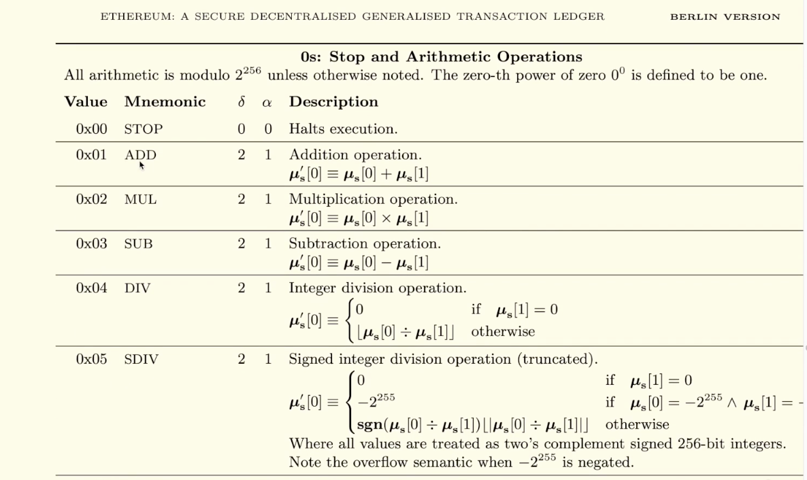
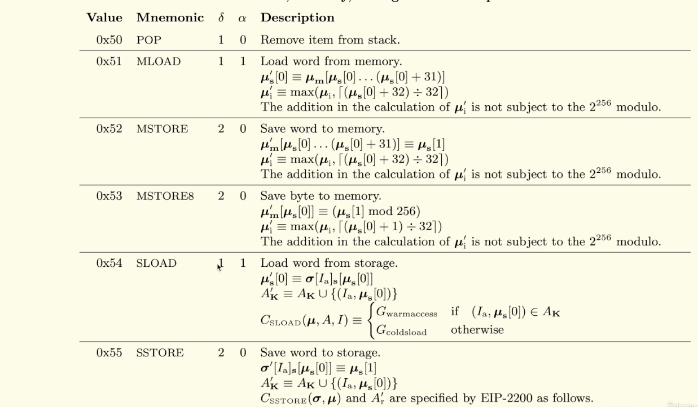
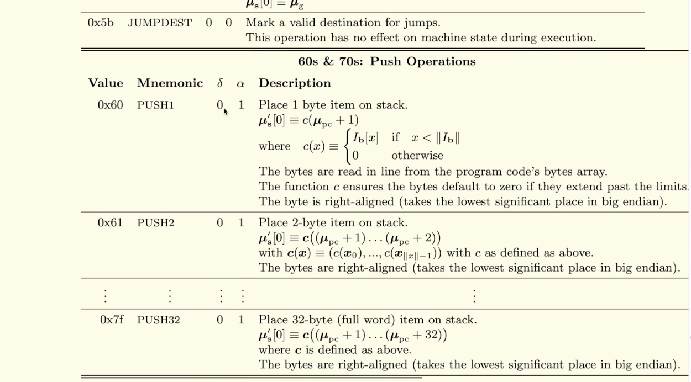
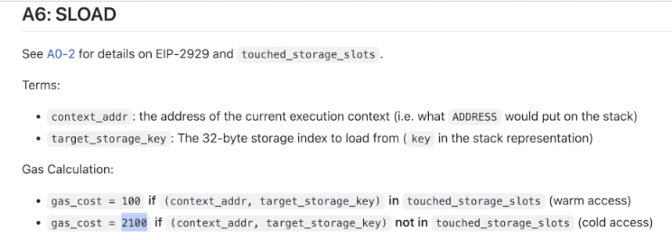
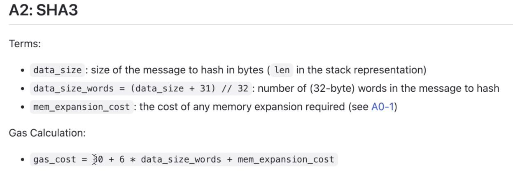

Each of the opcodes that we just looked at is defined inside of the Etherium Yellow Paper, and you can see some of the familiar ones here. We talked about ADD and what is this $\delta$ (delta) and $\alpha$ (alpha) value? 

Well, what it's saying is it's going to remove 2 items from the stack and add 1. Well, it's going to look at the top 2 values when we were adding 3 and 1, take them off of the stack and replace them with the sum. 

Another opcode that we saw in our earlier example, a... SLOAD, so it took, looked at the location on memory and removed it and then replaced it with the value, I'm sorry, in storage, it looked at a location in storage, remove that address from the stack and replaced it with the value stored there.

We also saw the PUSH operation, PUSH doesn't remove anything from the stack, it just adds one to them. Now, this yellow paper is, of course, a little bit hard to read. You can get a little bit of a lighter version if you look on this page (ethereum.org/en/developers/docs/evm/opcodes/).

And here you can see the opcodes labeled, it were the names of the opcodes given again, the initial stack, the top two items on the stack, A and B and what it gets replaced with in this column.

There's also a column over here that tells us how much each gas operation costs. So an ADD costs 3 gas, a PUSH will cost 3 gas and a SLOAD actually is a bit complicated and we'll get into this later because this cost will vary depending on what you are trying to do. But if we want to, look here, we can say we can see that it will cost either 100 gas or 2100 gas in our circumstance, it's actually going to cost 2100 gas and I'll explain why later. But the gist of it is because it's the first time accessing the variable in that transaction. It's a cold, cold access, so you have to pay extra for it.

A significant amount of the gas cost of an Ethereum transaction is simply the sum of all of the opcodes that you execute within that transaction. So the more opcodes that you execute, the more expensive the gas is going to be. Remember that time when we were hashing things over and over again? Well, if we look for the keccak opcode, where is it, oh, SHA was listed as SHA3 over here.

We can see that gas cost is going to be 30 gas plus how much data you're hashing and you can carry out this formula, but you can see 30 is much, much bigger than 3, right? And then we were doing it inside of a loop. So that's why when we looked at the heavy and the light functions from the smart contract earlier, we can see why the heavy was more gas than the light one and put a quantitative number to it.