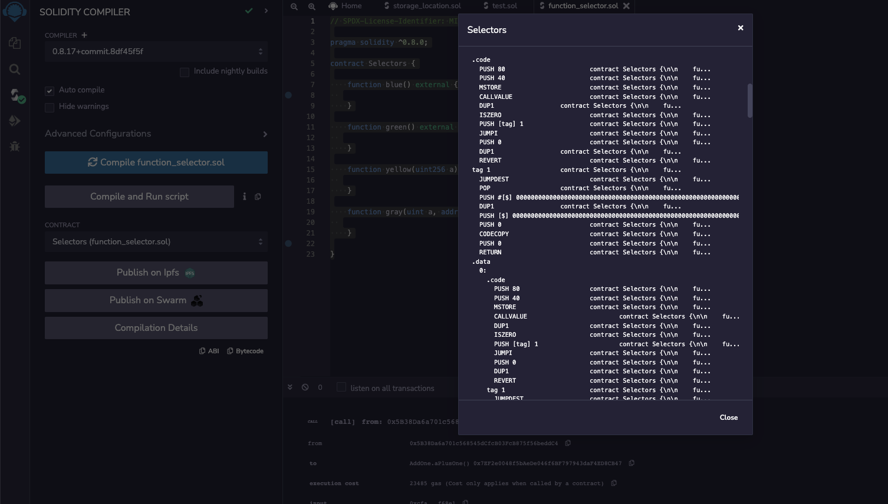
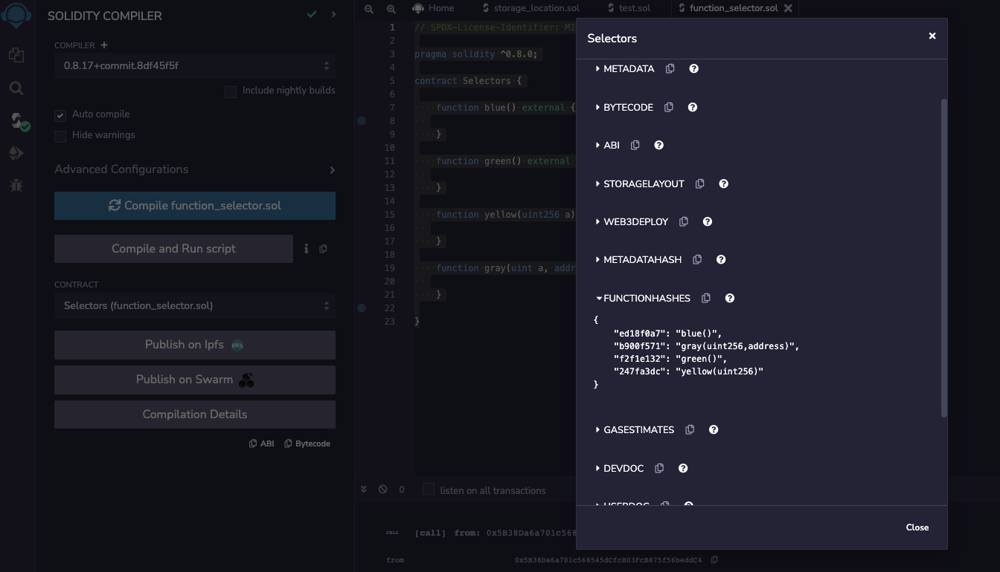
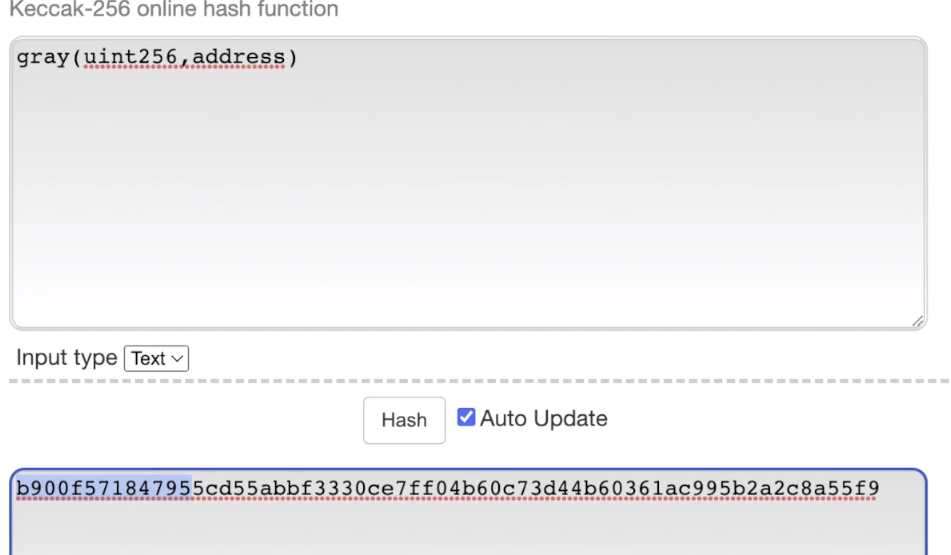
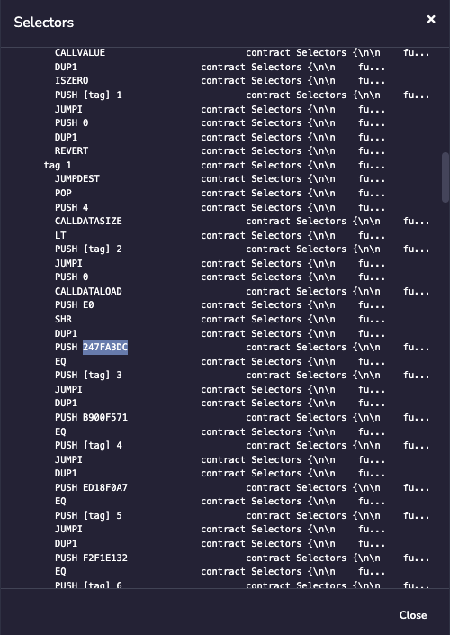

```solidity
// SPDX-License-Identifier: MIT

pragma solidity ^0.8.0;

contract Selectors {

    function blue() external {
  
    }

    function green() external {
  
    }

    function yellow(uint256 a) external {
  
    }

    function gray(uint a, address b) external {
  
    }

}
```

Before we're able to step through the options one by one and understand what's happening. We have some prerequisite knowledge to cover with function selectors.



When you create a contract, your function names are not actually stored inside of the bytecode. So if I look at **Compilation Details** over here and look at the assembly output, you're not going to see blue, green, yellow anywhere here, okay, I'm scrolling kind of fast, but you can do this on your own if you want to see this.



How they are actually stored is as hashes of the function name and then the first 4 bytes are taken. We had blue, gray, green and yellow and this is what their hash values are. So if you take this string and hash it with a keccak256 and take the first 4 bytes (指的是取哈希结果的前4个字节就是blue函数的哈希值), this is what you'll get.

```solidity
		function gray(uint a, address b) external {
  
    }
```

Now when you're doing this hash, you have to make sure that you include the exact event type and you don't include the variable name. So if we look at how I wrote gray over here, it was you uin256 address, this was just uint an address, and A and B are not included. But before you take the hash, this part needs to be included.



You see the same thing with yellow, the variable name is a, but that gets dropped in here. So if you want to compute this, you can just take any keccak256 library and plug it in. And here you will take the first four bytes of it and that's actually what you get b900 something, b900 not going to read enough.



And here we can find it inside the compiler output. Let's see if we can find one of these function hashes. Okay. There's 247F, which I think was yellow. We have b900, which was gray, etc., etc..

So this is how it's actually stored inside of the bytecode. And now we'll be able to understand what this represents when we step through the bytecode in the next video.