```solidity
// SPDX-License-Identifier: MIT

pragma solidity ^0.8.0;

contract DoNothing {

    function doNothing() external payable {
  
    }

}
```

All right. Now we are ready to look at the opcodes of a real smart contract, to make this as simple as possible. I've created a function that doesn't do anything, and I've also made it payable. This will actually simplify the output of the compiler. And the reason for this is something I'll explain later.

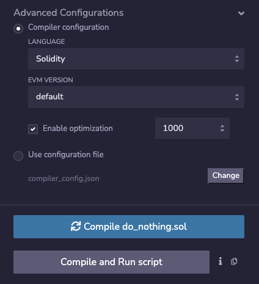

The other thing I've done that we haven't talked about yet is that I've turned on the optimizer, which will make the up codes fewer in number and thus make it easier to read. Again, this is something I'll explain later.

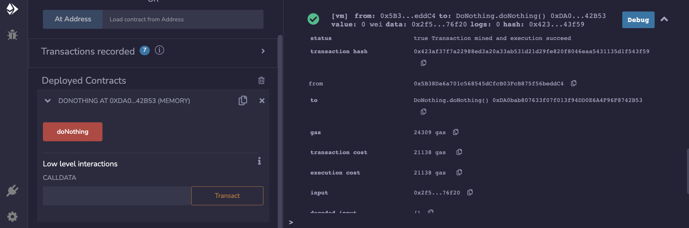

When we execute this function of **doNothing**. We'll see, we're going to pay 21,138 gas. And my objective in the next sequence of videos is to add up all the gas costs to see exactly how this number came about. Obviously, the first thing we're going to do is look at the opcodes.

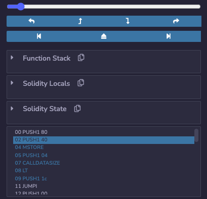

So let's go to the debugger and see what happens (点完debug再点一下向下的这个箭头才能进来). The first thing that happens is a sequence of PUSHes followed by an MSTORE. What this actually corresponds to, is solidity allocating space ([参考solidity文档: Layout in Memory](https://docs.soliditylang.org/en/latest/internals/layout_in_memory.html)) for different operations that might be conducted in the future. So the first 64 bytes are used as scratch space for hashing methods. This one tells you how much memory has been allocated so far. So memory in solidity is, you know, just a long array that you allocate more and more of as you need, I'll explain memory more later. And this is the zero slot where you would start like a bytes array or something like that, if you were doing it in memory. 

```yaml
PUSH FF PUSH 0
00000000_00000000_00000000_00000000_00000000_00000000_00000000_000000ff

PUSH FF PUSH 1
00000000_00000000_00000000_00000000_00000000_00000000_00000000_00000000_

ff000000_00000000_00000000_00000000_00000000_00000000_00000000_00000000

PUSH FF PUSH 3
00000000_00000000_00000000_00000000_00000000_00000000_00000000_00000000_

0000ff00_00000000_00000000_00000000_00000000_00000000_00000000_00000000

PUSH 80 PUSH 40
00000000_00000000_00000000_00000000_00000000_00000000_00000000_000000

00_ 0x00_
00000000_0x04_00000000_0x08_00000000_0x0B_00000000_0x10_00000000_0x14_00000000_0x18_

00000000_0x1B_00000000_0x20_00000000_0x24_00000000_0x28_00000000_0x2B_00000000_0x30_

00000000_0x34_00000000_0x38_00000000_0x3B_00000080_0x40_
```

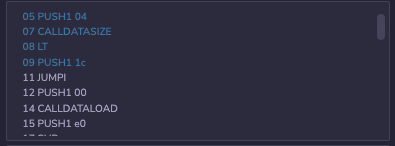

Okay. That's what the first three opcodes we are doing. And then it's going to push the hex number 4 on the stack and hex 4 is also decimal 4. Okay. Why is decimal 4 significant? Well, if you look at the opcodes here, what it's going to do is look at CALLDATASIZE, see if it's less than 4, push a certain location (指1c) on the stack and possibly jump to it. Okay. What is so important about CALLDATASIZE and 4?

0x0552e319afb7564c38197acc18a9f757f86d82a7630e5660e49850edc22e17bb

(This is the same **DoNothing** smart contract deployed on rinkeby)

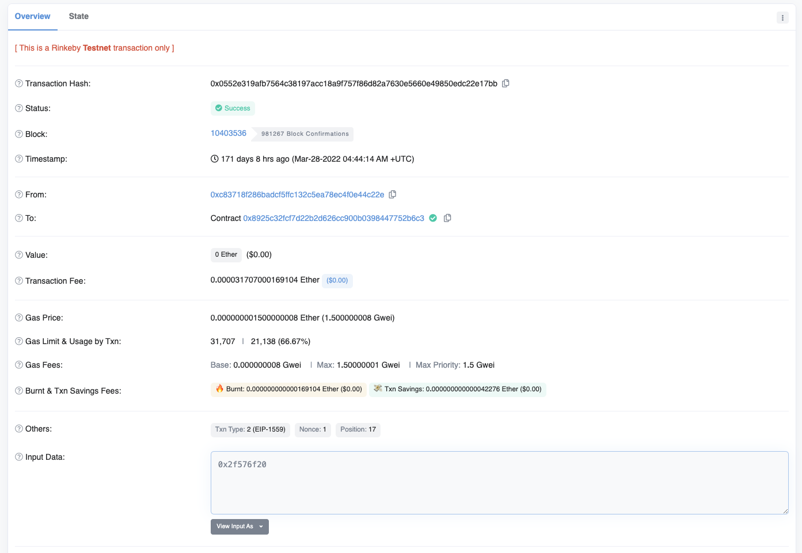

**When you interact with a smart contract, what you're actually sending is something inside of the input data field. If you're using solidity, you would see this in msg.data.** But if I look at this... like... So, you can actually see inside of this transaction was **2f57** whatever, whatever, I'm not going to read at all to you, but this is how you tell the smart contract I want to execute this particular function. So typically you can go to the contract and then if someone already published the source code or the API, you can interact with it directly. But that's not possible here actually, because I haven't published the source code.

However, ~~Ethereum~~ Smart contract transactions simply work by just putting the hex data that you care about inside of the... inside of the data field (上图里的Input Data框框里). 

先在设置里把这个选项打开

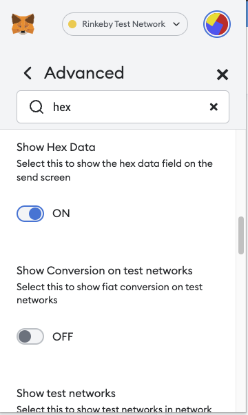

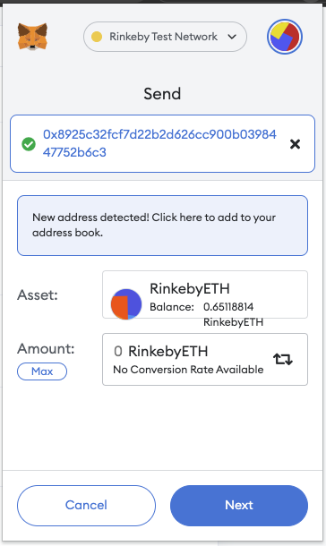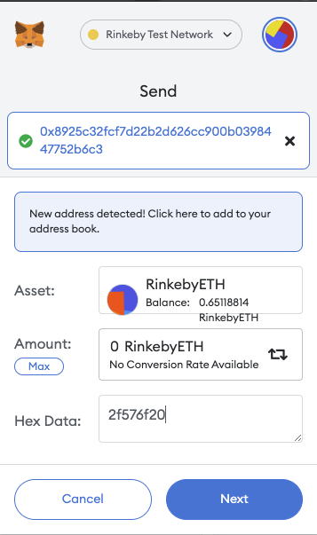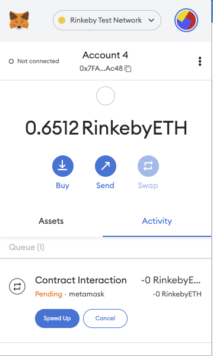

So that would look like this (copy合约地址0x8925c32fcf7d22b2d626cc900b0398447752b6c3).

Let's say I wanted to execute this, **doNothing** function, then I would just open my metamask I'm going to send to this address. I'm not going to send any ether, but inside of the **Hex Data** field, I will just put in 2f576f20 (this is the function selector of doNothing) and then confirm and send this transaction. Now, let's speed it up a little bit, shall we? Okay. So this will take some time to confirm in the background.

0xe4cc47cb73a08443d8d59dd4c0b8b8f8b3fc455b7831deb602624f103fa7857e

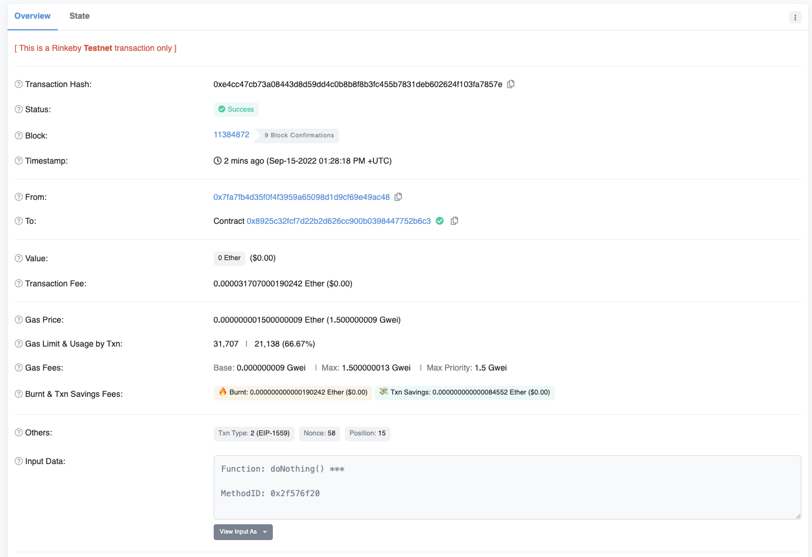

But you can see over here we spent 21,138 gas when this was executed on the Ethereum testnet.

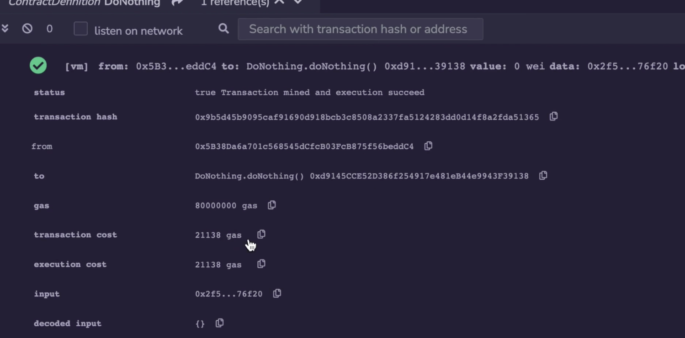

And it's 21138 gas again here inside of the reix environment. 

So here I am back at the Smart contract and it should be confirmed by now. And here you can see now that function has been executed twice. This is the one that I set in metamask earlier. And again, you can see it still costs 21,138 gas. 

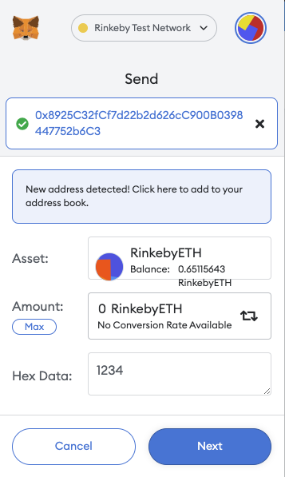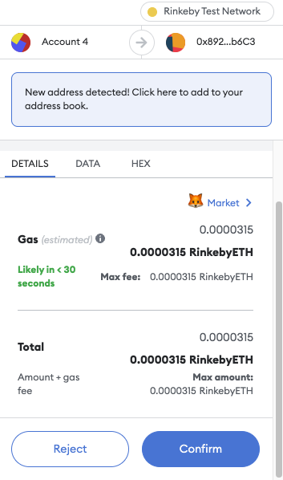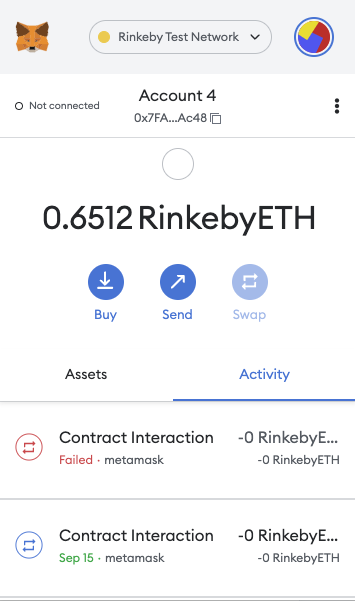

If you want to see what happens in the failure case, well, you can do that. Let's look at the first failure case where we send less than 4 bytes. So this transaction should fail. We'll put 1 byte in there, and when I send this, it's going, wel, the client behind the metamask recognizes that the transaction is going to fail, and so it doesn't actually send it, but it actually hits a simulation of the transaction on its local client and says, Yeah, this isn't going to work.

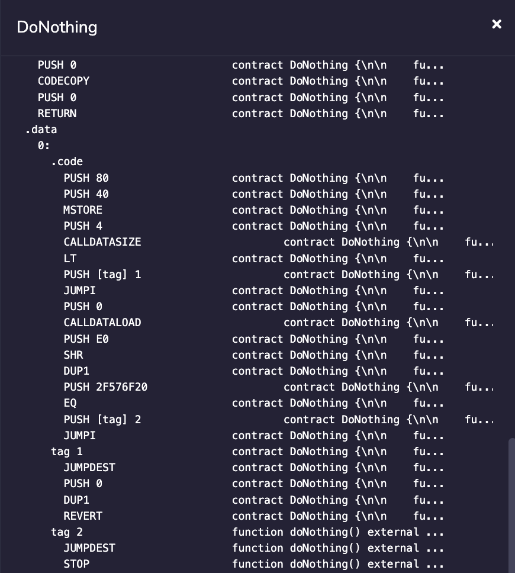

But this CALLDATASIZE is how it knows that you've actually sent 4 bytes inside of your msg.data. Let me show you, where is it, the assembly code, so we can look ahead to see what's going to happen. So at the actual execution, we saw allocating memory, pushing 4 bytes and checking that there were actually 4 bytes in here. So when I put that... those values into the msg.data portion of the transaction, if I've sent less than 4, then it's not going to be able to match the function selector later (指和2F576F20不匹配).

So first of all, it makes sure that there's actually 4. If there isn't, it's going to jump to tag 1. And over here we see a revert, which is going to cause the transaction to fail because it doesn't know which function selector it was going for. Otherwise, it's going to check if the data you put in actually matches the function selector, there's only one function here, so it just wants to check that you are making... make sure that you are actually calling that function. If they are equal to each other, then it's going to jump to tag 2, which is over here, and then it will stop. there's nothing inside of the function which is why there's only the stop opcode there.

Okay, let's go back to the debugger, so you can see we're setup for the PUSH, CALLDATASIZE, LT(less than) and JUMPI(jump if) if it was less than 4, but the jump doesn't happen, it just keeps going on to the next line because we set this, transaction sent the correct amount of bytes, and then it's going to load up that function selector inside of the stack and check if they're equal. And then it jumps to the location that... because it was in fact equal and stops. 

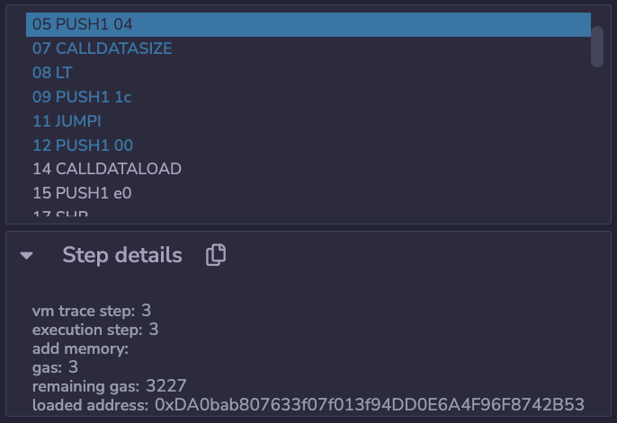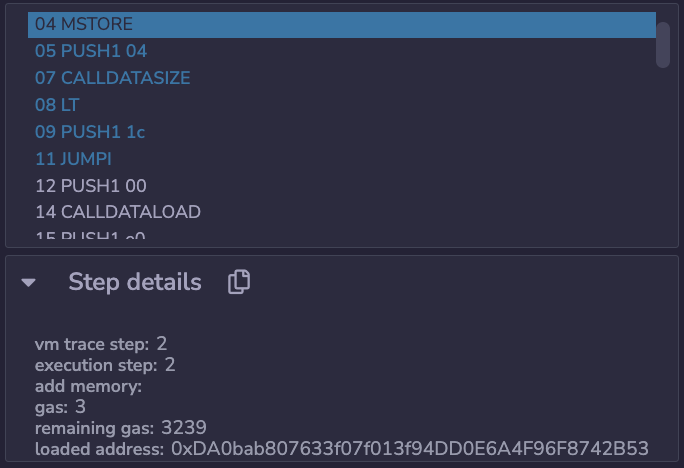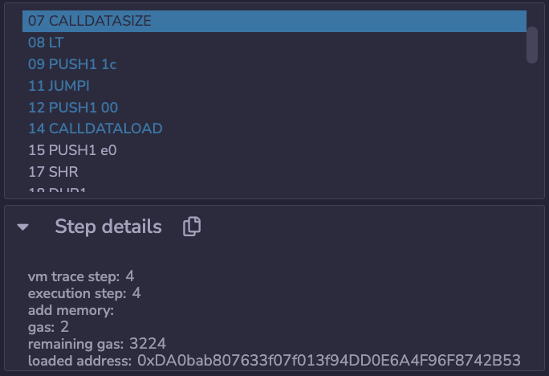

Okay, each of these opcodes have a gas costs which we can add up. We're not going to do that in this video because that will be too long, but we'll do it in the next one. But over here you can see PUSH costs 3 gas. Another PUSH still costs 3 gas. The MSTORE costs 3 gas again. And we have another push and CALLDATASIZE which costs 2 gas.

So we can add all of this up manually. It's actually going to add up to 65 gas. So if we add up 65 plus 21,000, which is for the cost, for initiating a Ethereum transaction, we'll see it's not going to add up. Now, why that is the case is actually quite interesting because there are other costs that we need to account for. But in the next video, I'm going to load these up codes into an Excel spreadsheet so you can see the math for yourself.