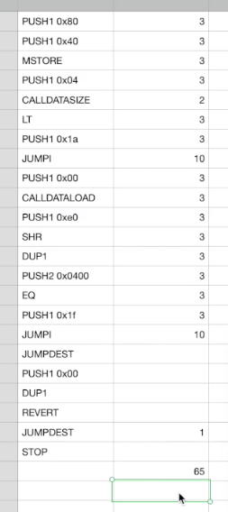
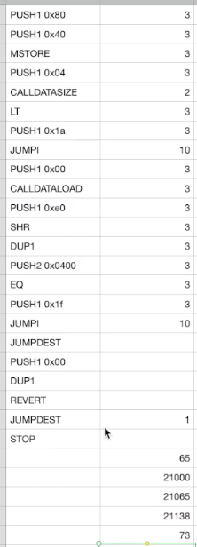

What I've done here is take the opcodes from the contract and copy them into this spreadsheet. So you would be able to see those over here. And I can copy it and put it over there. Again, I'm skipping the constructor portion of the opcodes and just looking at the execution part. So remember, not all of the opcodes we got actually get executed because for the successful case, the revert opcode and those leading up to it are not actually executed. So what I'm going to do is just go through the debugger again, and see the opcodes that are executed. And I've pre-populated this with the gas cost that you can get from Remix or from the specifications on Etherium.

So we have a PUSH 80, PUSH 40, MSTORE, PUSH 4, check the CALLDATASIZE, LT, PUSH a possible location to jump to, don't jump to it. PUSH 0, CALLDATALOAD, basically, load the function selector and check that it is equal, and if it is, then we will go to the function location and stop. 

These are the ones that actually get executed. You can work this out yourself if you care to, but I don't want to do too much accounting on a video because that's not very exciting to watch. 

If we add this up, we get 65, which at this point in time doesn't make sense because we know it costs 21,000 gas to start a transaction, and that means we would expect the total gas cost to be 21,065. But it isn't. We've been seeing that it's 21,138. So we have to account for how much missing gas we have to do... 73 gas that is unaccounted for.

Now, there are actually two reasons this is not adding up. One is you'll note that this information (指Input Data框中的0x2f576f20) that is on, excuse me, on Etherscan, this is stored on the blockchain forever. When we send this transaction. So we need to pay a fee for storing it.

And the other thing that we're going to be looking at is these memory instructions from earlier, the PUSH 80, PUSH 40, MSTORE, so this is actually using some memory on the EVM clients and we have to pay for that. We'll calculate the exact cost for those in the following videos.