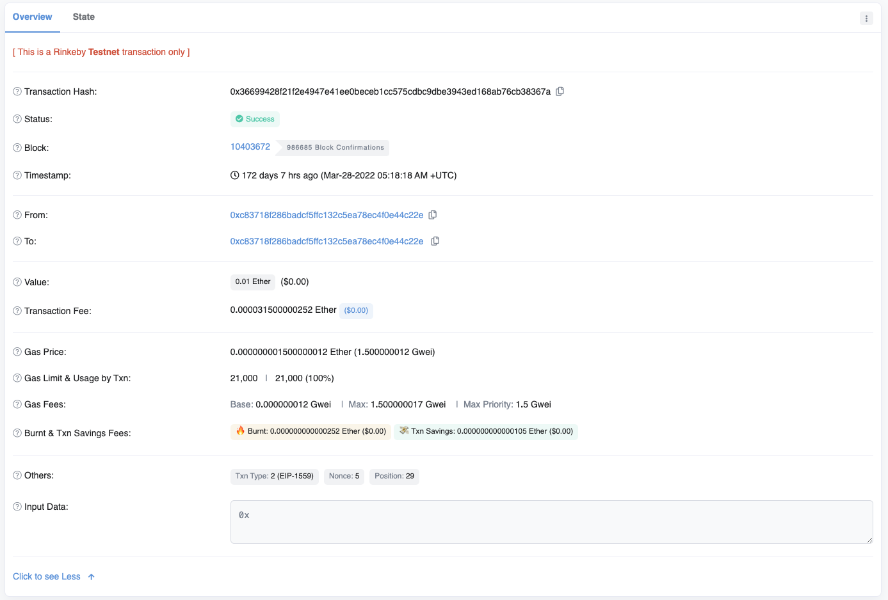
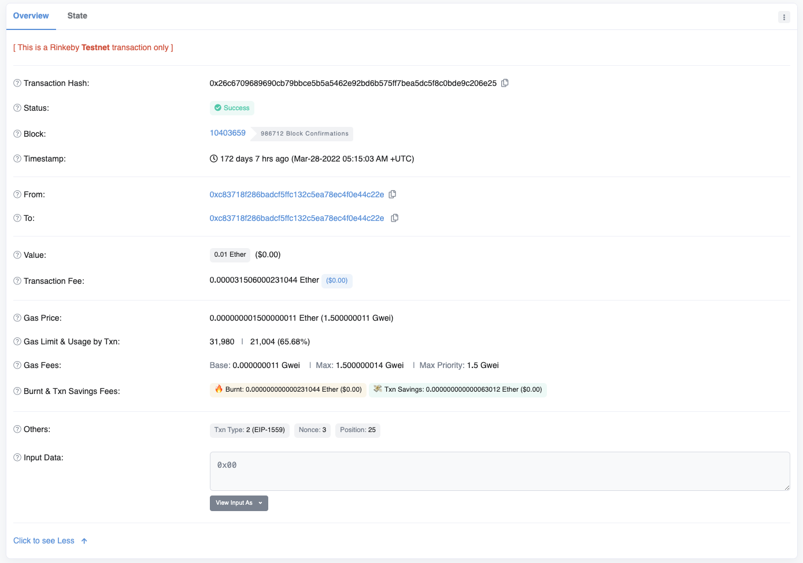
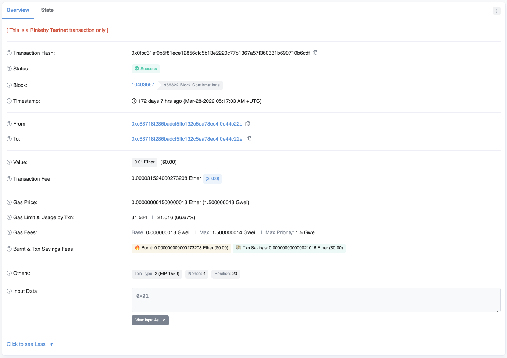
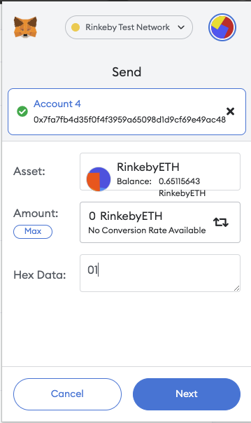
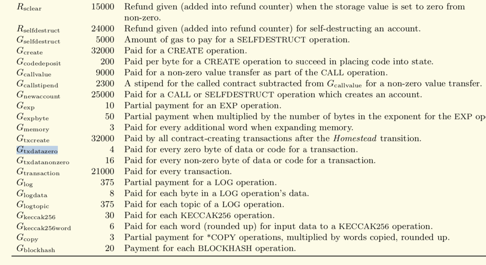
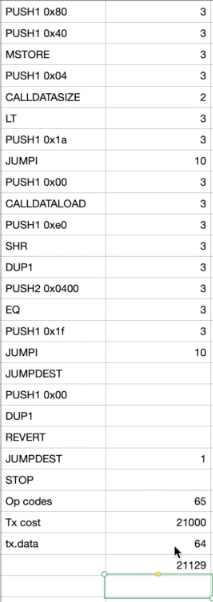

0x36699428f21f2e4947e41ee0beceb1cc575cdbc9dbe3943ed168ab76cb38367a (rinkeby)

In this video, we're going to be looking at how much the data portion of a transaction costs in terms of gas. When we do a simple transaction that has no data inside of it, it will cost us 21,000 gas. So in here, over here. I just sent some ether to myself.

0x26c6709689690cb79bbce5b5a5462e92bd6b575ff7bea5dc5f8c0bde9c206e25 (rinkeby)

Now, remember that data field I was filling out from earlier? If I were to put 1 byte of all zeros in there, the gas cost actually goes up to 21,004 gas. 

0x0fbc31ef0b5f81ece12856cfc5b13e2220c77b1367a57f360331b690710b6cdf (rinkeby)

Let's look at another situation. I'm going to send Ether to myself again, but put a byte of one in there and that costs 16 gas.

Just by review this is how we would do it. I would just send it to myself and let's get that out from there and send it. And I can just do something like this, like this, and send it. This is what I was doing last time when I was trying to interact with the smart contract. 

So how come a zero byte cost 4 gas and a non-zero byte cost 16 gas? Well, that's what's given in the yellow paper, I don't want to go over the yellow paper too much because it's frankly quite hard to read. But sometimes you can pick out the pieces of information that are relevant when you really need to dive into something. 

[Ethereum Yellow Paper](http://ethereum.github.io/yellowpaper/paper.pdf)

So this is from Gtxdata, if it's 0, we're going to pay 4 gas, if it's non-zero, it's 16 gas. 

So when we are sending that function from earlier here, we're sending 4 bytes, and 4 times 16 is 64. And we can see that here, the opcodes cost us 65 gas and the transaction costs 21,000 gas and the transaction data is 64 gas. So now we're closer to our target that we measured in Remix and on Etherscan. This is 21,129 gas. 

It's not quite where we need to be. There's still 9 more missing gas, but we're getting close. The way we computed the gas costs that are attributed to the data portion of a transaction will actually give you a hint about how you can save gas that way. But that's a topic for a later section. In the next video, we're going to figure out where that missing 9 gas is.