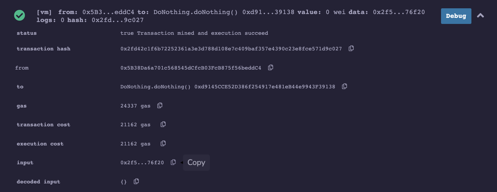
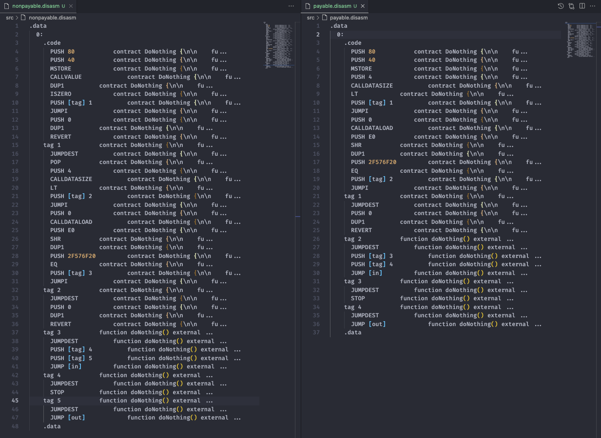

When we looked at the **doNothing** function, I set it to payable because I said it would be cheaper in gas. Let's see why that is actually the case. 

```solidity
// SPDX-License-Identifier: MIT

pragma solidity ^0.8.0;

contract DoNothing {

    function doNothing() external {
  
    }

}
```

So if I were to compile, let's... let's do it without payable first. If I were to compile this, deploy it and execute the function **doNothing**. I see that the gas cost is 21,186. Now let's add the payable portion and let's add them, let's spell it correctly, add the payable portion and redeploy it. So remember, it started off as 21,186 gas. I deploy execute the function and we see that it is 21,162 (这里没开optimization,所以不是21138) gas which is clearly cheaper. Why is that the case? 

Well, we already know that gas in execution phase can come from one of four places. One is the size of the transaction data. The other one is the amount of memory used and the amount of storage used and the opcodes that are executed. 



We can look at the transaction data that was sent over here (0x2f576f20) and see that the function selector is going to be the same in both function calls (第一个无payable和第二个有payable发送的txdata都是一样的).



Obviously because the function name didn't change. So in both cases we sent 0x2f576f20 as part of the function called because we were trying to say: execute the **doNothing** function. And you can see that as part of the opcodes (PUSH 2F576F20那行) that I've copied over here. And we can look at these opcodes and see where the difference is coming from. So I've copied over the opcodes from the non payable case on the left and the payable case on the right. **Already you can see that the payable case has *fewer opcode*, so it shouldn't be surprising that it costs less gas.** But let's see what's actually happening. We see both functions start off with the useful PUSH 80 PUSH 40 MSTORE situation.

And in the non payable case we see that it's looking for the CALLVALUE first and in the payable case it's just looking to make sure that there are 4 bytes inside of the call data. 

So why is it looking for a call value? Well, in a... in the non payable function, it's going to revert if you send ether to it. So it's going to check that, "well, did you send zero ether"? If so, that's fine. Let's continue on with the regular execution and see that you sent 4 bytes. But if this isn't zero, then it's going to revert. Let's see that in action. So if I put a non payable function over there, deploy it and send some ether with the transaction and **doNothing** reverts, that's what we see over here (non payable line 14), this is the revert code that's causing it because we sent a non-zero amount of ether.

In the payable case. It doesn't matter how much ether we send, so I can send 0 ether. It will not revert. Or I can send 1 ether and it still does not revert. That's the point of this course. I don't want to just tell you that payable functions cost less gas than non payable functions. I want you to have a mechanism and a framework for understanding why that is the case. But once you have the fundamentals, it's very easy to understand why payable functions are cheaper than non payable functions.