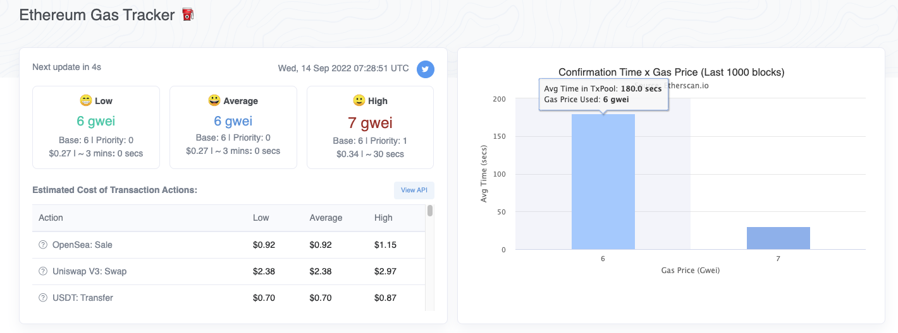

Going to disscuss how the transaction fee for transferring Ethereum is computed.

0x8af42d17fefd2e71ecbe3c9d4afa68a867f5238cb44e3ce05080833a6b74b350

In this example, somebody sent 0.099 ether from this address to this address and paid a transaction fee of 0.001 ETH. How was this computed? The transaction fee is the product of the gas used by the transaction times the gas price.

When you open etherscan, this might not actually be visible, You may have to click this in order to show the gas used by the transaction. In a later video, I'll describe the gas limit and the gas usage terminology, but the one you should be focusing on is gas usage for now. Gas price is given in units of ether, but it's often on the order of billionths of an ether, therefore, when people describe the gas price, they will often do it in units of gwei and one gwei is one billionth of an ether.

So let's carry out the multiplication. Over here we have 21,000 times 48 gwei divided by 1 billion. And dividing the gwei divide by 1 billion brings it back two units of ether. And over here we see we have 0.00101533, etc. and that matches exactly what we have here.

Now to get the dollar amount, we simply multiply this by the price of ether because remember this is in units of ether now. So let's just say Ethereum costs 2900 or so. In that case, the price of the transaction in dollars will be 2.94, and that's pretty close to what it was at the time. But again, this will fluctuate with the price of ether. 

Now, there are two things that might be a little bit counterintuitive at first. Where is this 21,000 coming from? It seems like a random number, and what exactly is a gas? And the other one is where did this 48.34 come from? 

Well, what you need to know for now is that whenever you transfer Ethereum, it always costs exactly 21,000 gas, this never changes. However, the gas price changes depending on network conditions. This is how much you pay the miners to get your transaction mined. If you want to get an idea of what the current market rate for gas prices, you can go to [Etherscan.io/gastracker](https://cn.etherscan.com/gastracker), And at the time I'm recording this video, it is about 22 gwei. Of course that will give you the amount in a Ethereum, but the actual price in dollar will depend on the price of ether at the time.

So the formula you need to remember is gas used by the transaction multiplied by gas price in gwei divided by 1 billion multiplied by the price of ether if you want the transaction costs in dollars.

Now I've simplified this a little bit because after EIP-1559 went into effect, the gas calculation formula is a little bit more complicated, but I'll go over that in detail at a later video because the fundamentals are not very different.

In the following video, I want to describe what's so significant about 21,000, What exactly is meant by saying a transaction is 21,000 gas?