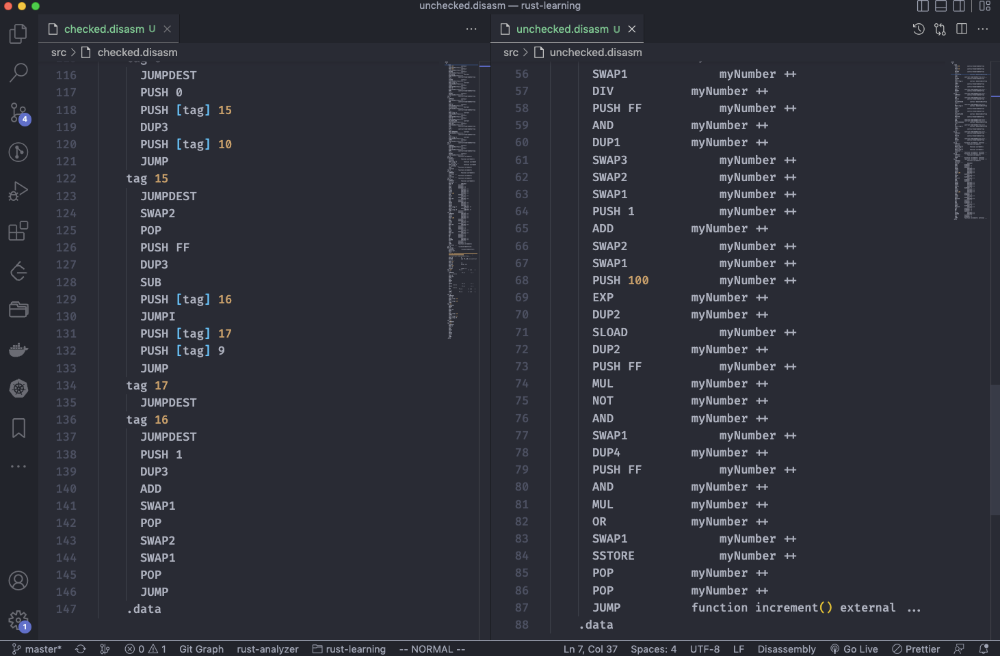

A natural question to ask is: unchecked blocks introduce a security risk because of underflow and overflow. Why would you ever use them? Well, that's a good question, most of the time it's not a good idea to put your code inside of an unchecked blocked. But sometimes the logic of the contract and the nature of the number you are using actually makes it make sense. 

```solidity
// SPDX-License-Identifier: MIT

pragma solidity ^0.8.0;

contract UnderAndOverflow {

    uint8 myNumber = 100;

    function increment() external {
        myNumber ++;
    }
}
```

First of all, let's look at it from a gas perspective. I've created a contract here that's just going to take a number and increment it every time I call the **increment** function. When I call increment, I'm going to see that the gas cost is 43,400 gas. 

```solidity
// SPDX-License-Identifier: MIT

pragma solidity ^0.8.0;

contract UnderAndOverflow {

    uint8 myNumber = 100;

		// 43400
		// 43323
    function increment() external {
        unchecked {
            myNumber ++;
        }
    }
}
```

What will happen if I put this inside of an unchecked block? I'm going to delete the old contract, make sure this is compiled, deploy this and hit **increment** again. In this situation, I see it has saved me a little over 70 gas because now the cost... because rather than being 43,400, now it's 43,323. 



Okay. Why did that save the gas here? Well, let's look at the opcodes to get a clue. I'm not going to step through them, but it will be pretty obvious this is the unchecked case and I'm going to copy the assembly code and put it in this text file and then I'm going to recompile this code without the uncheck block. Get the compilation details. Copy the assembly code and put it in another file. So in this file, let's just to simplify things, let's remove the constructor portion of the codes over here, and over here we can see that there are 98 opcodes. And over here we can see that there were 133. 

**So those extra opcodes that are called during the execution portion are going to increase the gas costs, which is the difference that we see inside of the measurements.** Those extra opcodes are checking: does this number pose the addition operation makes sense? Whenever you add two numbers together, the result should be bigger than either one of the terms of the addition right? And if that's not the case, then you know that an overflow has happened. So that's what's getting compiled into the smart contract.

When you are using counters, this is actually the most common case to put code inside of an unchecked block because the likelihood of overflowing a 256-bit number is pretty much close to zero, because $2^{256}$ is... is bigger than the count of all the items in the known universe, which is roughly $2^{80}$. So you're not going to be able to call the **increment** function enough times in order to actually cause that overflow. There's there's not enough time, there is not enough money to pay for all of that gas. 

So you can see that in something like the [OpenZeppelin counter library](https://github.com/OpenZeppelin/openzeppelin-contracts/blob/master/contracts/utils/Counters.sol) where they provide the counters that you can increment decrement a reset.

```solidity
		function increment(Counter storage counter) internal {
        unchecked {
            counter._value += 1;
        }
    }
```

And they know that if you're starting at zero that you're not going to be able to overflow. Now, if I had started this at something much closer to the maximum value of 2 to the 256, then there could be an overflow possibility. 

```solidity
		function reset(Counter storage counter) internal {
        counter._value = 0;
    }
```

But if it's initialized to zero (指reset方法) , you're not going to be able to increment enough times for that to happen.

```solidity
		function decrement(Counter storage counter) internal {
        uint256 value = counter._value;
        require(value > 0, "Counter: decrement overflow");
        unchecked {
            counter._value = value - 1;
        }
    }
```

For the decrement case, they had a check beforehand, before they decrement they want to make sure that, well, you're not doing 0 minus 1, now **because you're always decrementing in units of 1 or adding in units of 1, you know you're safe**. If you were adding much bigger numbers, you would need to put some thought into it to make sure that your starting value and your N value are not close to the boundaries of zero or the decimal number corresponding to all 256 set to 1.

```solidity
    function _transfer(
        address from,
        address to,
        uint256 amount
    ) internal virtual {
        require(from != address(0), "ERC20: transfer from the zero address");
        require(to != address(0), "ERC20: transfer to the zero address");

        _beforeTokenTransfer(from, to, amount);

        uint256 fromBalance = _balances[from];
        require(fromBalance >= amount, "ERC20: transfer amount exceeds balance");
        unchecked {
            _balances[from] = fromBalance - amount;
            // Overflow not possible: the sum of all balances is capped by totalSupply, and the sum is preserved by
            // decrementing then incrementing.
            // 这个issue里已经解释了为什么把下边这行也放到unchecked里了
            // https://github.com/OpenZeppelin/openzeppelin-contracts/issues/3512
            _balances[to] += amount;
        }

        emit Transfer(from, to, amount);

        _afterTokenTransfer(from, to, amount);
    }
```

The other situation you can see an unchecked block in is inside of the [ERC20 implementation from OpenZeppelin](https://github.com/OpenZeppelin/openzeppelin-contracts/blob/master/contracts/token/ERC20/ERC20.sol). When someone initiates a **_transfer** from one address to another, they need to subtract their balance and add it to the recipients. But you know that you cannot transfer more coins than what you own. This require statement (第3个require) says that the amount that you're sending needs to be less than your balance. So if I have 100 coins, I can't send you 101 coins. So because of that, you know that you're never going to subtract in such a way that you result in a negative number and you can put it inside of an unchecked block to save some gas. 

OpenZeppelin doesn't put an unchecked block around the increment part (视频里_balances[to] += amount这行代码是没有放到unchecked里的) because they don't know if you did something stupid, like initialize everybody's balances to be almost the limit of the maximum value that can be stored in 256 bits. So they need to keep the safeguard here. But if you were building an ERC20 like contract and you knew that you initialize the supply to be such that no one address could ever overflow and it's not possible to get more coins, then you would be able to put this inside of an unchecked block too.

So unchecked is a quick way to save gas, and it's also a nice way if you're trying to debug opcodes and see where gas costs are coming from because it gives you fewer things to look at. You just need to make sure that the constraints of your program and the surrounding require statements eliminate the possibility of an overflow or underflow happening. 