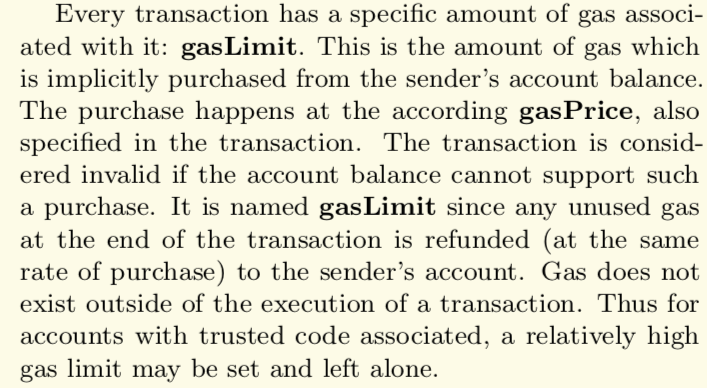

In this video, we're going to revisit the gas limit that we breezed through in an earlier video. I said the gas used (用了多少gas取决于多少opcode，他应该是这个意思，另外几个是发送的txdata、分配的memory和使用的storage ) by the transaction is the relevant part to computing the cost of a transaction.

**But what exactly is meant by the gas limit?** in this situation, I'm going to go off the script a little bit and actually read you the relevant part of the Ethereum Yellow Paper. I don't want to make this course something where I'm just going through the yellow paper and explaining all the sections about gas. But the part where they describe it is actually pretty relevant. And it's also a good segue for us to talk about why the number 21,000 keeps popping up.

In section 5 of the Ethereum Yellow Paper, on page 8, it says: "Every transaction has a specific amount of gas associated with it: **gasLimit**. This is the amount of gas which is implicitly purchased from the sender's account balance. The purchase happens according to **gasPrice**, also specified in the transaction. The transaction is considered invalid if the account balance cannot support such a purchase. It is named **gasLimit** since any unused gas at the end of the transaction is refunded (at the same rate of purchase) to the sender's account. Gas does not exist outside of the execution of the transaction. Thus for accounts with trusted code associated, a relatively high gas limit may be set and left alone."

(个人理解，gasLimit就是花费有限，不会无限花你的钱，**Gas Limit**代表了交易可以使用的资源上限，是为了防止合约漏洞或者恶意程序导致用户Gas量消耗过高的情况出现。一旦消耗的Gas量超过Gas Limit，矿工就会停止执行程序，做到及时止损。Gas Limit可以看成是一道保险，实际Gas消耗超过设定的上限就会终止交易，实际消耗Gas量低于上限，多余的Gas也会退回来。交易中的实际消耗资源量Gas Used by Transaction一般与交易合约中的设定有关。)

0x10b211d6567cda153d493b4ace9ddec7c37c3c189875b37a80d33791e362965c (main net)

So the gas limit is how much you set aside to complete the transaction, but this (指Usage by Txn) is how much gas that was actually needed to complete the transaction. If you set a gas limit that is lower than the gas used, then the transaction will revert because as you are stepping through each of the opcodes, your gas is continuously decrement it and at some point if you had zero, then it stops. 

**Why does this number even need to exist** (指Gas Limit)? Well, remember, the nodes in the Ethereum network cannot look at a transaction and instantly compute how much gas it's going to take. They have to actually carry out the transaction in order to see how much gas it's going to take, and then carrying out that transaction takes work. So it's much more straightforward if the customer says: "Hey, look, I know in advance how much this transaction is going to cost in terms of gas, so here is the limit I'm providing, and **I'm allocating this much Ethereum in my account to make sure that I can actually pay for it**. And you can carry out the computation". And if it goes below zero, then we'll get an out of gas error. This counting to make sure that the customer actually has enough Ethereum in their account to even reach the gas limit is one of the reasons that all transactions need to cost at least 21,000 gas.

Here's the relevant part of the yellow paper on the same page: "The execution of a transaction is the most complex part of the Ethereum protocol: that defines the state transition function. **It is assumed that any transactions executed first pass an initial tests of intrinsic validity**. These include the transaction is well-formed RLP with no additional trailing bytes. The transaction signature is valid, the nonce as valid. The sender account has no contract code deployed. The gas limit is no smaller than the intrinsic $g_0$ used by the transaction and the sender account balance contains at least the cost $v_0$ required in up-front payment."

So the first part checks, Okay, is this... "Is Ethereum transaction just containing nonsense?" Okay, this requires some execution (指检查有没有多余的字节需要额外的execution). Then you want to make sure that the signature coming from the private key is checking out with that 20-byte string that is the hash of the address. The nonce is associated with every transaction. So if I send you some Ethereum, there's without a nonce, you would be able to take that transaction and replay it back to the network and withdraw more Ethereum From my account, and that would be bad. So rather than just saying, I'm going to send Alice 5 Ethereum, I'm going to say I'm going to send Alice 5 Ethereum And this is the 5th transaction I've ever done. And that nonce, that number 5, is recorded in the blockchain state. So if Alice tries to take that and sends it again, the network can see, oh, this 5 has already been used. This is not a valid transaction.

Okay, so all of this work requires some computation, which is why we keep seeing the number 21,000 coming up. It's supposed to cover all of this. In fact, you can see that on the Ethereum specification on page 28, excuse me, page 27. And over here it says the $g_{transaction}$ is 21,000, paid for every transaction. 

So, that covers the cost of the six things that we talked about earlier. Now, I could have earlier said, okay, every transaction costs at least 21,000 because Ethereum says so, but I don't think that's enlightening. But after you have some intuition about Ethereum from really digging into it, then the yellow paper actually starts to make a lot of sense. 

You can see it inside of the math for the execution costs. So the execution cost is the transaction data, remember we had do a count for that when we looked at the function selector? We have to pay extra gas if we are creating a smart contract, which we aren't, but then we also have to pay that 21,000 that we will always have to pay. We'll talk about access lists later, but this is talking about storage costs, which is something we will get into a later section. 

But this is why I can keep subtracting 21,000 out of the computation in order to get a sense of how much these other costs are contributing to the transaction fee.