When we started this course, we talked about the gas price being something that's fixed in a constant, but that's not quite the case with EIP-1559. So it's helpful to understand it, so that when you're computing gas costs, you're not surprised when the numbers don't line up. 

**So what's special about EIP-1559**? Well, prior to EIP-1559, it used to be the case that the entirety of your gas fee would go to the miner, post EIP-1559, a portion of your transaction fee is now burned and not received by the miner, and the miner only receives a portion of it. 

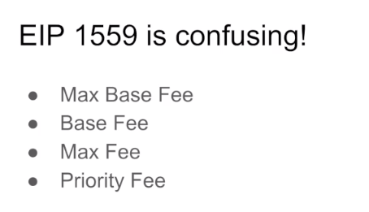

Now IP-1559 is pretty confusing because depending on where you look, you're going to see different terminology describing the same thing. Sometimes you might see a MAX BASE FEE, a BASE FEE, a MAX FEE, a Priority FEE. 

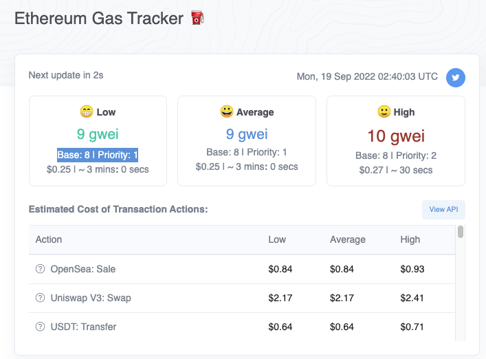

And we can see that, let's say if we look on Etherscan, here, we see a Base fee and a Priority fee. 

先在设置里把Enable Enhanced Gas Fee UI打开，然后在钱包里点击send发起一笔交易

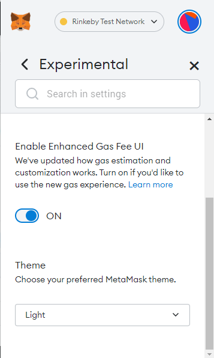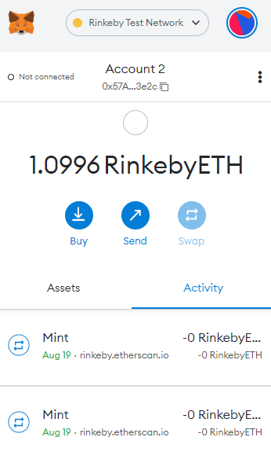

在Confirm页面点击Market，然后进到Edit gas fee页面再选择最下边的Advanced，在Advanced gas fee页面可以修改Max base fee和Priority Fee

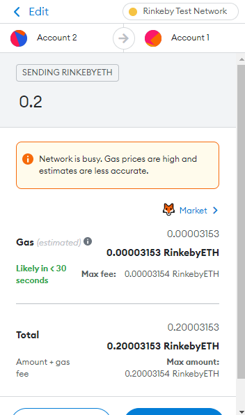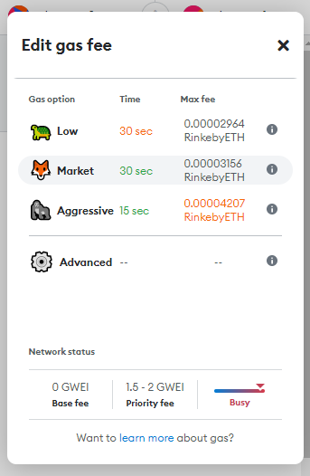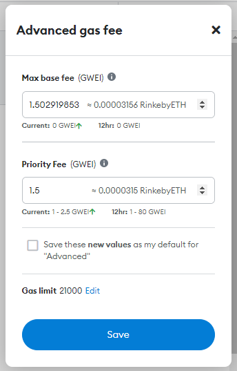

But if we look at Metamask, we will see a option to set a Priority fee and a Max base fees. 

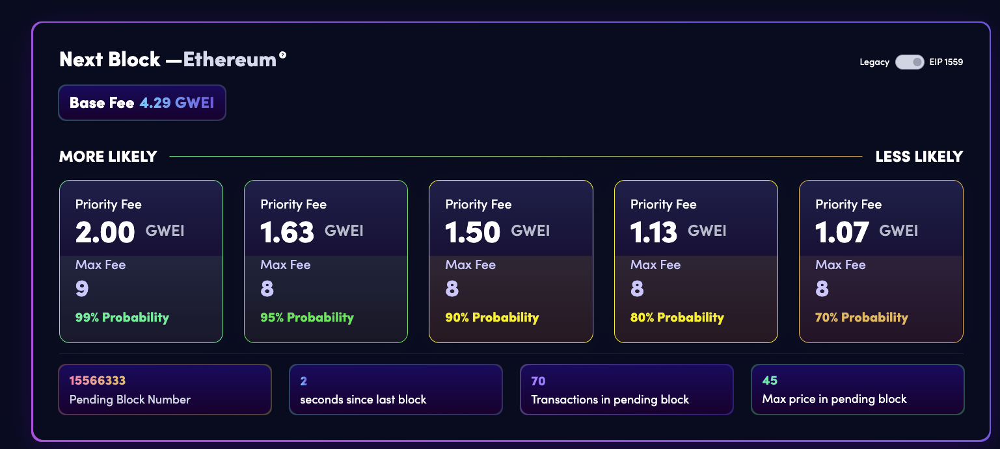

If we look on another gas tracker website ([blocknative](https://www.blocknative.com/gas-estimator)) , we're going to see priority fee and max fee and no base fee anywhere. (视频里没有，现在右上角选择EIP 1559左上角就有Base Fee了)

Okay. That's pretty confusing, isn't it? If you really don't want to get into this, all you have to remember is that the gas price per gwei is always less than or equal to the max fee with no mention of priority because the priority fee and the max fee are not the same. 

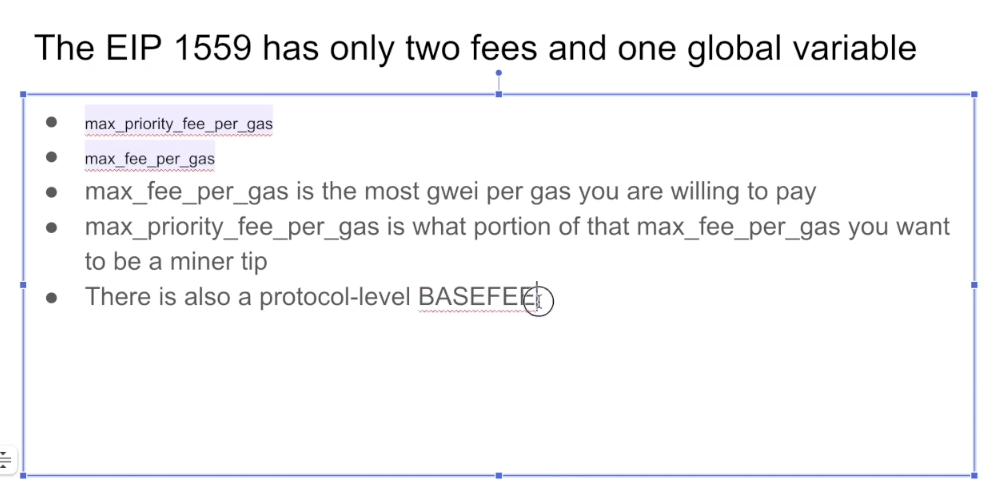

But don't worry, there's actually only three entities that you need to worry about here, three variables. 

```python
@dataclass
class NormalizedTransaction:
	signer_address: int = 0
	signer_nonce: int = 0
  
  # Metamask中叫做 Priority Fee
  # Metamask中是设置一个你能接受的，给miner最高的小费价钱，而不是那个给到miner手里的Priority fee，这个词也可叫miner tip
	max_priority_fee_per_gas: int = 0
  
  # Metamask中叫做 Max base fee
  # 因为Base fee会波动，设置一个高于Base fee的值，预留一点波动空间
	max_fee_per_gas: int = 0
  
	gas_limit: int = 0
	destination: int = 0
	amount: int = 0
	payload: bytes = bytes()
	access_list: List[Tuple[int, List[int]]] = field(default_factory=list)
```

One is **max_priority_fee_per_gas** and **max_fee_per_gas**. So if we look at the [actual specification](https://eips.ethereum.org/EIPS/eip-1559) over here, we can see that EIP-1559 transaction is going to have 2 components to it. One is the **max_priority_fee_per_gas** and the other is **max_fee_per_gas**. 

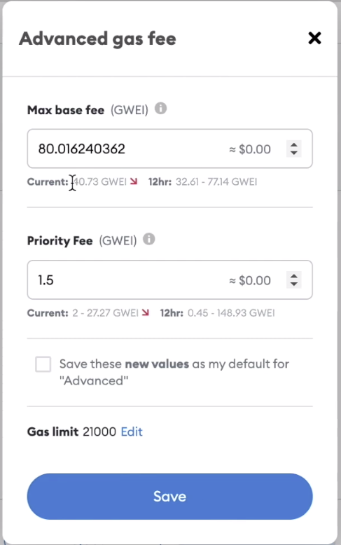

Now when we're trying to initialize the transaction from, say, metamask, we can see what those are here. The **max_fee_per_gas** is actually the <u>Max base fee</u> and the <u>Priority Fee</u> is **max_priority_fee_per_gas**. Now that might be confusing, but if you see the word priority inside of the variable, you know, it's referring to the **max_priority_fee_per_gas**. All right, that was really hectic. 


And now we have a third one that we're going to look at. There's also something separate to this called the **BASEFEE**. This is defined by the protocol, and it's not a part of what you put inside of your transaction. Let me just try to define this really quickly at a high level and then really dive into the details next. 

So **max_fee_per_gas** is the ***most*** gwei per gas you are willing to pay, independent of this other variable **max_priority_fee_per_gas**. So **max_priority_fee_per_gas** is a subset of **max_fee_per_gas**, this (指**max_priority_fee_per_gas**) is how much the miner might receive and **BASEFEE** is how much is definitely going to be burned. 

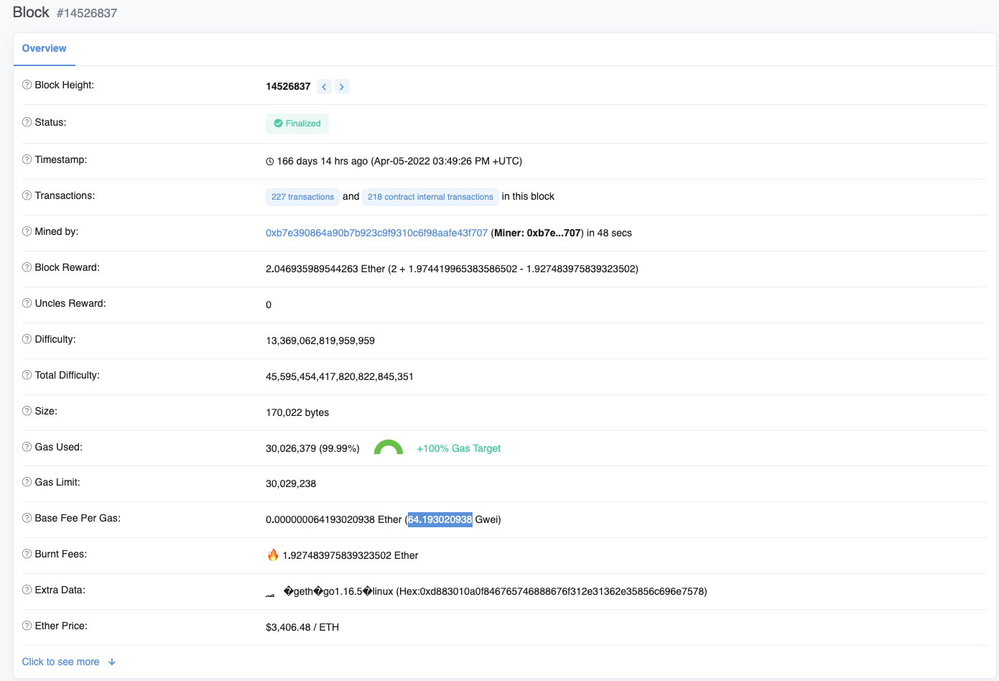

The **BASEFEE** is determined at the protocol level. So whenever you look at an Ethereum block like... here is block 1452... blah, blah, blah, you can see the **BASEFEE** as part of the header that would be... over here, over here at 64 gwei. 

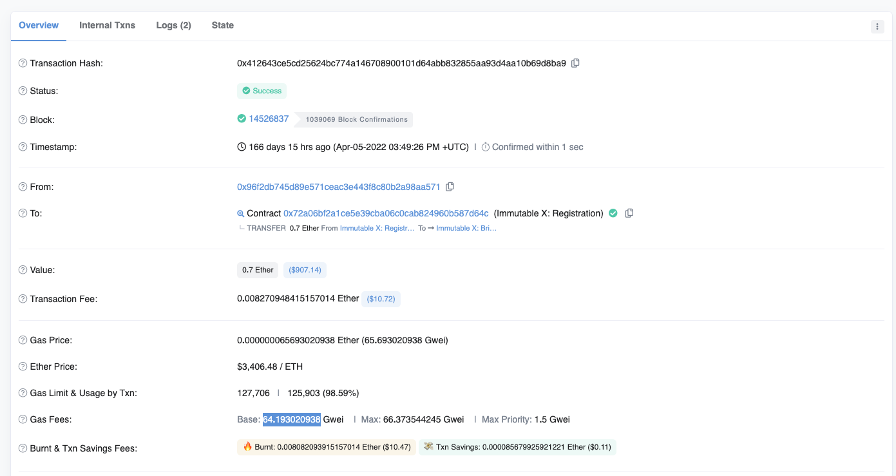

So every transaction inside of this block has to burn 64 gwei per gas. And that's what you're going to see if I just look at one of the transactions... here, here we can see 64 gwei again, and that's how much it burned. 

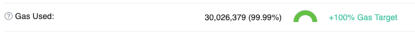

Now **the algorithm for computing it is done on the basis of how full or empty the last block was**. So over here, this block ([14526837](https://cn.etherscan.com/block/14526837)) was full. It was using up 100% of its 30 million gas target. 

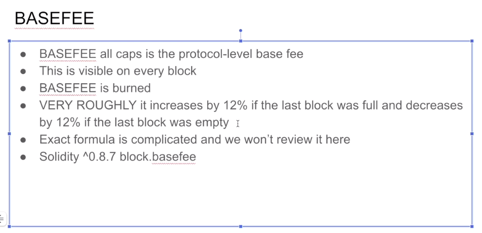

So the algorithm roughly states that if it's full, increase the **BASEFEE** by 12% and if it was empty, decrease it by 12%. Now, of course, it's definitely more complicated than that. If you want the actual specifications for that, it's this algorithm over here, which I am definitely not going to step you through, so our 12% heuristic is good enough for now. Let's see that in action. We saw that this block was full, so we expect that the next block is going to have a **BASEFEE** that's 12% higher than 64 gwei. So if I put in 64 times 1.12, I should see the next block having a **BASEFEE** in the vicinity of 72. **<u>64.193 * (1+0.125）= 72.217</u>**

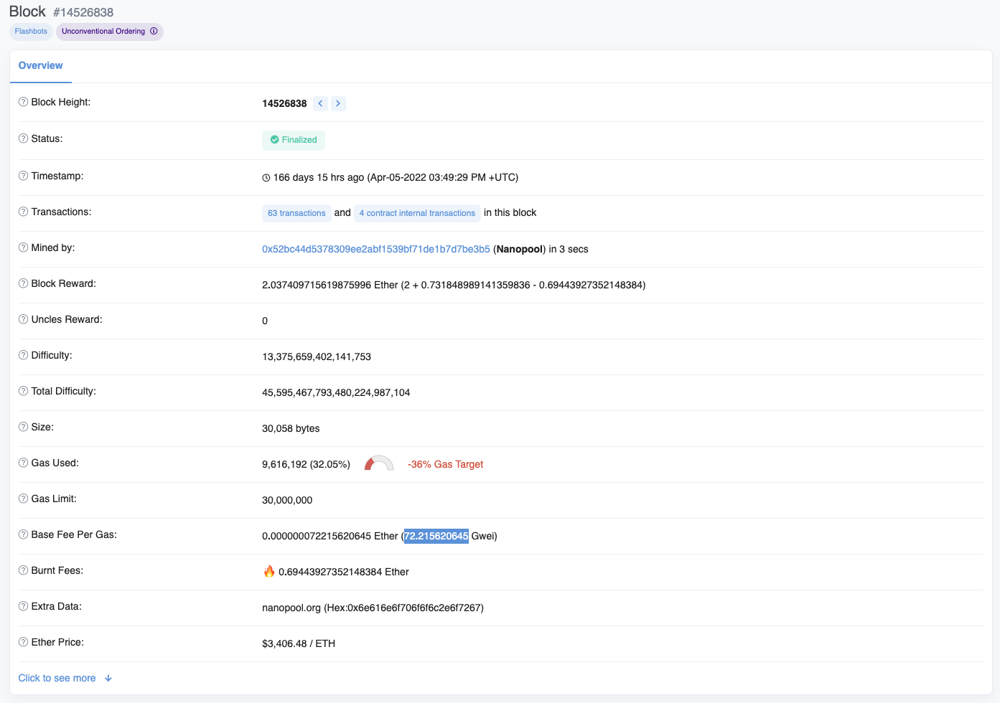

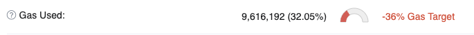

And that's what we see here, 72 gwei, over here the block was fairly empty, so we should see the **BASEFEE** drop by roughly 12%. 

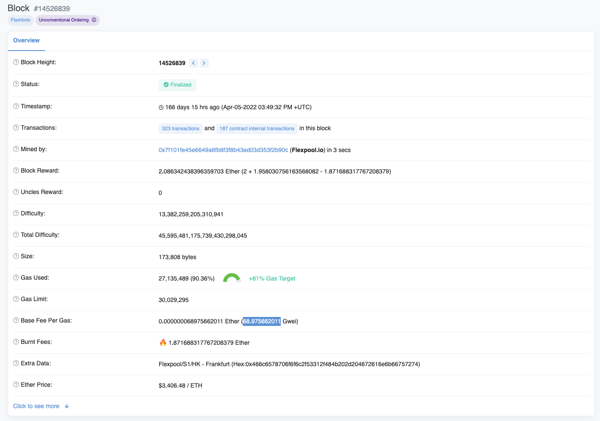

So let's multiply this by 0.88 and it should come back down to 63 gwei. **<u>72.2156 *(1-0.125) = 63.18</u>**

Okay with 68 gwei because the block was not quite empty, but you kind of get the point. By making the **BASEFEE** fluctuate with the amount of network usage that's intended to stabilize the transaction fees rather than it being purely determined by auction. Because this (指block.basefee) is inside of the actual block, you can access it with the **block.basefee** global variable inside of solidity if you're using 8.7 or higher. 

Like I said, <u>the **BASEFEE** is determined by the protocol, but you can specify something that kind of looks like the **BASEFEE** when you are initiating a transaction, which is the Max base fee (Metamask中叫Max base fee) over here, other people might refer to it as the Max Fee ([blocknative](https://www.blocknative.com/gas-estimator)中叫Max Fee).</u> And over here on Etherscan, it actually doesn't tell you what Max fee is people have been specifying.

Okay, in order for your transaction to go through, your <u>Max fee</u> needs to be bigger than the **BASEFEE**. What that ensures is that you actually have enough ether ready to be burned in order to put the transaction through. But you notice that the **BASEFEE** changes with every block. So that's why you need to generally specify a <u>Max fee</u> that's higher than **BASEFEE** with some margin of safety. Because if the next block has a higher **BASEFEE**, then your transaction fee won't be high enough. That's why I was able to say earlier that the gas price per gwei is less than or equal to the Max fee. 

Now, if your <u>Max fee</u> is bigger than the **BASEFEE** and we'll talk about how the <u>Priority fee</u> will influence this in a second, but the difference between those is refunded to you. So that's why we can say gas price per gwei is less than or equal to the Max fee. 

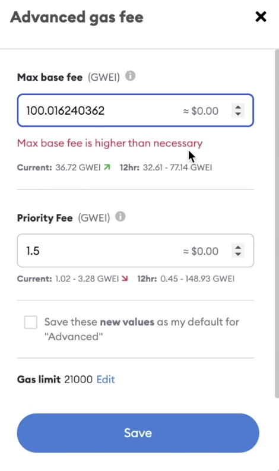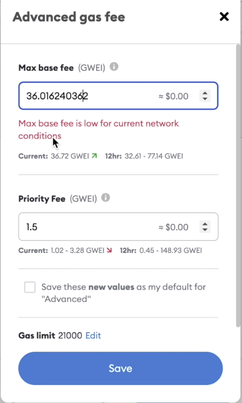

You can actually see all three variables at play when you try to use the Advanced gas fee feature of Metamask, over here it's saying recently the block basically has been around 40 gwei. So if I put in something like 100 gwei, it's going to say the <u>Max base fee</u> is higher than necessary. That's because it's really unlikely that the ~~block fee~~ **BASEFEE** is going to climb from 36 to 100. But if I specify exactly 36, then it's going to say the Max base fee is low for current network conditions because there is a very real risk. 

Well, let's say 37 because technically it's 36.7 here. But even though I have specified a Max base fee larger than 36, this is cutting it to close. There's a good chance that my transaction won't go through unless the block  **BASEFEE** goes down in the near future. And even as I'm recording this, I can see that the **BASEFEE** has increased. So if I had specified 37, it's definitely not going to go through. But if I specify it at something like 50, then there is a margin of safety and Metamask thinks, okay, this transaction is going to go through. Now let's discuss the Priority fee.