Now let's talk about the Priority Fee.

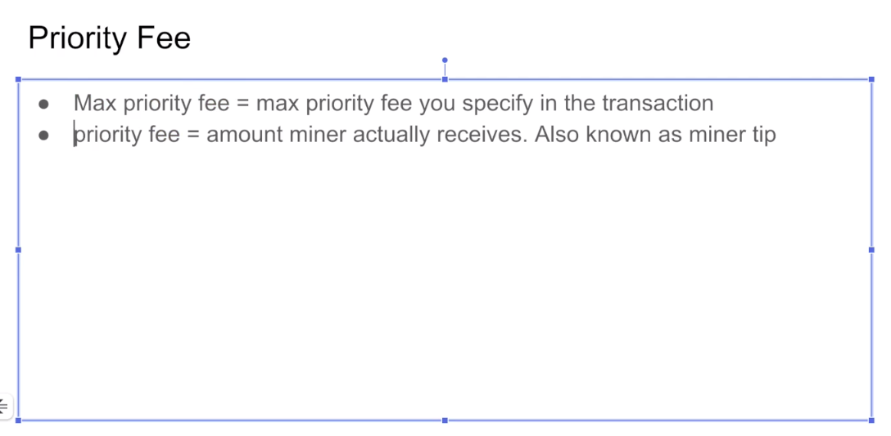

Unfortunately, there is a bit of a misuse of terms between the Metamask and the actual EIP specification. When you are creating a transaction, you can specify the **max_priority_fee_per_gas**. However, the max priority fee is not actually equal to the priority fee (他这里就是单纯指slider里的priority fee,也就是miner能拿到的小费，并不是metamask中的那个Priority Fee) . The max priority fee is the most that you're willing to give to the miner out of what's left when the Max fee (应该是Max base fee) gas is subtracted with the **BASEFEE**. 

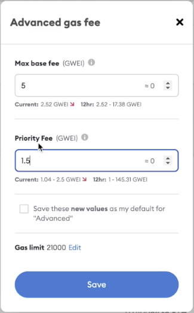

So when I specify a transaction here and let's make the <u>Max base fee</u> 5, I'm saying up to 1.5 of this (指Priority Fee) , these gwei per gas can go to the miner. **Metamask calls this <u>Priority Fee</u>**, but this is actually max... what do they call it here? But this is actually **max_priority_fee_per_gas** in the specification. Oh, well, sometimes this is known as a miner tip, so this is what the miner will get.

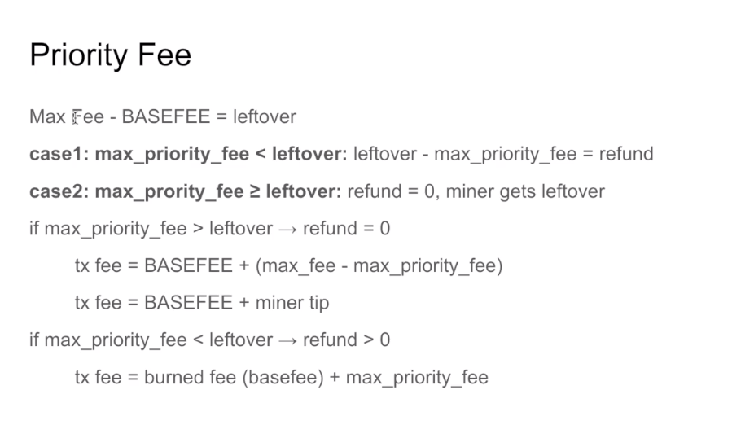

Now, let's... let's see the math here. As I said, when you take the Max fee subtract the **BASEFEE**, you get what's leftover. Now, there are two things that can happen. What's leftover is greater than the max priority fee. And in that case, let's look at that thing I was doing in Metamask earlier. 

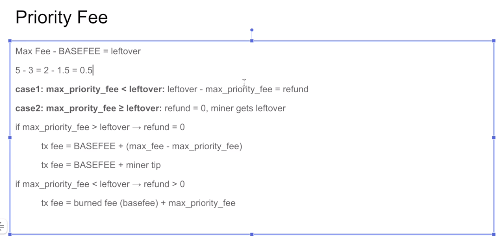

We had 5 specified as a Max Fee. Let's say that the **BASEFEE** was 3, that means we're going to have 2 gwei per gas leftover. Now the miner can take up to 1.5 out of it based off the values I was putting. And that means the refund will be 0.5 gwei per gas. 

We'll look at some more examples, here you can see the two situations. One is where the max priority fee is less than the leftover. So here the max priority fee is less than the leftover (1.5<2) . So a refund is issued to us. 

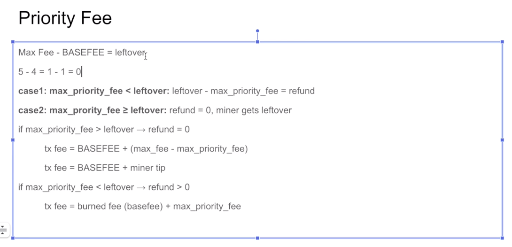

But let's say that the max priority fee was actually greater than the leftover. So if the BASEFEE was 4. This would be 1. And you can't get a negative value here. But what would happen is the miner would only get 1 gwei and then there's no refund. 

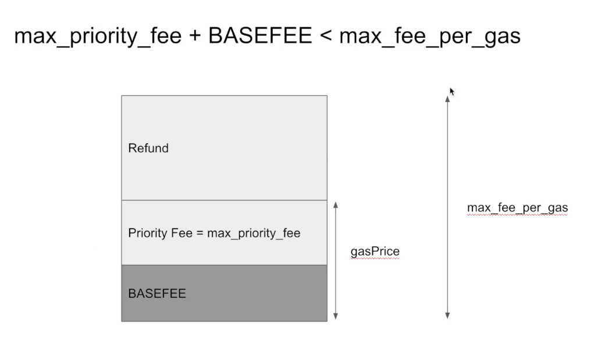

Okay, let's see this with pictures. You specify the **max_fee_per_gas** and this is the most you are possibly going to pay, if the **BASEFEE** plus the max_priority_fee is less than the **max_fee_per_gas**. This is the gasPrice you will pay and a refund is issued to you. 

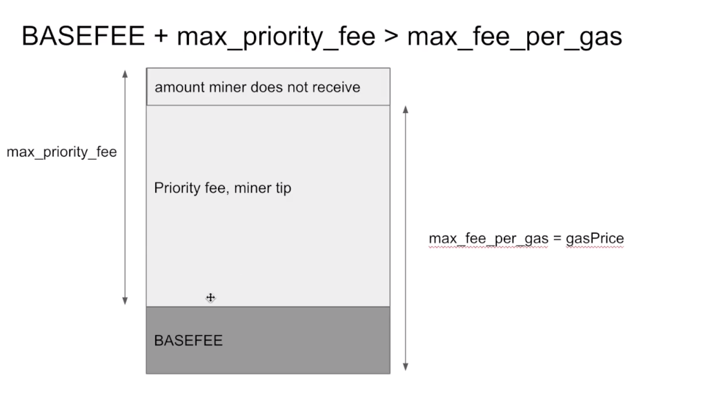

And the other situation where the **BASEFEE** plus the max_priority_fee is greater than the **max_fee_per_gas**, then during the execution, the miner will get the priority fee which is less than the max_priority_fee, and the **BASEFEE** is burned just the same in either transaction.

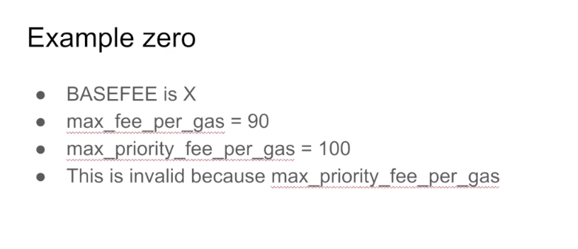

Okay. As we said earlier, if you enter the values like this, it's not going to work. 

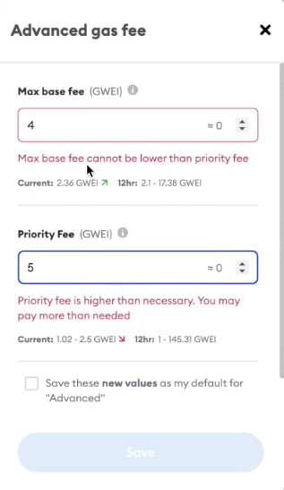

So let's do that in Matemask to see this failure in action. If I specify a <u>Max base fee</u> of 4 and a <u>Priority Fee</u> of 5, then it's going to yell at me because the <u>Max base fee</u> cannot be lower than the <u>Priority Fee</u>. The <u>Priority Fee</u> is a subset of the <u>Max base fee</u>. 

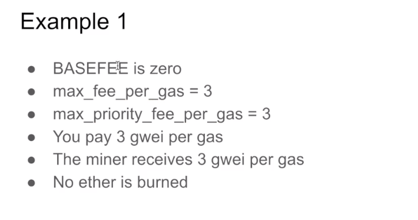

Okay, if the **BASEFEE** is zero which would never be the case but let's say it was, if the **BASEFEE** were 0 and the **max_fee_per_gas** is 3. The **max_priority_fee_per** gas is 3, then the miner is going to take up the entirety of the **max_fee_per_gas** right? Because you said the miner can take up to 3, but the most you're willing to pay is 3, and since the **BASEFEE** is 0, the miner is going to take all of it. 

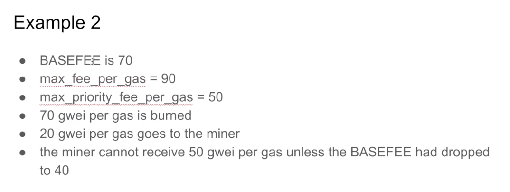

Here's a more realistic example. If the **BASEFEE** is 70, 70 will get burned, and if the max_fee is 90, after the burning 20 will be left. If you say the miner can take up to 50, well, the miner can't take 50 because only 20 is left. So the entire 20 will go to the miner and you will not get a refund. The only way the miner could have actually received this full amount is if the **BASEFEE** had been 40, in which case 90 minus 40 is 50.

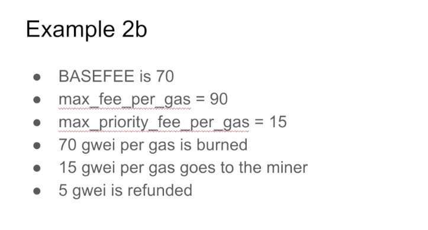

Let's look at the refund case. If the **BASEFEE** is 70 and the **max_fee_per_gas** is 90, what's left is 20. But if we had said the minor can only receive up to 15 gwei per gas, then 15 will be given to the miner and 5 will be refunded.

Whenever the miner has the option two, they're always going to take as much of the **max_priority_fee_per** as possible. 

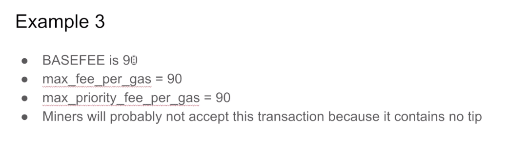

And let's look at this case. This one's a bit of a corner case. If the **max_fee_per_gas** is 90 and the **BASEFEE** is 90, then there's no way for the miner to receive a tip. It doesn't matter how much you set the **max_priority_fee_per** to, in this situation, the miner is won't accept the transaction because they want to be paid tips. 

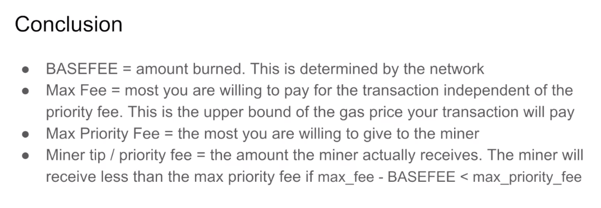

Okay, here's the conclusion. The **BASEFEE** is the amount burned and this is determined by the network. This is independent of what the miner wants and what you put inside of Metamask. The Max Fee is the upper bound of your transaction cost. So regardless of what you set as the <u>Priority Fee</u>, you know the most amount of  Ethereum that is going to leave your account as a result of the transaction fee. The max priority fee is the most that you are willing to pay to the miner. Most of the time the miner will receive the full max priority fee. But if the **BASEFEE** is very high relative to the max fee, there won't be much fee left for the miner to actually receive. And in that case, the actual priority fee they receive will be less than the max priority fee.