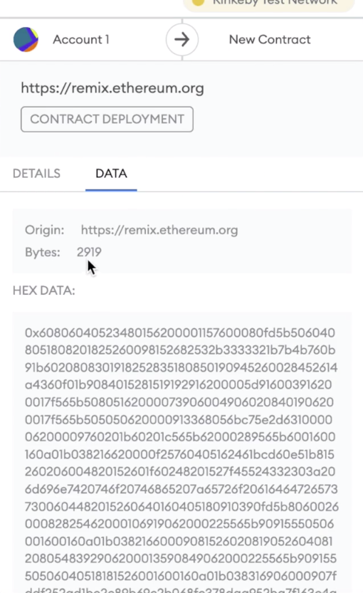

We are now ready to discuss the optimizer. Now, I'm sure you are already familiar with the optimizer and have likely used it before, but to really cover all of its nuances, we needed to cover all of the material that we've covered so far. 

The optimizer will do one of two things, depending on what you optimize for. One is the deployment size of the contract, and the other one is how expensive it will be to run a particular function after the contract is deployed. Here is the relevant part from the [solidity documentation](https://docs.soliditylang.org/en/latest/internals/optimizer.html#optimizer-parameter-runs): "The number of runs specifies roughly how often each opcode of the deployed ~~contract~~ code will be executed across the life-time of the contract. This means it is a trade-off parameter between code size  and code execution cost. A 'runs' parameter of '1' will produce short but expensive code. In contrast, a larger 'runs' parameter will produce longer but more gas efficient code. The maximum value of the parameter is $2^{32}$-1 ".


First, let's understand what is meant by the "deploy cost". A smart contract on the Etherium is really just a long sequence of bits. And on the screen here, it's represented as hexadecimal. This is the **doNothing** function from earlier. So remember when we were looking at PUSH 80, PUSH 40 MSTORE PUSH 0x04 CALLDATASIZE. But what's actually stored on the blockchain is this (指60806040...) , we can actually see that this 60 corresponds to PUSH, this 80 corresponds to this 80 over here, and this 40 corresponds to the 40 over here, and 52 corresponds to MSTORE, so remember this table saying MSTORE has the opcode of 52. So the more opcodes that you have the longer that this... this byte string is going to be and the more expensive it is going to be to deploy it. 

```solidity
// SPDX-License-Identifier: MIT

pragma solidity ^0.8.0;

import "@openzeppelin/contracts/token/ERC20/ERC20.sol";

contract Coin is ERC20{

    constructor() ERC20("ElvinsJCoin", "EC") {
        _mint(msg.sender, 100 ether);
    }

}
```

So let's see that cost in action with the help of the optimizer. I've created a coin named after myself over here that I'm going to deploy. First, I'm going to turn off the optimizer. Then I'm going to compile the contract. 


And then I'm going to deploy it. But I'm not... I'm going to attempt to deploy it to the Rinkeby test network so that Metamask will tell me how big it actually is. So when I hit deploy, look at the data that's actually being sent, it says that there are 6160 bytes that would be stored on the blockchain if we were to deploy this ERC20 token. Okay, that's a lot of bytes and we have to pay gas for each one. So you can imagine that deploying a smart contract can be quite expensive. I'm sure you know this from experience. 



Now let's turn the optimizer on and set it to 200. This is the default value actually. So I compile and then I deploy. And now I see that the bytes has dropped all the way down to 2919. Well, that's a lot of savings. Whatever the gas costs it was earlier, this is less than half of it. Okay, that's pretty cool. 


Well, what will happen if I set the optimizer to 10,000? Now it's going to be 3587. The interesting thing here is that when we **increased the optimizer runs** the size of the smart contract, the deployment size actually went up. **That is because the more runs you set for the optimizer, it's optimizing for execution cost and not for code size which would be the deploy cost**. 

Okay. **If it costs us more to deploy with 10,000 runs instead of 200 runs, why would we ever pick 10,000 runs**? Well, there's the deployment cost and then there's the execution cost. Let's see how much a ERC20 transfer is going to cost us under each of these three circumstances. So for that, I'm just going to deploy it to the local environment and I'm going to turn off the optimizer. So I compile and I deploy. Now this is programmed to mint 100 coins to the address that deployed it. So when I actually try to interact with the smart contract, what I'm going to do here is transfer. Well, first of all, let's get my account balance so that I know how much to transfer. I have this many, remember that there's 18 decimals after this, so that's why this number looks like it's a lot more than 100. So I'm going to transfer it... I'm sorry. 


I'm going to set the amount to this, and then I'm going to pick another address that I can transfer to, and then I'm going to transfer, the gas cost... here was 47,605. So for transfer with no optimization, this cost. 


Okay. Now, let's look at the circumstance where we enable optimization but set it to 200. So we compile this and we deploy it and we get our balance.  We'll get the other address and put it in here. In this situation, it costs us 46,814 gas. So that's an improvement. To speed things up, I'm just going to copy these values and redeploy this contract so that we can see what happens when the optimizer is set to 10,000. 


Okay, set the optimizer to 10,000, compile it, get rid of the old one, deploy and transfer to the other address for this amount. In this situation, we can see that the gas cost went down again. With 10,000 runs, we saved a little over 100 gas. 

Now, what you should do when you're deploying your own contracts is figure out how high you can go until this number stops improving for the relevant functions. For a very heavily used defi app that has a lot of code in it. Suddenly optimizer quite high can be very beneficial. So this is the Uniswap V3 router and you can see that they've set it to 1 million. That's because they correctly predicted it, that it would be used 5 million times, millions of times. So the higher you set the number, the better. 

By default, most software like HardHat or remix sets the default to 200, which, all right, that's reasonable if you want to cut down on the deployment costs. But your users are going to be less happy because you're making your deployment cost cheaper, but making the long term cost for your users more expensive. So it's actually a pretty sad state of the blockchain that 200 is the default because there's a lot of gas that could otherwise have been saved that isn't being saved just because the wrong default is being supplied, in my opinion. So the take away from this is set the optimizer level as high as possible until you stop seeing improvement and you should really only set it to a lower value if you're very sensitive to the deployment cost.