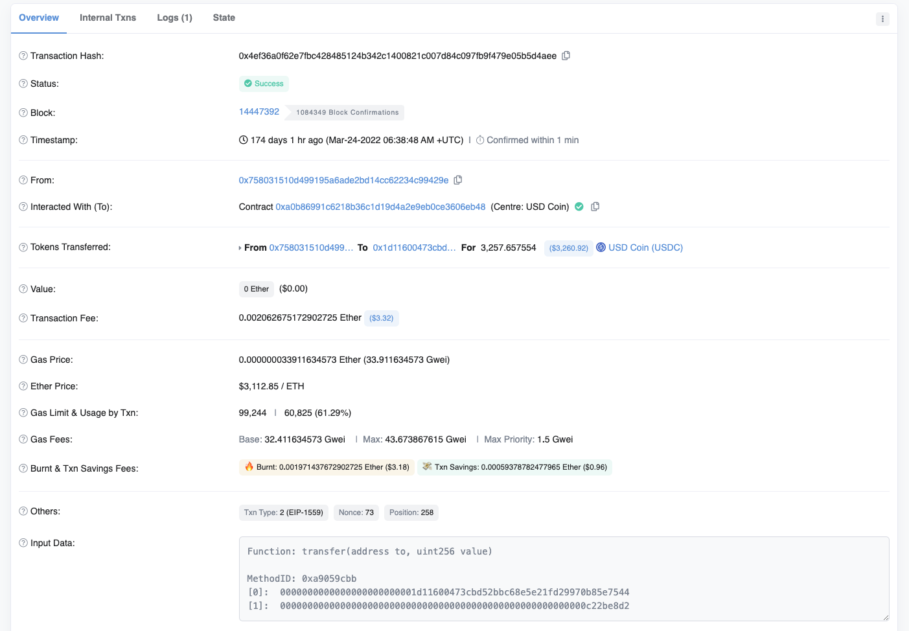
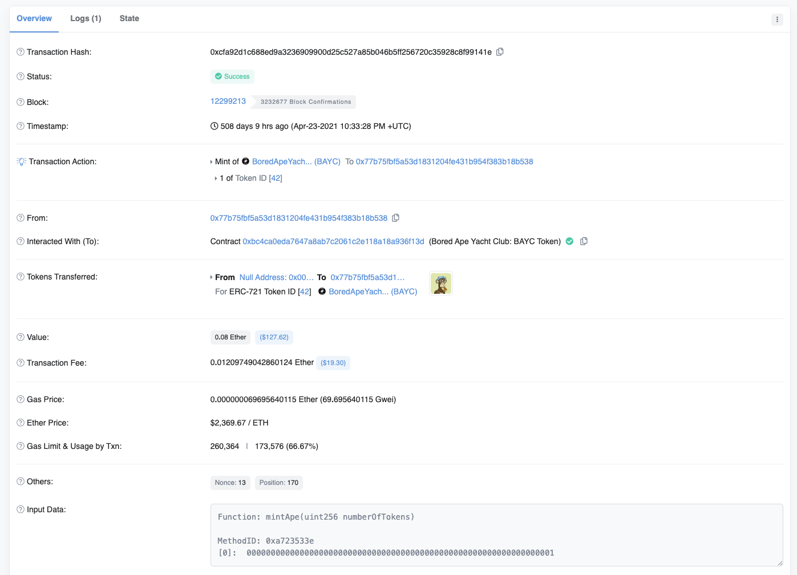
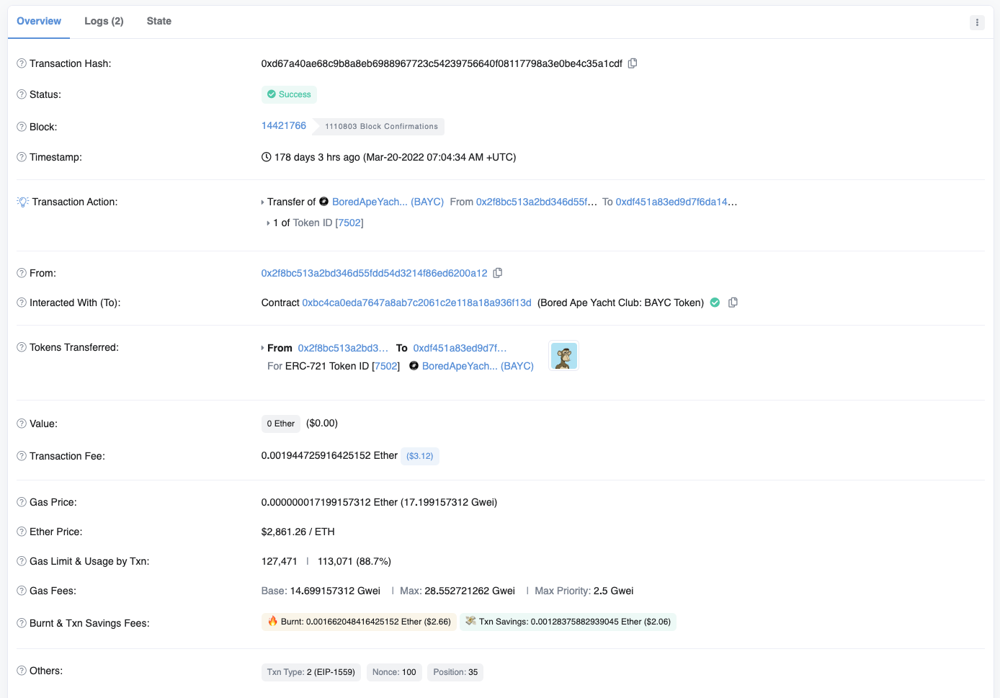
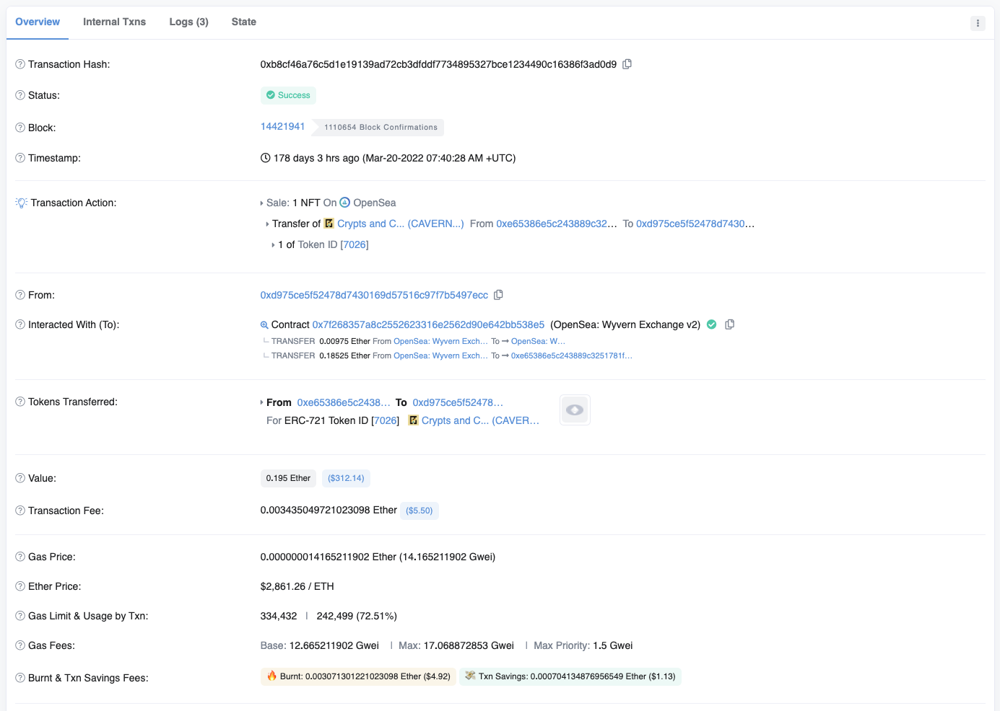
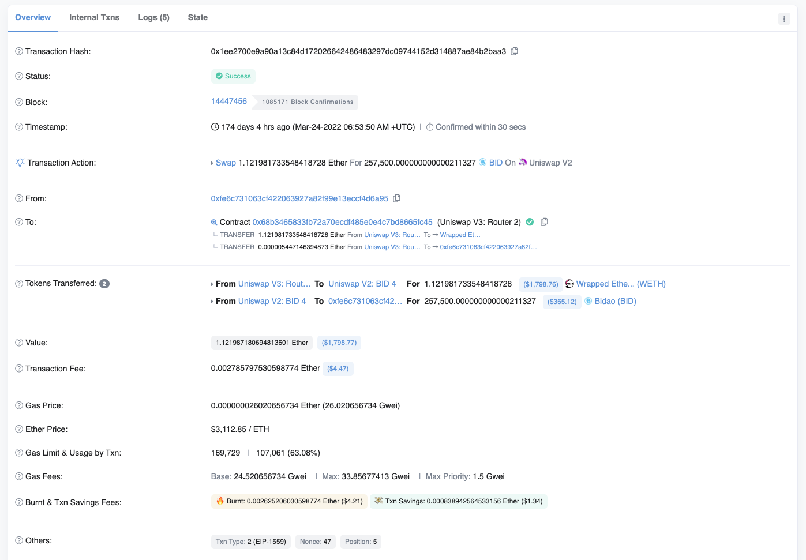
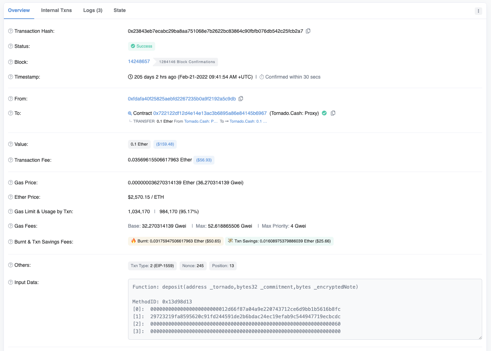

You can think of gas as measuring a unit of computation or very roughly how many CPU cycles it takes to execute a certain computation. So we're going to look at different smart contract interactions and see how much gas they require, so that you can start to get an intuition about how transaction complexity and gas costs are correlated with each other.

0x4ef36a0f62e7fbc428485124b342c1400821c007d84c097fb9f479e05b5d4aee

The first thing we're going to look at is transferring and ERC20 token. So over here I'm looking at the USDC stable token transferred from this address to this address, they sent about $3,000 worth of these tokens. The gas used by this transaction was 60,000 gas. Again, note that gas limit and gas usage are different. As I mentioned in the last video, I'll be describing what gas limit is later, but this is how much was actually used by the transaction, 60,000 gas. This is about three times as expensive as transferring Etherium and this probably matches your experience. You've noticed that sending an ERC 20 token costs more than transferring Ethereum. Here you can see why, because the gas used by the transaction is almost three times as much. So this is for a simple ERC20 token transfer, something you may know as being more expensive than transferring ERC20 is minting an NFT.

Over here, I have looked at the **Bored Ape Yacht Club** Smart contract, and this is a past transaction when somebody minted the token, so somebody minted token number 42 to this address and paid 0.08 ether. But the actual gas that was required to execute the transaction was about 173,000. Now, 173,000 is much larger than 60 (指第一张图里的gas usage 60,825). And the reason for that is that minting an NFT requires more computation than transferring an ERC20 token.

0xd67a40ae68c9b8a8eb6988967723c54239756640f08117798a3e0be4c35a1cdf

Okay, let's look at transferring an NFT from one address to another. Over here, somebody transferred a **Bored Ape Yacht Club** from this address to this address and used 113,000 gas in that transaction. So this is cheaper than minting an NFT, but it's still more expensive than transferring an ERC20.

0xb8cf46a76c5d1e19139ad72cb3dfddf7734895327bce1234490c16386f3ad0d9

Let's look at another one. Over here, I'm looking at the Opensea smart contract, over here, somebody purchased a token from this collection (指Crypts and C..). The cost of this transaction was 242 gas, again we can see here that purchasing from Opensea is sometimes even more expensive than just minting an NFT.

Now, why is that? Well, that's because Opensea has to run a bunch of checks to make sure that the transaction will go through the right amount of ether is paid and so forth and so on.

0x1ee2700e9a90a13c84d172026642486483297dc09744152d314887ae84b2baa3

Another common interaction is swapping ERC20 tokens. Over here, I'm looking at uniswap. Let's try to find a transaction that has actually confirmed. Here we see somebody swapped ether for some coins. Let's see how much the gas cost was. They paid 107,000 gas for this.

Now, remember, I'm talking about units of computation here, not the absolute price in dollars, because that will change based of the gas price and the cost of ether at the time.

0x23843eb7ecabc29ba8aa751068e7b2622bc83864c90fbfb076db542c25fcb2a7

Now, let's go to the final thing I want to look at, which is the **Tornado Cash** application. So if you're not familiar with **Tornado Cash**, it's a way of obscuring the transfer of ownership of Ethereum. So a bunch of people send their Ethereum to a smart contract address along with a zero knowledge proof that it really was them who sent it. And when they want to withdraw it at a later date, they submit their zero knowledge proof. And that checks out about how much ether they're able to withdraw because of the nature of zero knowledge proofs you can't track.

Okay, this deposit is associated with this withdraw, but zero knowledge proofs and all the cryptography that the **Tornado Cash** application needs, in order to run securely is quite expensive. So when we look at the gas used by a transaction for depositing, it actually costs almost a million gas which is quite a bit higher than the other applications that we looked at earlier.

Now, you can kind of get a sense about the relative costs of executing different smart contract interactions. You see why transferring ether is the cheapest thing you can do on Ethereum whereas interacting with different smart contracts varies depending on the complexity of that transaction.