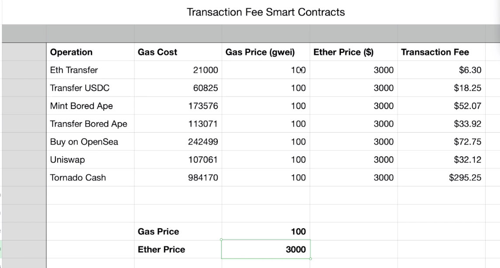
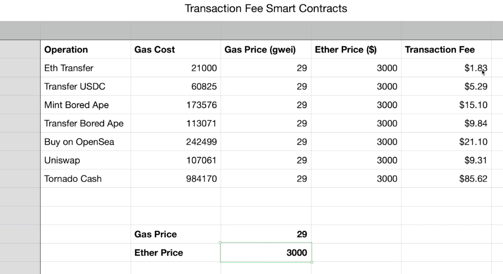
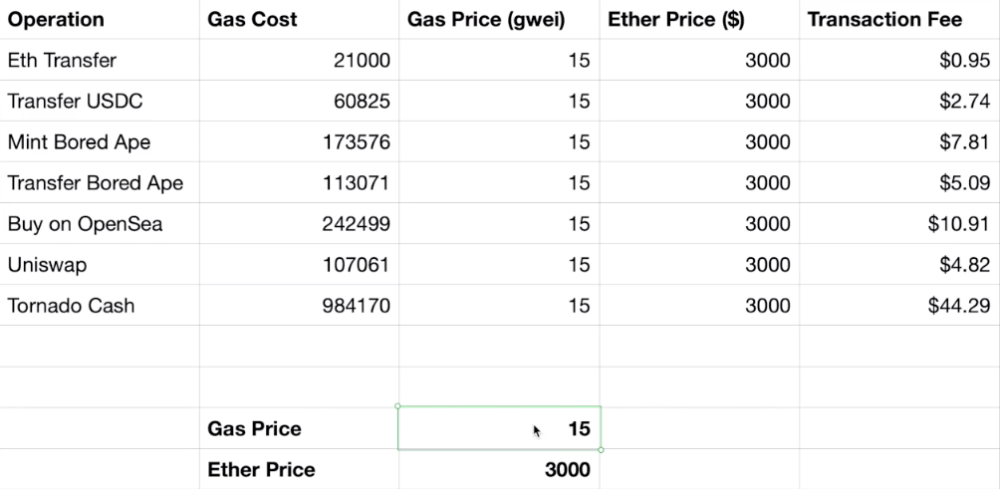
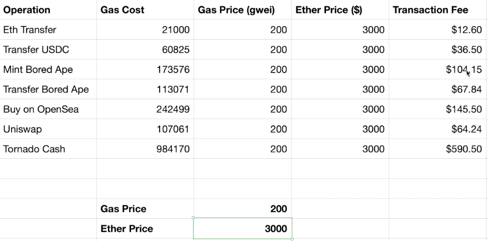
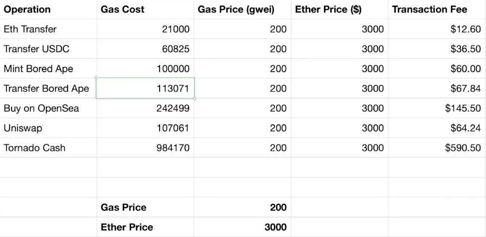

To help you get a better intuition about what all of those gas prices are from the smart contract interactions we looked at earlier in terms of dollars. Let's look at the formula again and calculate the transaction fee. So the amount in dollars that you are going to pay for a particular Ethereum transaction will be the gas cost times the gas price times the ether price and divided by 1 billion.

And remember, we got this gas cost by looking at etherscan. We got this gas price just by, well, looking at what the gas price was at the time of the transaction. But if we want to know what it is right now, we can just look it up on a website that provides the information like here (https://cn.etherscan.com/gastracker). And we can see that it's about 27 to 29 gwei right now. So the ether price is something we can look up on our favorite financial website, whatever that is. 

And let's see how much these transactions would cost if we were to execute them right now. So right now, Ethereum is roughly 3,000 dollars and the gas price is 29 gwei. So if I was to do an ether transaction at the moment that prices were these values, then it will cost 1 dollar 82 cents. Minting NFT like the Bored Ape would cost 15 dollars and using one of these defi applications would cost between 9 and 85 dollars.

Now, at sometime in late 2021, when Ethereum was around 4,000 dollars and the network was under heavy use and could sometimes hit 200 gwei pretty commonly, the prices looked more like this. And these may be numbers that some of you are familiar with.

Oh, yes, I remember minting an nft for 100 dollars or so. That makes sense, right? And if you've been using a Ethereum for a long time and remember the days when it only costs 200 dollars and gas price was, let's say, maybe 20 gwei or so, then the Ethereum transfer would cost 8 cents.

So that's how you can see where these numbers are coming from. The gas cost of Ethereum transfer hasn't changed. It's been 21,000 this whole time, but the transaction fee changes pretty dramatically depending on what the demand for gas is at the time and with the Ethereum prices. So look, when Ethereum price goes from 200 to let's say 2000, then the transaction fee goes from 8 cents to 84 cents.

And during a time of congestion, when this Ethereum network can hit 100 gwei pretty easily, then it goes from 84 cents to 4 dollars. In my experience, this gas price is the most volatile variable of all of them because it can be as low as 15 gwei at night time when people are not using it to as high as 200 or so, and that causes, well, let's see, the before and after. 

So during a current period, it's about 15 gwei. So even at, let's say, current prices, it can cost less than a dollar to transfer Ethereum.

But if there's a network surge, then that's going to jump from, the ether transfer will jump from 1 dollar and the mint cost from 7 dollars all the way up to 12 dollars and 100 dollars. But that's not to undermine the purpose of this course. We can't just hope that the gas prices lower if hope is not a strategy, right?.

We want to look at how can we make these numbers lower because this can still lead to a lot of savings for our users. Let's say we're under a congested period and we have an NFT contract that costs 173 gas to mint. Well, what if we could lower it to 100 gas, which is quite doable. Then the transaction fee would drop from 104 dollars to 60 dollars, that's 40 dollars of savings, which is quite substantial.