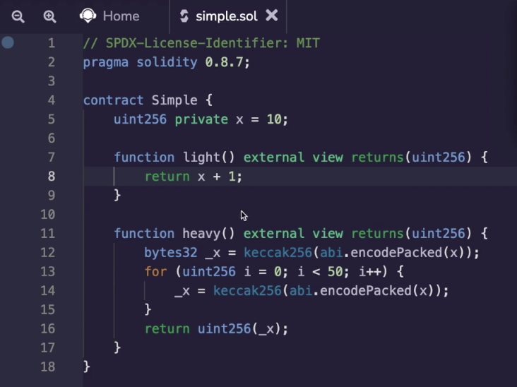
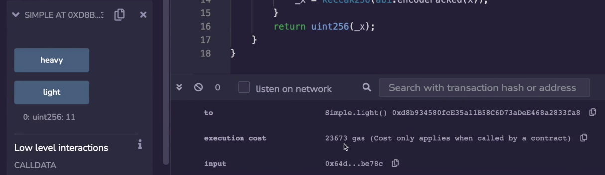
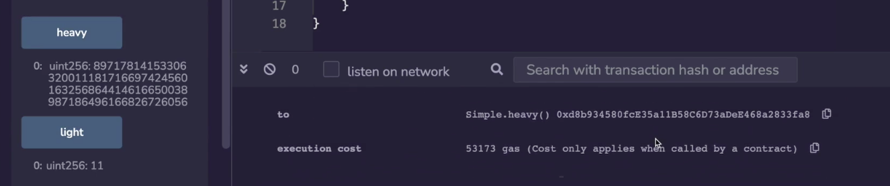

I've been saying that heavy operations cost more gas and that light operations cost less gas. And I pointed to different smart contracts and made an estimate about how complicated their operations are. But let's try to make it a little bit more reified by looking at an actual smart contract which you can very clearly see has a different computational cost depending on which function you call.

Over here we have a storage variable x which has a 10 and the light function just takes that variable out of storage adds 1 and returns it. The heavy operation will take the value x, take the hash of it, and for 50 times take the hash of it over and over again and then return the you uint256 the value of that hash.

You can imagine that this operation will be much more expensive in terms of gas compared to light. So let's see that in action, having to compile it and deploy it and let us call the light operation.

And the execution cost is 23,673 gas. This cost more than a transfer on a Etherium because all transactions on a etherium must cost at least 21,000 gas. So in addition to the transaction cost, which is 21,000 gas, we're paying an additional 2000 plus in gas.

Let's see how much the heavy operation costs. And here we can see that the execution cost is much higher at 53,000 gas. So there is over 30,000 gas associated with running all of these hash functions. Intuitively, if I hash half as often, hash half as many times, then the gas costs should go down by roughly half, plus the transaction cost, right?.

So let's see that in action. We'll deploy the smart contract to play this one and run heavy again. And heavy this time costs us 38,000 gas. So quite a bit of gas disappeared because we passed it a lot fewer times.