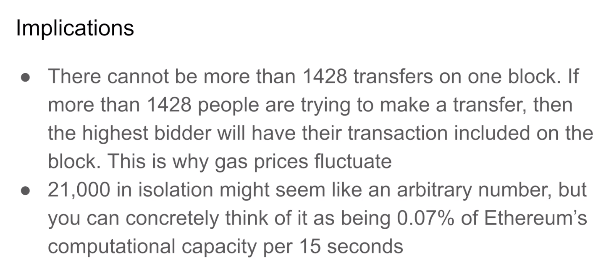

To understand gas costs, it's important to understand the block limit. 

Now, historically, Bitcoin has limited each block to 1 megabyte, and the rationale for that is if the block is too big, it may become too expensive to store or to synchronize with other nodes across the world. Ethereum does not place an explicit byte limit to its block size like Bitcoin does. It actually limits the total amount of computation or gas that can be stored in a single block. The sum of all the gas costs of all the transactions in a single block needs to fall below a certain number. And that's how Ethereum limits its block size.

The rationale for this is if the block gas limit is too high, then the network might stall. So let's say someone did something silly, like do an aerodynamic simulation inside of a smart contract. Well, the nodes that are running this would get completely stalled out as they are trying to verify the transaction and everything would come to a stop on Ethereum. So to prevent this from happening, if a transaction turns out to require too much gas, that transaction will actually get pre-emptively reverted.

At the time of this recording, the block limit is 30 million gas. And if we do a little bit of math, we can see that we can fit 1428 transfers on a block, knowing that each transfer cost 21,000 gas. That's 30 million divided by 21,000. But that's for very light transactions that are only moving Etherium around. What if people were using something heavier like Tornado Cash, which costs almost a million gas per transaction? Well, 30 million divided by a million is 30. So the throughput of Ethereum would go down quite a bit. 

Throughput is measured in transactions per second, and a new block is generated every 15 seconds on Ethereum. So in the most extreme case, if everybody is using Tornado Cash and it costs a million gas per transaction, we're only going to fit 30 transactions on a block and that's 30 transactions every 15 seconds, which translates to 2 transactions per second. And if we do the same math in the case where people are only doing Ethereum transfers, Ethereum could theoretically do 95 transactions per second.

Of course, in reality it would fall somewhere between that and recently Ethereum has been doing about 13 transactions per second at the time I'm recording this.

Now, this gas limit is necessary to keep the Ethereum network running smoothly, but it has a side effect that there are more people trying to make transactions than there are space on the block for. That's why we have gas warries and why the gas price fluctuates. It also helps us put into context 21,000. Okay. 21,000 in isolation just might seem like an arbitrary random number, but you can think of it as a percentage of what Ethereum can process over the course of 15 seconds. And it helps you understand how, quote, unquote, larger transactions are in a relative sense to Ethereum of capacity.

It's also important to note that this limits the size of your transactions, it's not just for preventing people from doing aerodynamics simulations, it also has the effect that you will not be able to, in a single transaction, say, transfer any ERC20 token to 5000 different holders in one transaction, that's just not going to work, right? There isn't enough gas limit in a single block for you to do that.

And I'm being a little cheeky here. But if you, if more people take this course and apply what they learn, then smart contract interactions will be smaller and the overall speed of the network will increase because the smaller transactions means more transactions can be found on a single block and that increases the transactions per second.

Okay, I am being a little goofy there, but you are being a good citizen if you make your smart contracts efficient because if your users are submitting large transactions to the Ethereum blockchain, then that creates a negative externality for other people because now they have to bid higher to get their transaction to fit inside of the block.

It's, Ethereum does not make 30 a hard cap, there is a little bit more nuance to this, that number can change dynamically, you can look into exactly how it's computed if you care to, but it really doesn't affect how you design things. You shouldn't really be making transactions that cost a few million gas, that's just quite large.

But if you're curious, you can look up the details. This number has changed over time. In the past, it used to be, I think, 12 and a half million gas and an even smaller number before that. Over time, the number has been increasing, but don't just rely on a future increase to make your smart contract viable. You want to design it around what the current limits are.