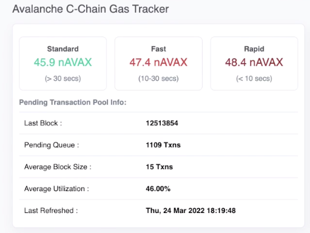
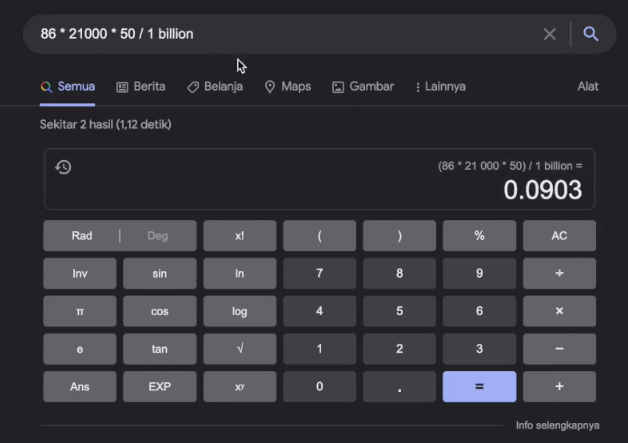
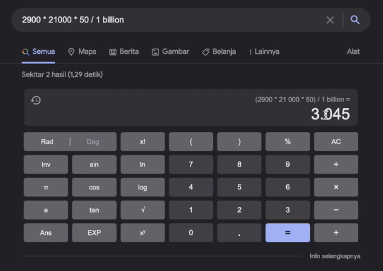

A reasonable question to ask is: do we really need to learn about smart contract optimization if we can just use a cheaper chain than Ethereum?

There are many Ethereum compatible alternatives to Ethereum nowadays, like Avalanche, Polygon, Binance Smart Chain, Fantom, Harmony, I can't keep them all in my head at this time. There's a lot, but if we can just use one of those, what do we need to study gas optimization techniques for?

Well, the first important thing to understand is that each of these chains, like Ethereum, has a gas block limit. This limits how large a transaction you can put on it. So you need to at least be able to size your transactions to make sure that they're going to fit inside of the block. But the other thing to keep in mind is that a new chain may come along and advertise that, okay, yes, we have better gas costs than Ethereum. But the underlying reason is not necessarily because the chain is more efficient, it's just because fewer people are using it.

So the gas prices lower simply because there's less demand to take up space inside of the block. One of Ethereum's most successful competitors at the time of this recording, which is Ethereum compatible, is Avalanche.

And we're looking at an avalanche gas tracker here, which is showing something like almost 50 gwei they call it nano ACAX, but that's the same thing as a gwei. 

What's interesting about this is if we compute the price, which is an avalanche, an avalanche costs about 86 dollars right now. So 86 times 21,000 times 50 divided by 1 billion is 9 cents, which okay, that sounds cheaper relative to Ethereum, but that's because 86 dollars is a lot less than what Ethereum costs right now. Ethereum costs something like 2900 dollars. So if we run this again, we'll see that 21,000 gas on avalanche costs about the same as it does on Ethereum, which can happen if the adoption on avalanche reaches the adoption that Ethereum has.

Now, I'm not knocking avalanche. It's, I think, a very good technology. But when you compare Ethereum to other chains, there are two things to keep in mind.

One is the level of adoption, because that's going to affect the gas price and the better chain is, the more adoption it's going to have which is going to drive up the gas price.

And two, I'm not going to name names, but some blockchains cheat and are not really decentralized so they can make the gas cost lower just by taking more control of the ecosystem, which of course, makes it more vulnerable to censorship. So it is absolutely worth learning how to optimize gas costs, even if you're going to use another chain. Because if you're able to predict what the next hot chain is, then at some point other people are going to catch up to your prediction, start using it and bid up the gas prices just like has happened on Ethereum.