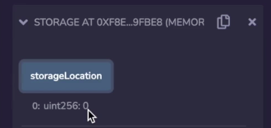
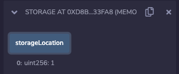
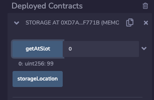

I want to give you an intuition about how storage addresses are determined in Etherium. Now, this is not going to be a complete tutorial. It's just going to be enough information so that we can keep going and get an intuition about how to understand the opcodes that are generated from the smart contract.

```solidity
// SPDX-License-Identifier: MIT

pragma solidity ^0.8.0;

contract Storage {

    uint256 private a;

 
    function storageLocation() external pure returns(uint256) {
        uint256 slotLocation;

        assembly {
            slotLocation := a.slot
        }

        return slotLocation;
    }

}
```

We have a storage variable **a** that we are curious about the address of and the storage, and we're going to get the slot location and return it. Now, regular solidity can't do this. You have to use a dialect of solidity called... ([Yul](https://docs.soliditylang.org/en/latest/yul.html)) %^&%&^^*@^*&#^* dialect of solidity, but it's a programming language that developed by Ethereum that's designed to be pretty close to the assembly opcodes. It's actually not technically assembly, I do think that this tag (指assembly这个关键字) is a little bit misleading, but it's pretty close.

What it's going to do is just look at **a** and get the slot of it, so you can read through the documentation if you're curious about how this works. But I'll just look at the variable and get the slot and store that inside of the variable **slotLocation** and then return that. 



So let's run it. When I execute this, I get 0 back as a result. Now let's try to get an intuition around where the 0 comes from.

```solidity
// SPDX-License-Identifier: MIT

pragma solidity ^0.8.0;

contract Storage {

    uint256 private b;
    uint256 private a;

 
    function storageLocation() external pure returns(uint256) {
        uint256 slotLocation;

        assembly {
            slotLocation := a.slot
        }

        return slotLocation;
    }

}
```



What would happen if I added another variable, **b**, up here and deploy and rerun this contract. Well, now I get 1. Okay, let's do this, have a third variable. Deploy that and I get 2.

Now you can think very roughly that the storage slot will be how many variables down it is, but that's not quite accurate. However, the important thing you want to come away from here is that the storage location doesn't change. These variables don't get moved around. So once you allocate a particular storage slot to belong to a certain variable, it does not get altered later on.

The reason why these addresses or slots matter is because this is how the Etherium virtual machine knows which value to access. When you say return C, B or A, that makes sense from a human perspective, but from the machine perspective, it doesn't understand whatever you named your variable, it only understands the location of that variable.

```solidity
// SPDX-License-Identifier: MIT

pragma solidity ^0.8.0;

contract Storage {

    uint256 private c = 99;
    uint256 private b = 31;
    uint256 private a = 2;

 
    function storageLocation() external pure returns(uint256) {
        uint256 slotLocation;

        assembly {
            slotLocation := a.slot
        }

        return slotLocation;
    }

    function getAtSlot(uint256 slot) external view returns(uint256) {
        uint256 value;

        assembly {
            value := sload(slot)
        }

        return value;
    }

}
```



So if we say **getAtSlot** 0, then it's going to return 99 because in the 0 with slot we have 99. If we enter 1, then we're going to see 13 come back. So that's the same as if we had said return B, but the compiler is going to turn "return B" into "return whatever is stored at slot 1". And the same thing will happen here, If we put 2 in, then we're going to get the storage value at 2, which is 2.