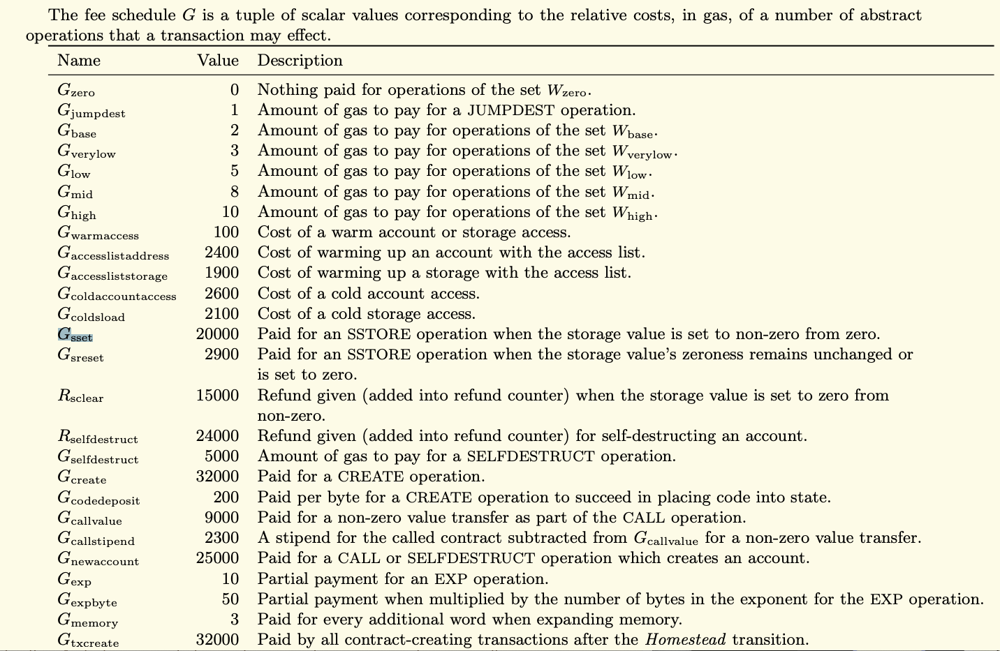
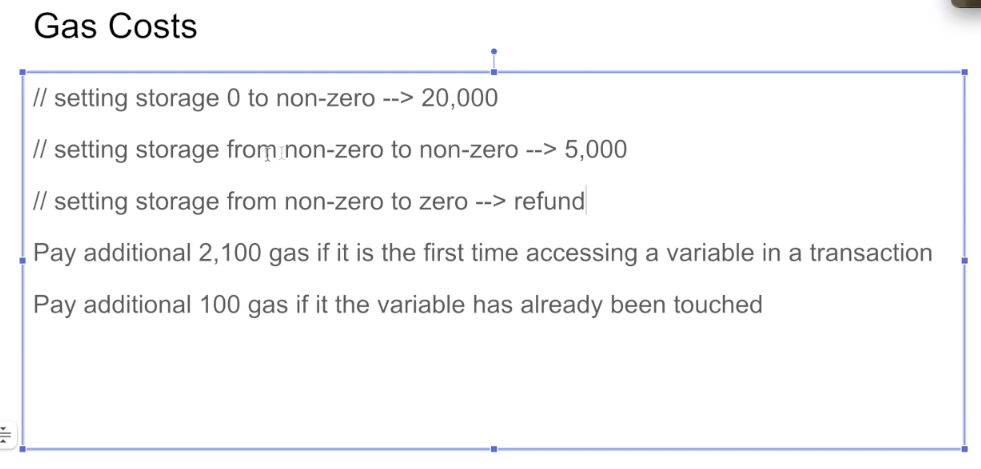
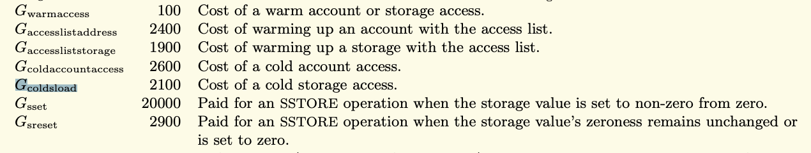
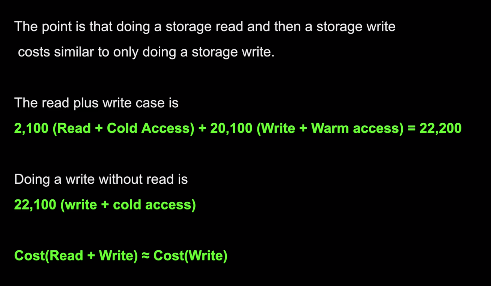

Now let's try to understand the gas costs associated with storage. This is probably one of the most important videos inside of this course. So definitely make sure that you understand it. 



Because when you look at the gas cost of storage from the yellow paper, you'll see it costs an order of magnitude more than almost everything else. So this is a SSTORE opcode that we looked at. The other ones that cost a lot... are for one initializing a transaction ($G_{transaction}$ 21,000) and for creating a smart contract ($G_{create}$ 32,000) which you can imagine is expensive and you probably know that by experience.



Storing variables inside of storage is a frequent operation, so it's one that we want to manage carefully. When you set a storage variable **from zero to non-zero**, it's going to cost **20,000 in gas plus extra cost** that I'll discuss in a little bit. When you are just **changing the value**, it costs 5,000 dollars... **it costs 5000 gas**. And when you are setting the storage from non-zero to zero, you actually get a refund. 

Now, **why would Ethereum be programmed like this**? Well, let's think about it. When you are storing a non-zero value, that's something that all of the nodes need to keep track of, and it could possibly be stored for forever right? So that's designed to disincentivize people from abusing the storing values.

Because as Ethereum has zero by default inside of its variables, so you actually don't need this (把赋0值去掉了，因为默认就是0值), this is perfectly valid too. So if this has never been set before Ethereum doesn't need to index this value, it just returns zero by default. 

This cost (指from non-zero to non-zero) is still expensive, but it's quite a bit less than setting it from zero to non-zero. **Well, why is this? Well, this has already been indexed, so there is already a tracker for this**. 

And when you set storage from zero... from non-zero to zero, well, that's one less thing that all of the Ethereum state needs to keep track of. So they want to reward people for setting variables to 0.

```solidity
// SPDX-License-Identifier: MIT

pragma solidity ^0.8.0;

contract StorageExample {

    uint256 private myInteger;

    function setToOne() external {
        myInteger = 1;
    }

    function setToTwo() external {
        myInteger = 2;
    }

    function setToZero() external {
        myInteger = 0;
    }

    function getInteger() external view returns(uint256) {
        return myInteger;
    }

    function getAndSetInteger() external {
        uint256 _myInteger = myInteger;
        myInteger = _myInteger + 1;
    }

}
```

Okay, now let's see this in action. I am going to just clear and deploy this, so you can see this from the get-go, compile, deploy and this is set to 0 (指myInteger) as I was discussing earlier. Let's set it to 2 now. And when I run this transaction, I see it cost me 43,000 gas, well, let's do some math, shall we? That will be 43,303, minus 21,000 for the transaction, minus 20,000 for setting the storage variable from zero to non-zero. 

43303 - 21000 - 20000 = 2303

And we still have an extra 2000 gas here. We know that the extra costs from doing nothing are on the order of the few hundred, a couple hundred gas at most. But over here it's a whole 2000. So where is this coming from?



Well, that is this over here. **When you access a storage variable for <u>the first time in a transaction</u>, you have to pay a cold storage access fee**, which is what it's called here, Inside of the yellow paper, so $G_{coldsload}$  is 2100. 

[For `SLOAD`, if the `(address, storage_key)` pair (where `address` is the address of the contract whose storage is being read) is not yet in `accessed_storage_keys`, charge `COLD_SLOAD_COST` gas and add the pair to `accessed_storage_keys`. If the pair is already in `accessed_storage_keys`, charge `WARM_STORAGE_READ_COST` gas.](https://eips.ethereum.org/EIPS/eip-2929)

个人理解：在当前这个execution context中，如果之前没有被访问过，那么它的accessed storage keys是没有被加入到一个叫Ak的set里，此时访问这个storage变量就是cold access，访问过后，它的accessed key就被加入到Ak中了，那么当前这个execution context中再访问这个storage变量就不是cold access了。

43303 - 21000 - 20000 - 2100 = 203

So if we look back at the calculator again and subtract away 2100, now we're back in the territory of... these are just all of the extra costs that are associated with calling any function even if they're empty. 

Okay, now let's look at the other situation setting from non-zero to non-zero. We already have it set 2, so let's set it to 1. If you set a storage variable to the same value, there's a separate cost with that, which I will get into later. 

26224 - 21000 = 5224

5225 - 2900 - 2100 = 225

Over here we see it costs 26,224 and we subtract 21000 and it costs 5... a little over 5000 gas. This is actually including the cold storage access I talked about earlier. (下一节会讲这5000gas的具体构成)

Let's try to understand this aspect (指cold access) a little bit better now. If I do a **getAndSetInteger** over here, I'm doing a cold... it's cold storage access. So actually we can actually demonstrate just the cold storage over here where we're only reading the variable, we're not writing it. So if I do **getInteger** (每次调用都是一个新的execution context，执行SLOAD这个opcode，花费$G_{coldsload}$ 2100 gas) and look at the cost, then I'm paying 23,000 (23355) gas. So that's 21,000 for the transaction plus 2100 for the cold storage access that comes out to 23,000 which is exactly what we see here. 

```solidity
		function getAndSetInteger() external {
				// statement1
        uint256 _myInteger = myInteger;
        // statement2
        myInteger = _myInteger + 1;
    }
```

But if we do this (getAndSetInteger), this won't cost 2100 for the cold storage (指statement1) and then 2100 again for the cold storage (指statement2) and then 20,000 for setting it from... from zero to non-zero, that's what in fact we are doing. Because **this second access (指statement2) is not a cold access**, so we're only going to be paying 100 gas in that situation, and you can look that up in the yellow paper, too. (指$G_{warmaccess}$ 100 gas)

个人理解：如果statement2是read的话，那么是花费额外的100 gas，如果是上边例子中的write是花费20000 gas，并没有额外的100 gas，所以整个方法的花费是statement1的cold access花费2100 + statement2的20000

Okay. So first, let's set it to zero (调用了**setToZero**) just to make all those numbers nice and then let's call, **getAndSetInteger**. And sure enough, it's 43,000 because the extra warm access (指statement2) after this (指statement1) is much cheaper. You can see that this cost of 43,000 is quite similar to just going from 0 to 43,000 again right? Because this extra 100 gas is relatively small compared to the 20,000 gas of setting from zero to non-zero. 

So **when we go from zero to non-zero the first time, we have to pay the cold storage access and the storage costs** (指执行statement1那行), whereas over here we pay the cold storage access and just the storage costs (指执行statement2那行). 

