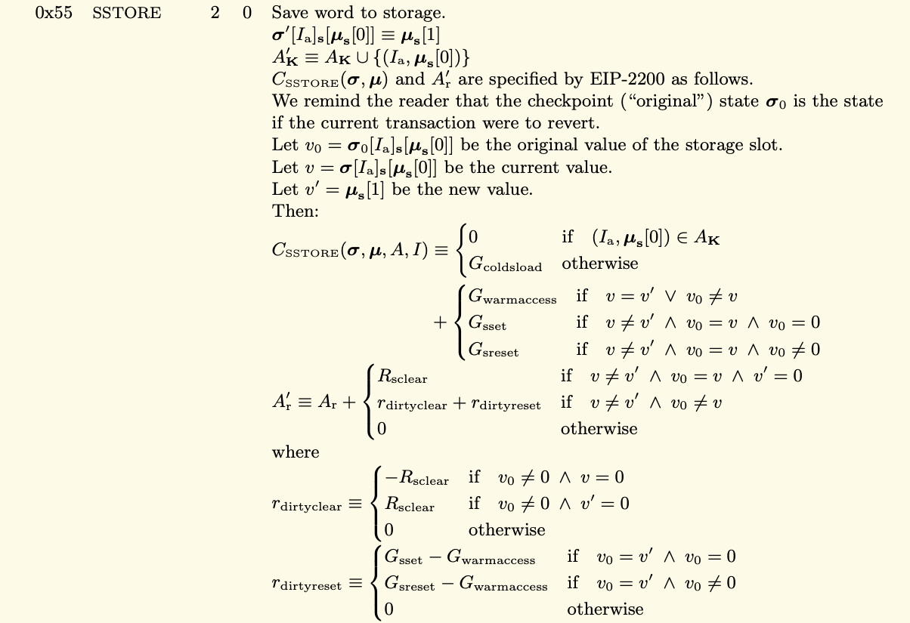

In this video, we're going to look at where exactly the 5000 gas is coming from when you change storage value from a non-zero to a different non-zero value. Interestingly, if you look through the yellow paper, you're not going to see a mention of 5000 gas for that situation anywhere. 

Over here (指整个yellow paper) , we have different gas costs for different operations when we're dealing with storage and other things. But 5000 is not one of those numbers. And you can search the ~~white~~ yellow paper, it's not there.

But you can actually see the formula where that is derived. **The two relevant numbers are $G_{sreset}$ and $G_{coldsload}$.** 

So $G_{sreset}$ is paid for a SSTORE operation when the storage value's zeroness (可以理解为emptiness) remains unchanged or is set to zero. When we go changing a storage value from... let's say 5 to 6, we expect to pay 5000 gas for that. So that's because it's zeroness remained unchanged. It was non-zero in both situations. 

The other portion of the 5000 gas comes from $G_{coldsload}$, cold storage load, that's 2100, 2100 plus 2,900 is, of course, 5000. 

----------------------------------------------------------------------------------------

这里补充一下下图中$v$、$v_o$、$v^{'}$ 的定义 https://eips.ethereum.org/EIPS/eip-1283 

- *Storage slot’s original value*: This is the value of the storage if a reversion happens on the *current transaction*.
- *Storage slot’s current value*: This is the value of the storage before SSTORE operation happens.
- *Storage slot’s new value*: This is the value of the storage after SSTORE operation happens.

$I_a$ : 9.3, the address of the account which owns the code that is executing.

$u_s[0]$ : 3, denotes the first item on the machine’s stack.

$A_k$ : 6.1, the set of accessed storage keys (more accurately, each element of AK is a tuple of a 20-byte account address and a 32-byte storage slot).

[When calling `SSTORE`, check if the `(address, storage_key)` pair is in `accessed_storage_keys`. If it is not, charge an additional `COLD_SLOAD_COST` gas, and add the pair to `accessed_storage_keys`.](https://eips.ethereum.org/EIPS/eip-2929#sstore-changes)

---------------------------------------------------------------------------------------

The formula for that is on page 34. If we look at this section, frankly, it looks like hieroglyphics, but luckily the relevant parts stand out. We have to pay the $G_{coldsload}$ if it's our first time accessing the variable and then we have to pay that $G_{sreset}$ operation, and this operation (指SSTORE这个opcode) cost 2900 gas plus 2100 gas is 5000. That's also why we can see the storage costing 22,100 gas when we went from 0 to 1. If we go back to that page I was looking at earlier, over here, we can see that the $G_{sset}$ is 20,000 and that's when we go from ~~non-zero to zero~~  zero to non-zero. 

And you'll see a lot of material saying that $G_{sset}$ costs 20,000 gas, which is true, but when you measure it, it actually costs more. Well, that's because if it's the first time accessing it, then we need to also pay a $G_{coldsload}$ in addition to that.

So let's go back to the formula and see that in action. So we see we pay the $G_{coldsload}$, which is 2100, and then we pay the $G_{sset}$ and we can see the initial value was 0 (指$v_o = 0$), that's why we are paying the 20,000 gas costs, when in the $G_{sreset}$ situation, the initial value is not 0 and that's the 5000 gas costs which is the sum of the $G_{coldsload}$ and $G_{sreset}$.

