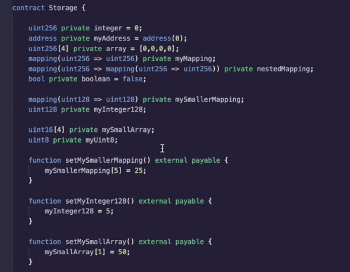
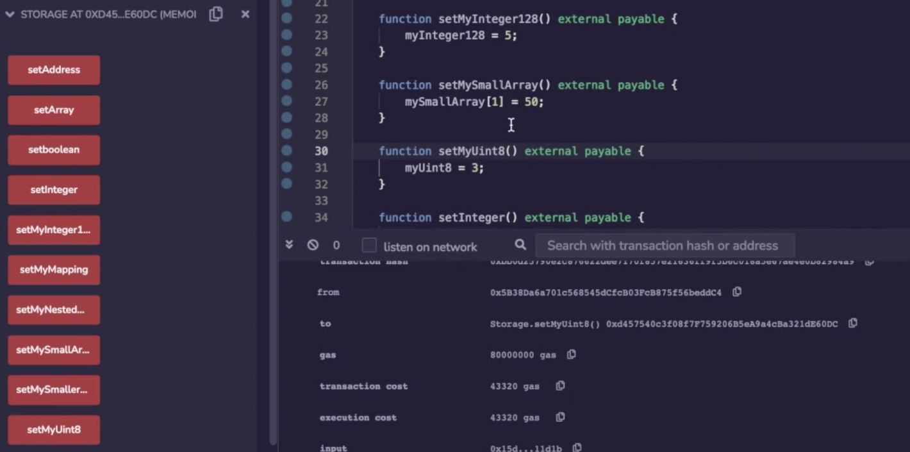
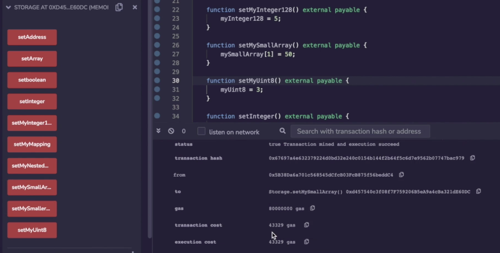
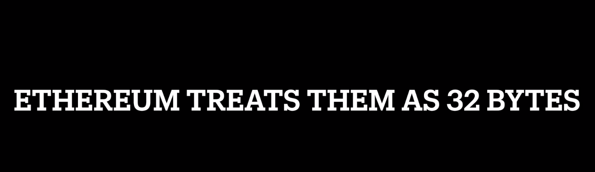

It's important to grasp that all storage operations are happening with 32 byte slots, even if you're using variables that are smaller. So I've added some more variables to our smart contract over here with smaller sizes. So we have a mapping from 128 to 128 and a 128-bit integer over here, a uint16 array and a uint8 integer again. 

Okay. I've already compiled and deployed this, if I set... oh, this is unfortunate, It's cut off over here, let's start with the uint8. So if I set the uint8 (**setMyUint8**), we're going to see it's going to cost 43,000 gas again. So even though we were only supposedly just changing a bits, the reality is the operation is happening inside of a 32 byte slot. 

So let's set my smaller array, which was uint16 and over here it's 43,000 gas. Okay, I could keep clicking through these things, but you get the point. It's going to cost 43,000 gas because **whether it's a boolean or an address, uint256 or a smaller uint, under the hood, it's just a 32 byte storage slot**.

