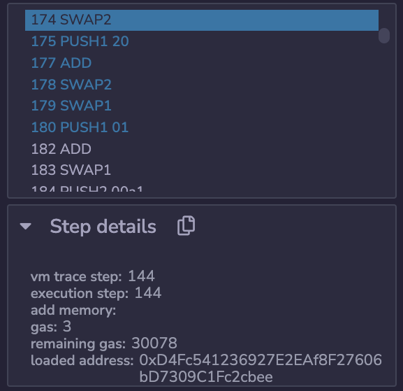

In this video, we're going to be talking about the gas costs of array storage. Now, arrays are quite a bit more complicated than the other data types we had talked about. Let's see how they are actually stored in Ethereum.

```solidity
// SPDX-License-Identifier: MIT

pragma solidity ^0.8.0;

contract Arrarys {

    uint256[] private myArray;

    function set(uint256[] calldata _val) external payable {
        myArray = _val;
    }

    function getLength() external returns(uint256) {
        return myArray.length; // line2
    }

    function getSlotValue() external view returns(uint256 val) {
        assembly {
            val := sload(myArray.slot)
        }
    }

}
```

Over here, I have declared a private array that is dynamic in length. 


When we set this contract, excuse me, set the value of the array, then we're going to see that the gas cost is about 66,000 gas, which is higher than the 43,000 we had seen for setting other values, so we can guess that there's another storage operation going on here. 

It turns out there is. So on one, we are paying 21,000 for initiating the transaction, and two, we are paying another 22,000 for storing that one value in the first slot of the array or the zeroth slot depending on how you're counting. And finally, we have another 22,000 gas coming from storing the length of the array. So, you know, you can get the length of the array like this (line2). This is actually being stored in that storage location over here. So if we get the length of the array, we can see predictably that it's equal to 1. If I get the slot value, what it's doing is it's just looking at slot zero which is where this (myArray) is, and you can see that it's returning the same thing of 1. 


Let's set this back to zero and when I get the slot values you see 0. So this is storing the length and then you have to store the actual values of the array. So let's do some more exercises to build up our intuition. 


What would this cost in terms of storage? Remember that we're starting from a zero array and adding two elements. It is 88,000 gas. Does that make sense? Well, let's see. 21,000 for initiating the transaction, then we have to set the length from zero to a nonzero value, so that will be another 22,100, and then we have two values that we're storing, so that's going to be plus 22, plus 22, and that gets us close to the 88,000 that we are seeing here.


Okay. Let's look at a trickier problem where we start with an array of two or an array of one with a value of 2 at zero slot and add value afterwards. What would the gas cost come out to? I encourage you to pause the video and try to work out yourself. 


Here's what happens: we see that it is 51,000 gas, well, let's derive where that's coming from. We know that we have to pay 21,000 for the transaction. We know that we changed the length variable from 1 to 2 which costs us 5000 gas. We also know that we had to store this 9 in there, which would cost us 22,100 gas, and we get to 48,100 gas, and that's not quite at the 51,000 gas.


Where it is these missing 3,000 gas coming from? Missing couple thousand gas, well, this was actually a trick question because we already had the value 2 stored in slot 0. And when we wrote this array, we actually wrote a 2 back to that same location, so we did a cold storage access to that spot(slot?) which costs 2100, and then we have another 100 gas because we did a write of the same value as we talked about in an earlier video. 

48,100 + 2,100 + 100 = 50,300

And now we're much closer to that 51,000 gas. **So in this situation, it actually would have been more efficient if we had just done a push if you know that you're going to be keeping the earlier values the same.** 

Now, how am I able to derive what all of those costs are? Well, if you're not sure, you can always just step through the opcodes (remix中debug查看每一步的gas消耗情况) and check how much the remaining gas changes at the critical points. 


35,318 - 37,418 = 2,100 这是个cold access

So over here, we see our first SLOAD which is associated with getting the length of the array.


35,312 - 32,412 = 2900 这是个non-zero to non-zero 应该是array的length属性从1变为2

And then there's another SSTORE over here, which is where we update the length of the array.



32,278 - 30,078 = 2,200 这个应该是第一个item被赋相同值的 cold access + warmaccess 即 2100 + 100

And we can keep stepping until we find another SSTORE.


30,008 - 7,908 = 22,100 这个应该是push 9的时候，cold access + sset 即 2100 + 20000

And then we see our final SSTORE over here. So you can just look at each of those cases, see how much the gas changed, and then look it up against the yellow paper to see what kind of storage or retrieval makes sense in the context of the execution.