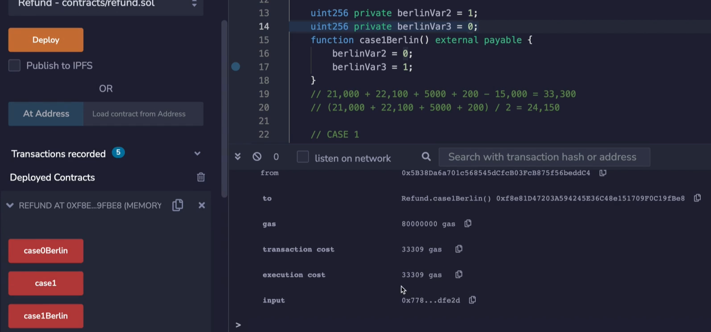

In this video, we're going to be discussing how gas refunds working in Ethereum and when it comes to storage. Now, this is going to be interesting because the yellow paper is out of date with the current state of Ethereum, and I've checked the GitHub of Ethereum, and for some reason ~~the white paper~~, excuse me, the yellow paper has not been updated yet. However, we still need to review the yellow paper in order to understand the overall strategy of Ethereum when it comes to refunds, and then we will look at EIP-3529 which brings us back up to date. 


The most interesting thing here is R_{sclear} which is a refund that you are given for storage when you clear a variable that is set to zero. So this clear could be setting an address from a non-zero address to the zero address, going from a true to false or going from a non-zero number to zero. 

What this is? It's a refund given or added into the refund counter when the storage value is set from ~~zero to non-zero~~ non-zero to zero. Now, **this does not mean that the instant that you set a particular storage variable from non-zero to zero, you're going to get 15,000 gas back, you still have to pay that 5000 gas when you change the value of that storage variable**, this is the same as if you had changed the storage variable from non-zero to non-zero. 

Now remember, we still had to pay that 5000 gas in the scenario where we went from non-zero to non-zero, that's true in the non-zero to zero case also.


Here's why, because we pay the 2900 for SSTORE operation when the storage value zeroness remains unchanged or is set to zero. Okay. So when we set something to zero, we still have to pay that 2900, and most of the time will be accessing that variable for the first time in the transaction when we set it to zero, so we'll also have to pay the cold storage access of 2100. Okay. There is a technicality here: **You were not always able to get this full 15,000 gas and refund**.

----------------------------------------------------------------------------------------

半个方括号是向下取整 -> https://en.wikipedia.org/wiki/Floor_and_ceiling_functions

$T_g$ -> 4.2 -> gasLimit: A scalar value equal to the maximum amount of gas that should be used in executing this transaction. This is paid up-front, before any computation is done and may not be increased later.

$A_r'$ -> 6.1 -> Sunbstate: $A_r$ is the refund balance, increased through using the SSTORE instruction in order to reset contract storage to zero from some non-zero value. Though not immediately refunded, it is allowed to partially offset the total execution costs.

Stack Overflow上一个关于这个公式的解释 https://ethereum.stackexchange.com/a/859

----------------------------------------------------------------------------------------


In another page, if we read through all of these formulas which you are certainly welcome to do on your own but I will not do here, you're going to get to this one. And the explanation for that is: The total refundable amount is the legitimately remaining gas **g'** (g prime), added to the $A_r$ (amount refunded), with the latter component being capped up to a maximum of half (rounded down) of the total amount used $T_g$ minus the legitimately remaining gas **g'**. So you cannot get a 15,000 gas refund if your transaction costs less than 30,000 gas. 

```solidity
// SPDX-License-Identifier: MIT

pragma solidity ^0.8.0;

contract Refund {

    uint256 private berlinVar1 = 1;
    function base0Berlin() external payable {
        berlinVar1 = 0;
    }

}
```

So let's see that in action. I'm going to compile this smart contract over here, and run it not on the London version which is the version running now at the time of this recording, but **to an earlier one called Berlin which is what the yellow paper is reflecting**. When I deploy this contract and I call the **case0Berlin** which is where I take a storage variable, **berlinVar1** and it has a value of 1 and I set it to 0 inside of the function. 


We're going to see that the gas we pay for this transaction is **13,112**. Now, **where does this value come from**? Well, the total gas spent on the transaction is 21,000, 5000 plus 200. Now, remember, that's 5000 comes from setting it to 0, but that doesn't include the refund. Now, we could get up to a 15,000 gas in refund, but the sum of this is 26,000 and **half of that is 13,000. So we cannot get the full 15,000 gas in refund**. Otherwise we would get 11,000, but 11,000 is less than half of 26,000. 


----------------------------------------------------------------------------------------

我自己remix上的gas消耗情况


从doNothing能得出，21,138 = 21,000 + 138 也就是说一个empty function就要消耗138 gas

case0Berlin中，21,000 + 5000 + 138 =  26,138 / 2 = 13,069

所以他说的200就是一个doNothing函数执行时分配memory等必要的开销


因为是把storage从non-zero置为zero，所以这时$A_r'$是15,000，但是本次交易使用的gas的一半是13,069

根据公式，13,069 < 15,000，所以refund取值为13,069

那么最终的gas消耗为：21,000 + 5,000 + 138 - 13,069 = 13,069 和图中13,078只差9个gas 

----------------------------------------------------------------------------------------


```solidity
		uint256 private berlinVar2 = 1;
    uint256 private berlinVar3 = 0;
    function case1Berlin() external payable {
        berlinVar2 = 0;
        berlinVar3 = 1;
    }
```

Okay, what about **berlinVar2**, **berlinVar3** and **case1Berlin**. Well, what I'm going to do is set this to zero and set this to one. **In this scenario, we'll be able to get the entire refund back because the total gas we're spending is more than 30,000**. 



The total execution cost is 33,300. And where does that come from? This (21,000) is the transaction cost, this (22,100) comes from setting **berlinVar3** to 1 when it was originally 0, and this (5,000) comes from setting **berlinVar2** from 1 to 0, and then **200 is for the extra stuff around the function call** and we can get up to 15,000 gas in refund. 

21,000 + 22,100 + 5,000 = 38,300 / 2 = 24,15

If we were to add up all of these values, it would normally cost us 48,000 and half of that is 24,000, so we could get up to a 24,000 gas refund. However, we only get 15,000 for setting that storage variable to zero. So that's why our gas comes out to 33,300. 


----------------------------------------------------------------------------------------

我自己remix上的gas消耗情况


21,000 + 22,100 + 5,000 + 138 = 48,238 / 2 = 24,119 > 15,000

所有refund取值为15,000

那么最终的gas消耗为：21,000 + 22,100 + 5,000 + 138 - 15,000 = 33,238 和图中33,287只差49个gas

----------------------------------------------------------------------------------------


Okay. Now, as we know, Berlin is no longer the latest version of Ethereum. In fact, it's not London either. We are currently looking at Arrow Glacier which is at the top of this page, but nothing interesting happened here except for delaying the difficulty bomb, which seems to happen quite often. 


Anyway, the interesting stuff happened in London, and London is where we did another delay in the Ice Age, I guess that's how things roll around here. But the interesting thing happens in **EIP-3529** which **reduces the gas refund for EVM operations.** So don't worry, the concepts in the yellow paper were still correct, but the numbers need to be adjusted. 

[EIP-3529](https://eips.ethereum.org/EIPS/eip-3529)


And here are the adjustments. The first significant change that happened in the EIP is that you don't get a refund for self-destructing contracts anymore. So there is actually quite little incentive to self-destruct contracts now, with one minor exception that I'm going to talk about in the later video. But you don't need to worry about that right now. 

The next thing we're going to look at is the refund. So this might look like gibberish and you can feel free to look through it on your own. But this (4,800) essentially replaces the 15,000 we were looking at earlier. So you can get up to 4800 gas refund instead of 15,000 gas like it used to be. 

And the other thing is, remember how we said we could get up to half of the amount that we spent back as a refund? Well, that's not the case anymore. Now it is 1/5. 

```solidity
		uint256 private var1 = 1;
    function case1() external payable {
        var1 = 0;
    }
```

Okay, let us see these numbers in action. The first thing, of course, that we're going to have to do is compile this against London and make sure that we're compiled, deploy it. And let's look again at the original case where we said just one variable to zero, and that will be, over here where we have **var1** which is one, and we set it to 0. 


Let's run case one and we see that the gas cost is 21,400. How does this come out? Well, the 21,000 hasn't changed, the 5000 cost of setting a variable to zero hasn't changed, this 200 hasn't changed either. But rather than subtracting 15,000, we're going to subtract 4800. And that's where we get the 21,400 gas from that we see over here.


----------------------------------------------------------------------------------------

我自己remix上的gas消耗情况


21,000 + 5,000 + 138 = 26,138 / 2 = 13,069 > 4,800

所有refund取值为4,800

那么最终的gas消耗为：21,000 + 5,000 + 138 - 4,800 = 21,338 和图中21,356只差18个gas

----------------------------------------------------------------------------------------

