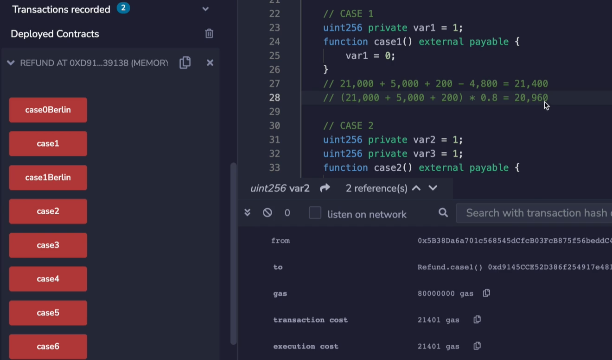
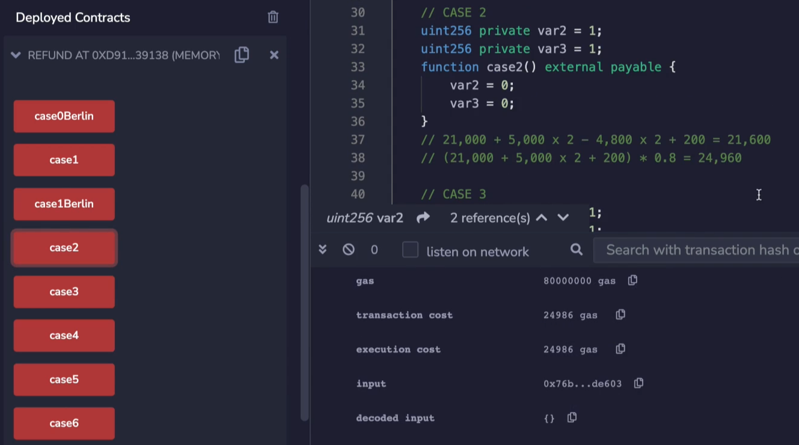
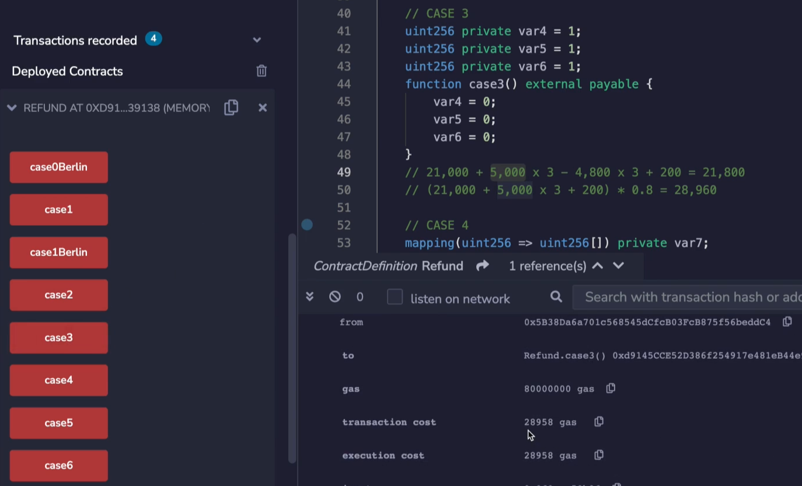
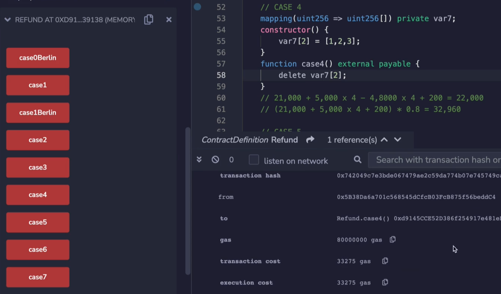
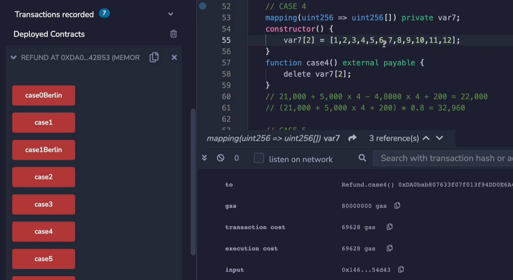
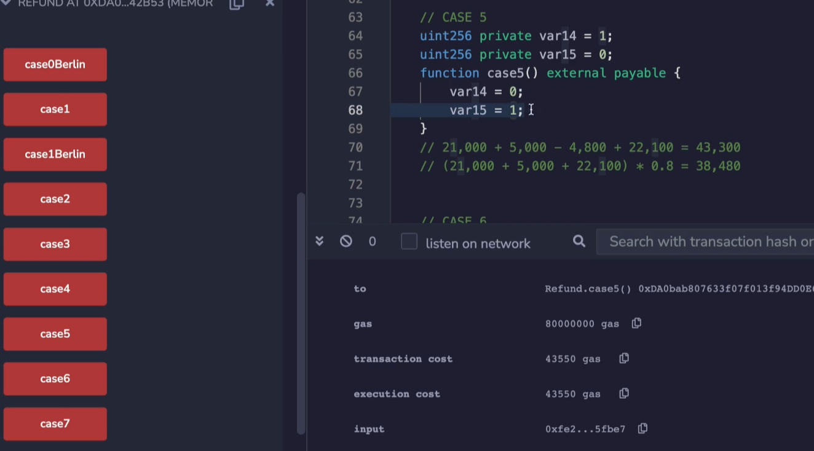
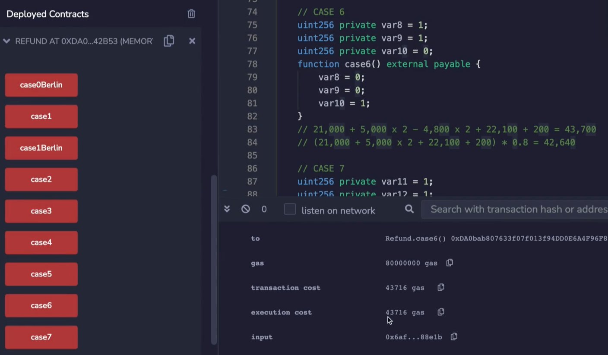
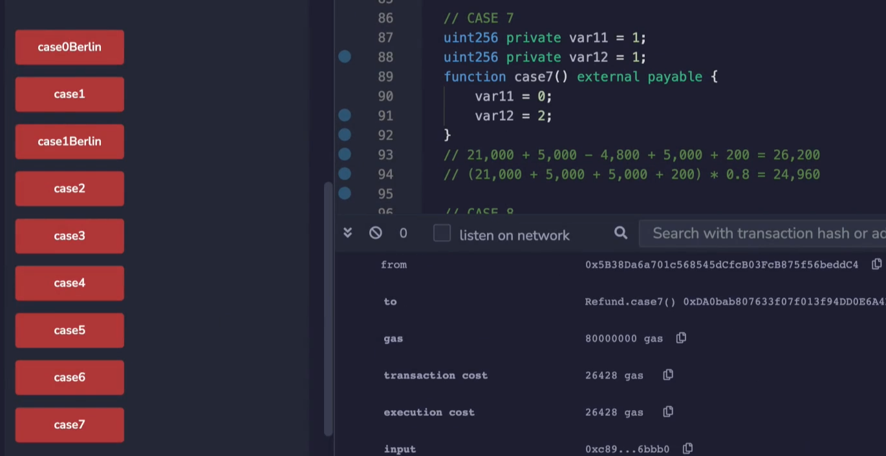
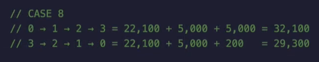
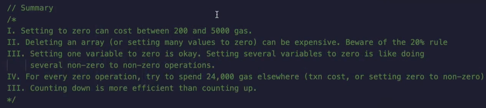

Now let's look at the cases where we are not able to get our full refund back and see what the implications of that are. Going back to the case earlier, our transaction cost was 21,400 gas. **But if we look at the gas that we could have obtained, that is we had gotten the full 20% possible back, we would have spent as little as 20,960 gas, but we didn't get this refund because we only got 4800 back.** 

(EIP-3529把1/2改为1/5了，可以参考上一篇md)

这里说的意思应该是，如果refund是使用的gas的20%，那么花费的gas应该就是使用的gas的80%，那么实际上应该是20,960，但是我们这里花费了21,400是因为refund少了，不是20%而是4,800，refund少了所以最后花费的gas就多了

```solidity
		uint256 private var2 = 1;
    uint256 private var3 = 1;
    function case2() external payable {
        var2 = 0;
        var3 = 0;
    }
```

Well, let's set more variables to 0, so that we get an even bigger refund. 



Let's run **case2** and see what we get, and we see, as predicted that the gas cost is 24986 gas. That actually causes the price to go up, interestingly. So when we look in this situation, we could say, oh, we could have gotten 20,960 in gas. 

----------------------------------------------------------------------------------------

这里，21,000 + 5,000 * 2 + 200 = 31,200 / 5 = 6,240 < 4,800 * 2 (var2 = 0、var3 = 0都能refund)

所以refund取值为6,240

那么最终gas消耗为：21,000 + 5,000 * 2 + 200 - 6,240 = 24,960

也可以直接用这个算法：(21,000 + 5,000 * 2 + 200) * 80% = 24,960

因为refund是使用gas的20%，那么使用的gas就是剩余的80%

----------------------------------------------------------------------------------------


```solidity
		uint256 private var4 = 1;
    uint256 private var5 = 1;
    uint256 private var6 = 1;
    function case3() external payable {
        var4 = 0;
        var5 = 0;
        var6 = 0;
    }
```

Well, let's get another refund by setting another variable to 0. It doesn't work that way, because for each variable that you set to... that you spend 5000 gas on, to set it to 0, you only get 4800 back (If it doesn't exceed 20% of the transaction). So the reason there was a net redemption here is because we were eating into the 21,000 gas of the transaction. This trend continues if we decide to delete yet another variable. Now, if we look in **case3** where we delete yet another variable, the gas cost is going to continue to go up because we spend an additional 5000 clearing this variable, but we cannot get any more ethers back because the additional 5000 that we're spending, we're only able to get 20% of it back.



So let's run **case3**, and in **case3** we see indeed that the cost goes up to 28,000. Again, we could have dropped all the way back down to 21,000 if we were able to get all of these refunds back. But whenever we'd clear another variable, we are adding 5000 to the cost and only able to get about 1000 of it back. (If we have used up the 20% limit)

个人理解：每多把一个变量置为0，要要多花5000gas，但是refund只能获得这5000的20%，因为这时候肯定是走20%的


```solidity
		mapping(uint256 => uint256[]) private var7;
    constructor() {
        var7[2] = [1,2,3];
    }
    function case4() external payable {
        delete var7[2];
    }
```

We get a very similar situation if we clear out an array. Now behind the scenes, an array consists of four variables if there are three items inside of it. One is all of the storage for each of these items, and then there is the length variable, as we talked about earlier. So you'll see if we run this that deleting a array can actually cost quite a bit of money. So this is something you need to be careful with in your application. 



If you find yourself deleting arrays, that might actually be quite long (指数字大) because over here you can see that the transaction costs 33,000. But what if this array was, let's say, 12 items long? Well, let's recompile this and deploy this and run **case4**.

```solidity
		constructor() {
        var7[2] = [1,2,3,4,5,6,7,8,9,10,11,12];
    }
```



In this situation, we're going to see that the gas cost is 69,000. So, that went up quite a bit. And if the variable had a thousand items in it, well, good luck. 

```solidity
		uint256 private var14 = 1;
    uint256 private var15 = 0;
    function case5() external payable {
        var14 = 0;
        var15 = 1;
    }
```



In **case5** we're going to change **var14** from 1 to 0 and **var15** from 0 to 1. So we know the 0 to 1 operation is expensive, it costs 22,100 gas, but the 1 to 0 gives us a refund, it will be 43,550 gas, and this is nice because remember, 43,000 is roughly what we pay when we set a variable from zero to non-zero because there's the 21,000 in the gas and the 22,000 from the... going from zero to non-zero. So we can think of it as being able to set this particular variable (**var14**) to 0 for mostly free. 

----------------------------------------------------------------------------------------

这里，21,000 + 5,000 + 22,100 + 200 = 48,300 / 5 = 9,660 > 4,800 * 1 (因为只有var14 = 0一条能refund)

所以refund取值为4,800

那么最终gas消耗为： 48,300 - 4,800 = 43,500

----------------------------------------------------------------------------------------


```solidity
		uint256 private var8 = 1;
    uint256 private var9 = 1;
    uint256 private var10 = 0;
    function case6() external payable {
        var8 = 0;
        var9 = 0;
        var10 = 1;
    }
```



Let's continue the **case6** and run it. We see if we compare the gas cost, that **case6** is 43,716 and **case5** was 43,500. So where is it exactly 200 gas or almost exactly 200 more gas? Well, if you look at the difference between these two equations over here, you'll note that they're almost exactly identical except that we have 5000 times 2 and 4800 times 2 whereas there's only one of these (指case5中没有x2) right? So the extra difference between these two is 200 gas. 

----------------------------------------------------------------------------------------

这里，21,000 + 5,000 * 2 + 22,100 + 200 = 53,300 / 5 = 10,660 > 4,800 * 2 (var8 = 0、var9 = 0都能refund)

所以refund取值为4,800

那么最终gas消耗为： 53,300 - 4,800 * 2 = 43,700

----------------------------------------------------------------------------------------


```solidity
		uint256 private var11 = 1;
    uint256 private var12 = 1;
    function case7() external payable {
        var11 = 0;
        var12 = 2;
    }
```



And for the final case, I recommend you work through this problem yourself before I show you the answer. And here it is. We see that the gas cost is 26,000. This comes from the 21,000 of the transaction costs, the 5... there are 2 five thousands in here because we go from 1 to 0 and non-zero to non-zero, and we get a 4800 gas refund for setting **var11** to 0, and then there's the 200 for the extra opcodes associated with the function. 

----------------------------------------------------------------------------------------

这里，21,000 + 5,000 * 2 + 200 = 31,200 / 5 = 6,240 > 4,800 * 1 (因为只有var11 = 0一条能refund)

所以refund取值为4,800

那么最终gas消耗为： 31,200 - 4,800 = 26,400

----------------------------------------------------------------------------------------




So what's the conclusion of this? Well, one is that you should try to count down rather than counting up if you're keeping track of things like, for example, how many NFTs a particular address has minted. We'll actually discuss a better strategy for that particular case in a later video. But let's just say we were storing that in the storage variable. Well, if you go from 0 to 1 and 1 to 2 and 2 to 3, you're going to have to pay 22,100 plus 5000, plus 5000 and net. The total gas either spent by you or by the buyer is going to be 32,100 gas. If you go in the opposite direction, however, you're going to get a refund or at least a considerably cheaper transaction when you go from 1 to 0. So if you can try to have as many 1 to 0 transactions as possible instead of 0 to 1s, you can save gas in your application. 

最后的200是：你花5000，但是refund 4800，所以就是花200



Okay, now let's look at the summary here. 

Setting to zero can cost between 200 and 5,000 gas depending on how much of a refund you're able to get back. 

Deleting an array or setting many values to zero can be surprisingly expensive, so be mindful if you are doing a lot of deletes but don't actually have an opportunity to capture the refund. 

This is basically saying something similar, setting a value from non-zero to non-zero is the same as setting it from non-zero to zero if you do not have extra gas costs that you can redeem. So if you are able to do something expensive at the same time that you do a redemption, then you can actually net save gas and get more work done for the same amount of gas. 

And counting down is more efficient than counting up.