The gas cost of a struct is simply the sum of all of the 32 byte values that it uses and the manner in which they are used, whether they are write from 0 to 1, 1 to 0 or non-zero to non-zero as we looked at in the previous videos. 

```solidity
// SPDX-License-Identifier: MIT

pragma solidity ^0.8.0;

contract Structs {

    struct MyStruct {
        uint256 a;
        address b;
    }

    MyStruct myStruct;

    function setStruct() external {
        myStruct = MyStruct({
            a: 5,
            b: msg.sender
        });
    }

}
```

Let's look at a simple example here. MyStruct has a uint256 and an address in it, but remember that an address takes up 32 bytes even though it's only 22 bytes long. So we are going to set the struct with the integer 5 and msg.sender. 

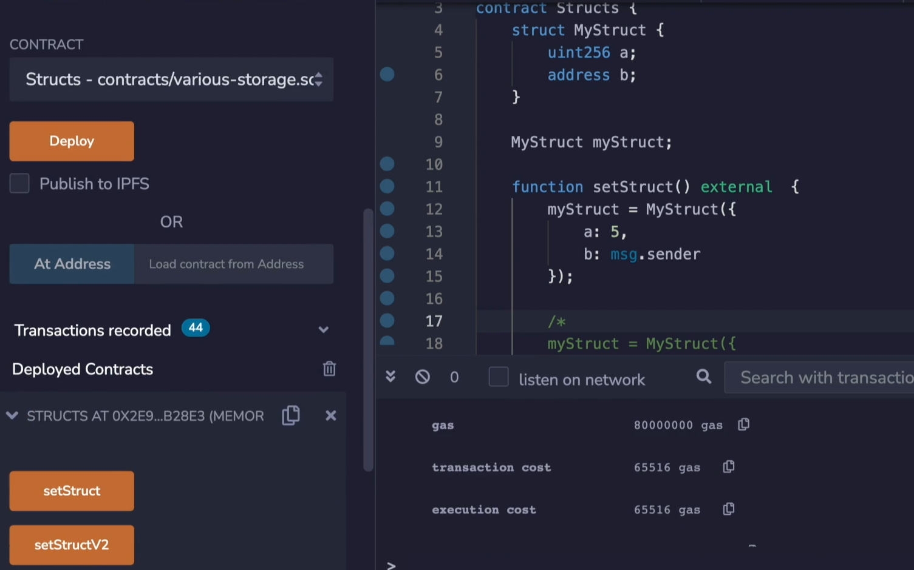

Let's deploy this contract and test out the gas cost. When we do **setStruct**, we are going to see that the gas cost is 65,516. **Does this make sense**? We'll take this subtract away the transaction cost (21,000) and we have to pay a cold storage write from  ~~0 to 1~~  0 to non-zero twice (22,100*2). Yes, this makes sense.

----------------------------------------------------------------------------------------

这里，21,000 + 22,100 * 2 + 200 = 65,400 (没有refund)

那么最终gas消耗为： 65,400

----------------------------------------------------------------------------------------


```solidity
	function setStructV2() external {
        myStruct = MyStruct({
            a: 6,
            b: msg.sender
        });
    }
```

What if we update only one of the variables with **setStructV2**? What that's going to do is obviously keep msg.sender the same, but change **a** from 5 to 6.  

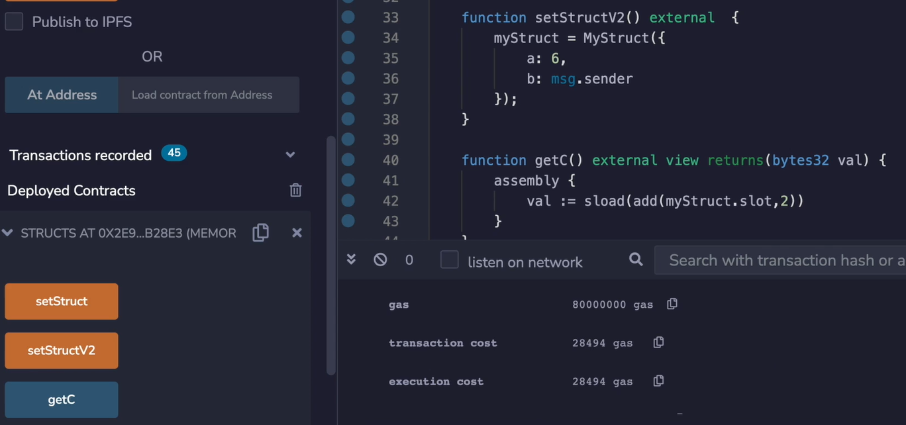

What do you expect this to come out to? Obviously it's less. It's 28,494. Let's work out these costs also. We have a cost of 28,494, 21,000 for the transaction and setting msg.sender to the same value is a cold storage read and a warm access. So that's going to be 2,100, minus 100, this leaves us with 5,294 which makes sense because we change the value from 5 to 6. So this just leaves us with the extraneous opcodes have needed to call the function. 

----------------------------------------------------------------------------------------

这里，21,000 + 5,000 + 2,100 + 100 + 200 = 28,400  (没有refund)

那么最终gas消耗为： 28,400

----------------------------------------------------------------------------------------


```solidity
		struct MyStruct {
        uint256 a;
        address b;
        uint256 c;
    }
    
    MyStruct myStruct;

    function setStruct() external {
        myStruct = MyStruct({
            a: 5,
            b: msg.sender,
            c: 8
        });
    }
```

Okay. So far so good. If we change this struct to also include yet another... to include yet another 256-bit item, hopefully the cost of this will be obvious to you. Now, we can't use this anymore (删掉了**setStructV2**) . 

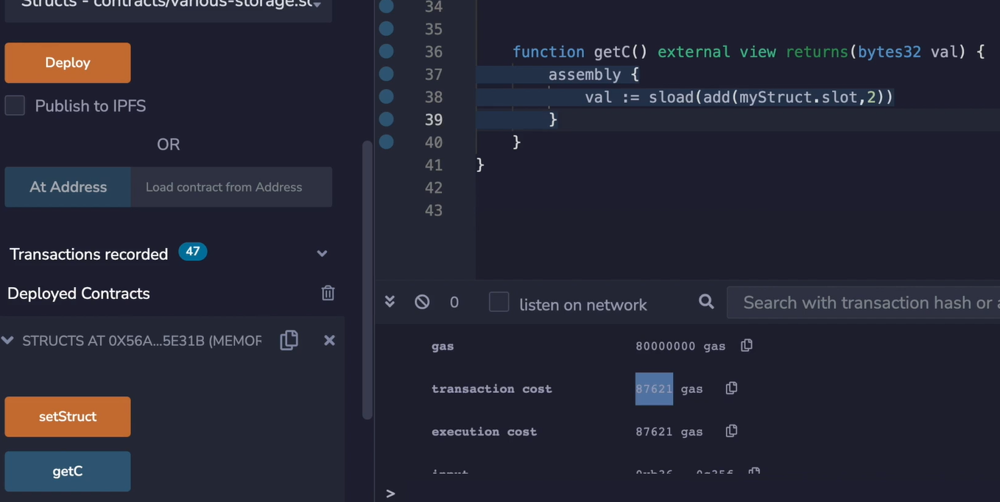

So I'm going to compile, deploy and test, pause the video and see if you can work out what this number should be. Okay. It's 87,000. Again, not to belabor the math, it's we're going to subtract away the transaction cost (2,100) and then subtract 22,100 times 3 because we are writing three 32-byte items and we're left with 300 gas left over which makes sense. 

----------------------------------------------------------------------------------------

这里，21,000 + 22,100 * 3 + 200 = 87,500  (没有refund)

那么最终gas消耗为： 87,500

----------------------------------------------------------------------------------------


```solidity
		struct MyStruct {
        uint256 a;
        address b;
        string c;
    }

    MyStruct myStruct;

    function setStruct() external {
        myStruct = MyStruct({
            a: 5,
            b: msg.sender,
            c: "lorem ipsum dolor sit amet"
        });
    }
```

Okay. **What if we have something a little bit trickier, like a string?** So if this is a string and we write "lorem ipsum dolor sit amet" into that slot, what it going to come out to be? Well, as we looked at in a previous video, the strings behave like array. And when everything fits into a 31 bytes, then this is going to only live inside of a 32 byte slot. So this should be similar to what we saw over here. 

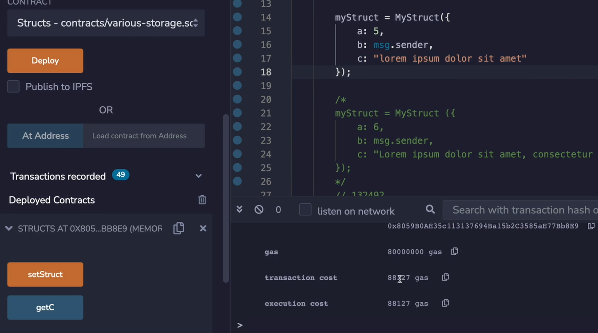

And indeed it is, it's 88,000 because this is only taking up 32 byte. But remember, strings are a little bit tricky because when you can store both the length and the contents of the string inside of 32 bytes, it's only going to use up 32 bytes. But once you use up two slots, then it needs to use 3 storage slots because it needs to store the length and all of the information that the string is holding.

```solidity
		function getC() external view returns(bytes32 val) {
        assembly {
            val := sload(add(myStruct.slot, 2))
        }
    }
```

Over here, what I'm doing is getting the slot for where **myStruct** is and adding 2 to it because that's going to offset us from slot 0 (**uint256 a**), slot 1 (**address b**), slot 2 (**string c**) and get whatever is stored inside of here (**string c**). But I'm going to return it as a **bytes32** so that you get a better intuition of what's happening.

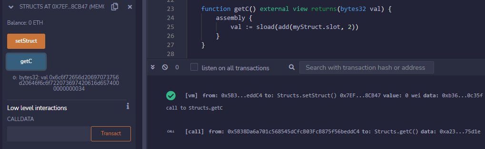

Compile, set the struct to put the "lorem ipsum dolor sit amet" inside of it and **getC**, and over here you can see this (指6c到74这26个字节) is where the "lorem ipsum dolor sit amet" is living, and this (指00到34后6个字节) is how it knows it's inside of the slot and taking up a certain amount of space. 

https://www.rapidtables.com/convert/number/hex-to-ascii.html

0x6c6f7265_6d206970_73756d20_646f6c6f_72207369_7420616d_6574_00000000_0034

6c到74占据26个字节，是**字符串内容**，00到34占据6个字节，是**字符串长度**，这个storage slot 2 一共32个字节

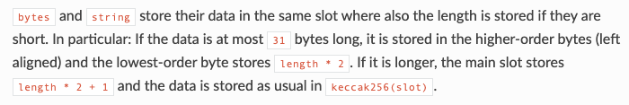

十六进制的34 -> 十进制 52，[字符串少于31字节，那么前31个字节存储内容，最后1个字节存储的是字符串的长度*2](https://docs.soliditylang.org/en/latest/internals/layout_in_storage.html#bytes-and-string)

SLOAD操作符就是返回一个word，EVM中一个word是32字节，可以参考上一个md文档或者yellow paper 9.1节

[evm.codes](https://www.evm.codes/)  SLOAD:  Load word from storage


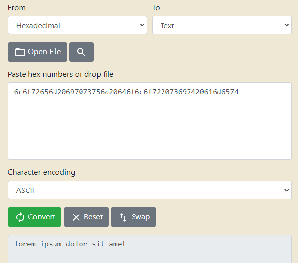

This actually is "lorem ipsum dolor sit amet", because if I put it in here, I've already pasted it. But here you can see it's "lorem ipsum dolor sit amet" on it. 

```solidity
		function setStruct() external {
        myStruct = MyStruct({
            a: 5,
            b: msg.sender,
            c: "lorem ipsum dolor sit amet, consectetur adipiscing elit."
        });
    }
```

Okay. As I was talking about, if we have a longer string that... in this case is about 56 bytes long, then we're going to see that the value is going to **jump up by 2 storage slots**. So, again, clear, deploy and test. 

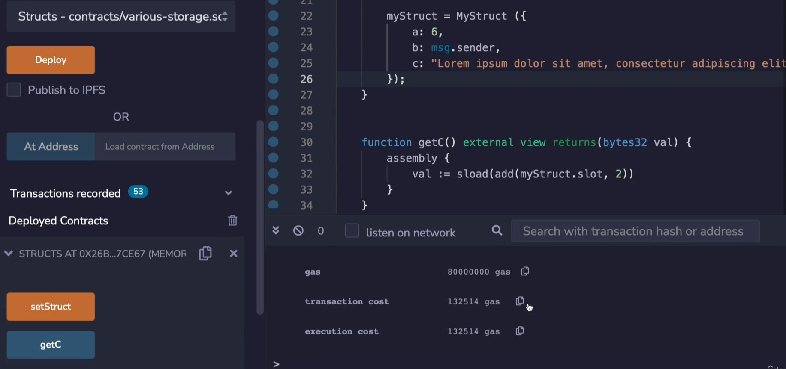

In this situation, the gas cost is quite a bit higher, right? 

----------------------------------------------------------------------------------------

这里，21,000 + 22,100 * 3 + 22,100 * 2 + 200 = 131,700  (没有refund)

那么最终gas消耗为： 131,700

slot 2 存的是长度，在别的位置又开辟两个slot来存字符串本身的内容，所以比上一个例子多消耗的gas就是额外执行两个 **0 -> non-zero** storage 的赋值语句所消耗的gas

```solidity
		function getC() external view returns(bytes32 val) {
        assembly {
            val := sload(add(myStruct.slot, 2))
        }
    }
    
		function getC2() external view returns(bytes32 val) {
        bytes32 p = keccak256(abi.encodePacked(uint(2)));
        assembly {
            val := sload(p)
        }
    }

    function getC3() external view returns(bytes32 val) {
        bytes32 p = keccak256(abi.encodePacked(uint(2)));
        assembly {
            val := sload(add(p, 1))
        }
    }
```

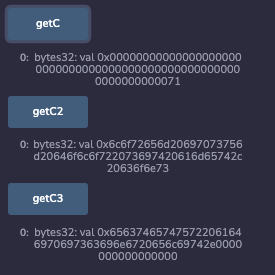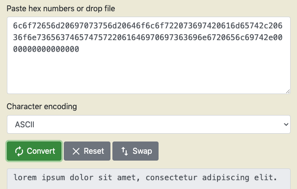

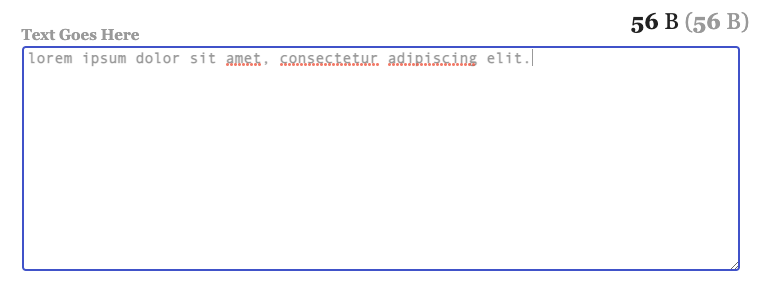

https://www.javainuse.com/bytesize


根据文档，slot 2存的是字符串的 length * 2 + 1，HEX 71 = DEC 113 = 56 * 2 + 1，所以字符串长度为56，也符合上图

[字符串大于31字节，那么这个slot 2只存字符串长度，在keccak256(2)存内容](https://docs.soliditylang.org/en/latest/internals/layout_in_storage.html#bytes-and-string)

----------------------------------------------------------------------------------------


```solidity
		struct MyStruct {
        uint256 a;
        address b;
        bool c;
    }

    MyStruct myStruct;

    function setStruct() external {
        myStruct = MyStruct({
            a: 5,
            b: msg.sender,
            c: true
        });
    }
```

So what will happen if instead of a string we had a boolean over here, how much would it cost to store it? It's probably wrong. Well, it's actually not going to be using up all 3 slots.   **这里 c和b共用slot 1**

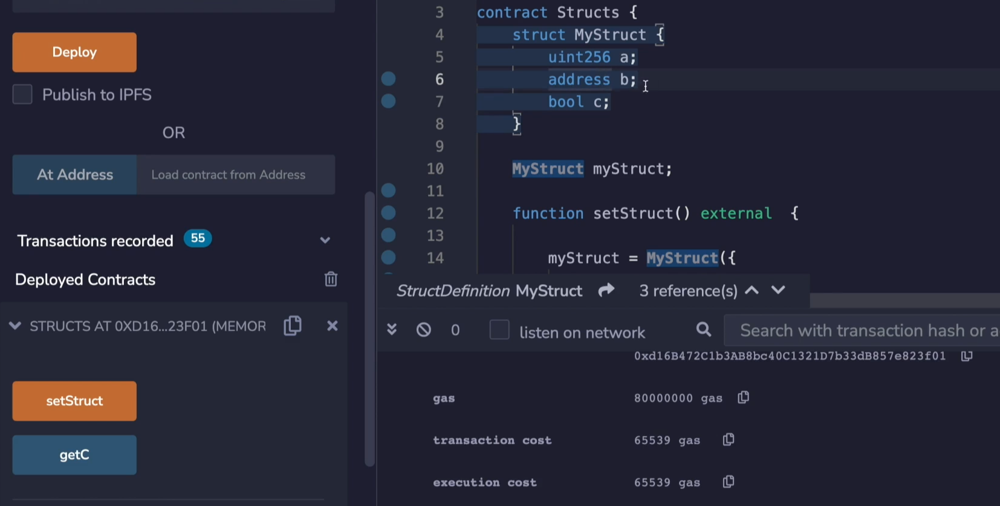

And here you can see that this is clearly, only using 2 slots because we have one 21,000 for the transaction and that will leave us about 44,000 which is used up by the two 22,000 transactions, well, that's because address takes up **20** bytes and that leaves **12** bytes left over which is plenty of room to put this **boolean** in there. And so **solidity is going to try to pack the variables**, and this is something we'll talk more about in the next video. 

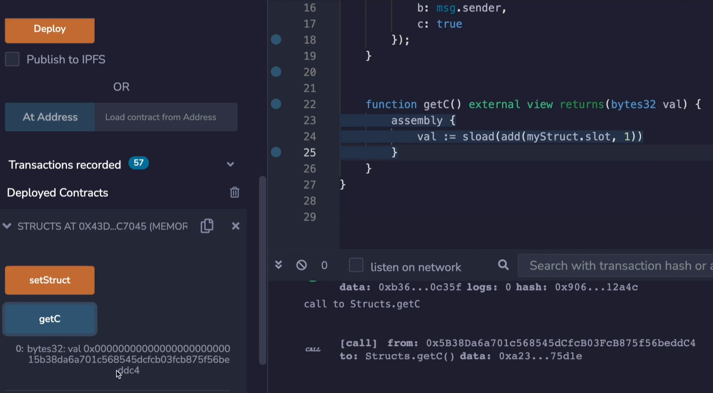

But if you want to see what's actually inside of **C**, we can look over here. Oh, well, because there is no slot 2 anymore, then that's why it's returning zero. 

a 32字节占据一个slot，b 22字节和c 共用一个slot，所以只有 slot 0和 slot 1，没有slot 2

So let's let's redo that, deploy and see what's in there. Okay. We see the address that I'm actually using is 0x5B3...dC4,  and here you can see 5b3, but there's this extra **1** over here and **that's the true value that's being stored**. 

----------------------------------------------------------------------------------------

这里为什么是 1 在前边，而 0x5B3...dC4 在后边，可以参考官网文档

[The first item in a storage slot is stored lower-order aligned.](https://docs.soliditylang.org/en/latest/internals/layout_in_storage.html)

----------------------------------------------------------------------------------------


```solidity
	function setStruct() external {
        myStruct = MyStruct({
            a: 5,
            b: msg.sender,
            c: false
        });
    }
```

If we had instead set this to **false**, you would see that set to **0**. 

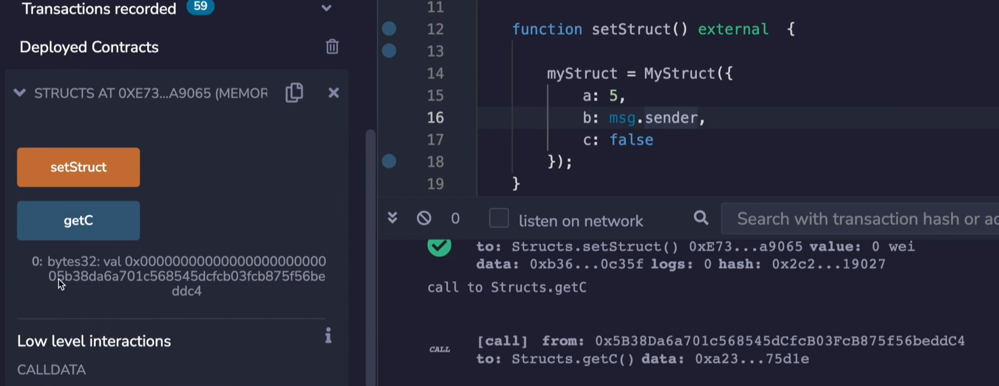

And indeed that is the case.