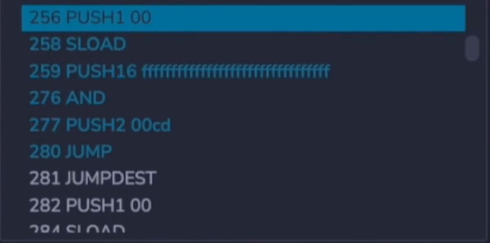
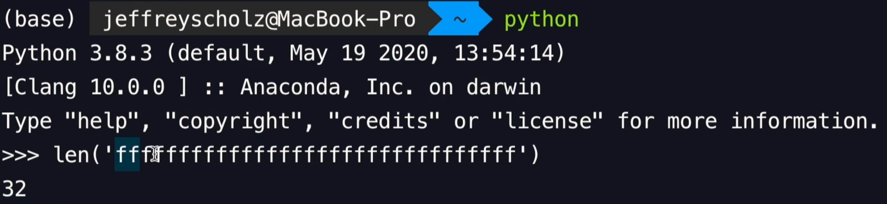
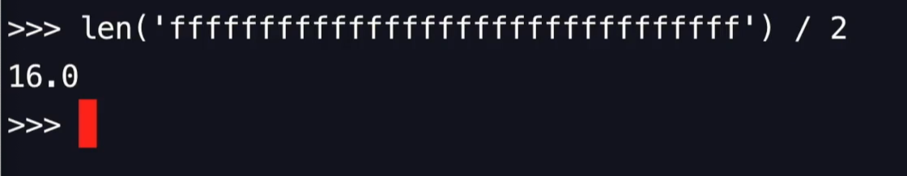
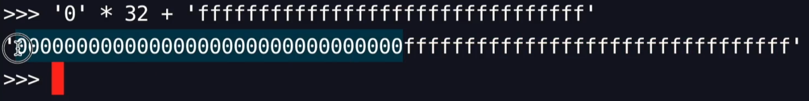
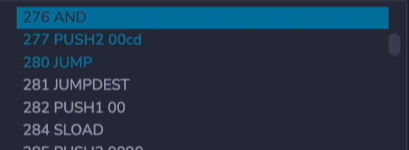
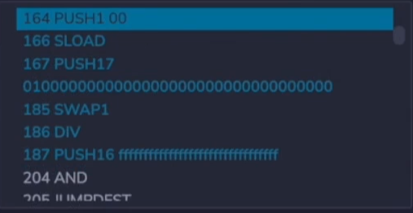
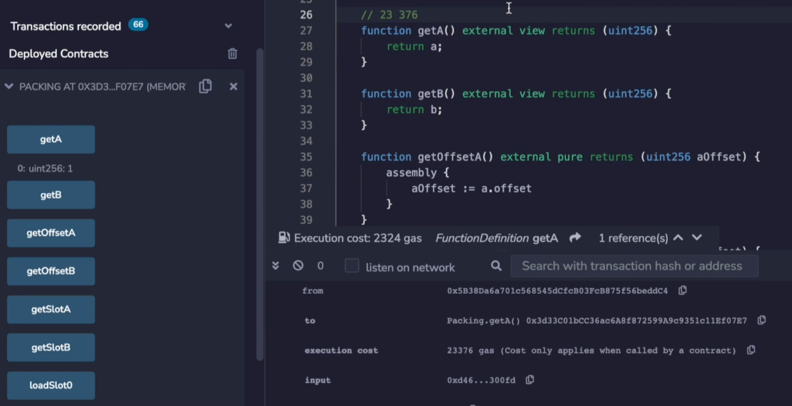
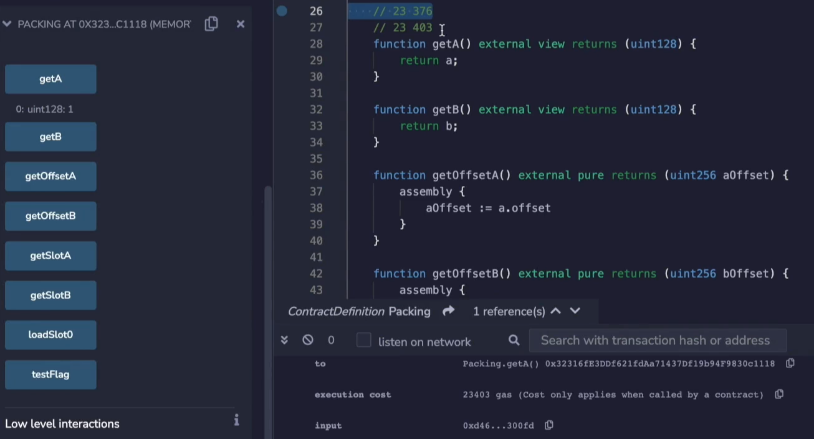
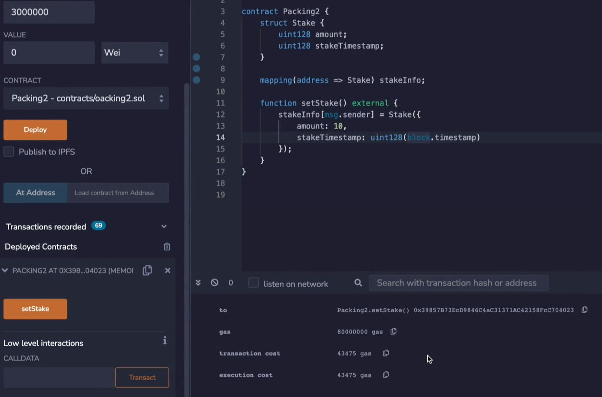

In this video, we're going to be diving into variable packing. This is when two variables or more are kept in a single 32 byte slot. 

----------------------------------------------------------------------------------------

[State variables of contracts are stored in storage in a compact way such that multiple values sometimes use the same storage slot.](https://docs.soliditylang.org/en/latest/internals/layout_in_storage.html#layout-of-state-variables-in-storage)

----------------------------------------------------------------------------------------


```solidity
// SPDX-License-Identifier: MIT

pragma solidity ^0.8.0;

contract Packing {

    uint128 private a = 1;
    uint128 private b = 2;
    
    function getSlotA() external pure returns(uint256 value) {
        assembly {
            value := a.slot
        }
    }
    
    function getSlotB() external pure returns(uint256 value) {
        assembly {
            value := b.slot
        }
    }
    
    function loadSlot0() external view returns(bytes32 value) {
        assembly {
            value := sload(0)
        }
    }

}
```

Let's see that in action. Over here we have **two 128-bit numbers that are both stored inside of the same slot**. 


You can see this when we call the function **getSlotA** and **getSlotB**, both of them are going to return 0, 0 and 0. Now, the first thing that might be coming to your head would be, well, if they're both in the same slot, how is the **SLOAD** instruction going to work? Because we've been seeing that we would push the address of the storage before we would call an **SLOAD**. If that's the case, wouldn't something very strange come out of it? And you would be correct. 


If we execute **loadSlot0**, what we are going to do is load the value that stored inside of slot 0. And you can see that there is a **2** and a **1** here. This would be a very strange number if this was converted to **uin256** and it certainly wouldn't correspond to either **a** or **b**.

```solidity
		function getOffsetA() external pure returns(uint256 aOffset) {
        assembly {
            aOffset := a.offset
        }
    }
    
    function getOffsetB() external pure returns(uint256 bOffset) {
        assembly {
            bOffset := b.offset
        }
    }
```

**How solidity deals with this is to also have an offset for the variable**. So over here we have some more assembly code but instead of getting the slot, we get the offset. **Dot slot gives you the storage location and offset gives you the location within the storage location**. 


The offset of **a** is 0, as you can see, it's the first variable and the **1** is over here, so this is the 0 with offset.

低端存储


**getOffsetB** will return **16**, and remember that there are 32 bytes here? So that's halfway to this side where the **2** was stored. 

```solidity
		function getA() external view returns(uint128) {
        return a;
    }
    
    function getB() external view returns(uint128) {
        return b;
    }
```


So when you are actually getting the value for **a** or the value for **b** under the hood, it needs to read out the **entire storage slot** and then isolate the parts that are interesting. So if we do **getA** we get **1** and **getB** we get **2**. Okay. that's not... that's not surprising. 



Well, let's see what the codes that are actually happening here are (debug **getA**). I'm going to debug this and it's going to **PUSH 0** onto the stack and **SLOAD**. Okay. We've been seeing that several times, but it's also going to **PUSH** a bunch of **f**s onto the stack and conduct an **AND** operation. 



What's that doing? Now, looking at all these **f**s might be a little bit confusing, but if we get the length of this, that may give us some intuition. So there are 32 **f**s over here, but remember **1 byte is a pair of these** (**f**), because **0** through **f** is 4 bits (0~f 用4位二进制数可以表示), so this (**ff**) is a byte. (一个byte是8位二进制数)



So we have in reality, 16 bytes over here. 



What's actually implied is that we have something that looks more like this. 



And when you conduct an **AND** operation over here, if you **AND** something with **0** everything in this region will disappear. And if you **AND** with **1**s, whatever it was previously will be carried over. So that's how it's able to load up the storage slot and then mask over everything that's in **b** and force it to be **0** so that only **a** is loaded. 



You can see something similar happening when we look at the **getB** operation except it's doing it in reverse. So it loads up the 0 slot, **SLOAD** and then it's going to **PUSH** a **0100000000**... well, all of these **0**s are going to mask out the **a** so that only **b** is left. And then there needs to be some more manipulation here in order to get **b** into the right location, but you get the point.

It actually takes more work in execution if you are using a integer that is less than 256. So that is one thing to be mindful of is that it actually costs more gas to use a **unit128** or smaller compared to a **uin256**. 

```solidity
		uint256 private a = 1;
    
    function getA() external view returns(uint256) {
        return a;
    }
```

If these were the regular 256 bit types. So I'm going to have to change the numbers like this (128->256) compile, deploy and test. 



Over here, this cost 23,376 gas. 



Let's go back and make it a 128, and this is the new value. We see that it is clearly more expensive to use **uint128** than a regular **uint256**, and that's because it has to do all of that extra masking operation. 

**getA** 返回uint128要执行一些额外的masking opcode，所以花费gas更多，返回uint256直接返回就行了

So if that is the case, **why would you ever use something less than 256 bits if it is less efficient**? Well, if you knew that you were going to be writing both of these variables in the same transaction, then it would make sense to pack them.

```solidity
// SPDX-License-Identifier: MIT

pragma solidity ^0.8.0;

contract Packing2 {

    struct Stake {
        uint128 amount;
        uint128 stakeTimestamp;
    }

    mapping(address => Stake) stakeInfo;
    
    function setStake() external {
        stakeInfo[msg.sender] = Stake({
            amount: 10,
            stakeTimestamp: uint128(block.timestamp)
        });
    }

}
```

Let's look at this example. Suppose you have an operation where people are staking coins, when they stake it, you want to record how much they staked and the time at which they staked it. In this situation, all of this is going to fit into a single storage slot, so that will be cheaper gas cost wise compared to if these were both **uin256**. 



Let's see this in action. And the gas cost is 43,475. Now, I've done this calculation several times over, so I'm not going to repeat it again. But you can see that we are clearly writing to only **1 storage slot**. If we have been writing it 2, this transaction would have been considerably more expensive.

----------------------------------------------------------------------------------------

21,000 + 22,100 + 200 = 43,300 因为只有一个storage slot from zero to non-zero

----------------------------------------------------------------------------------------

