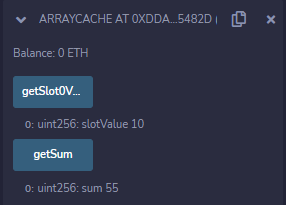
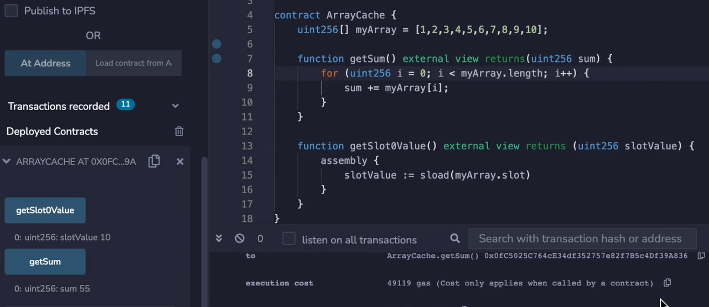
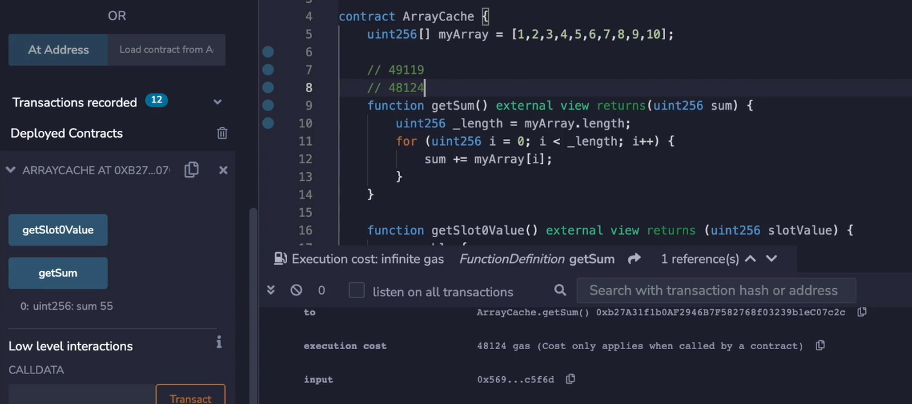
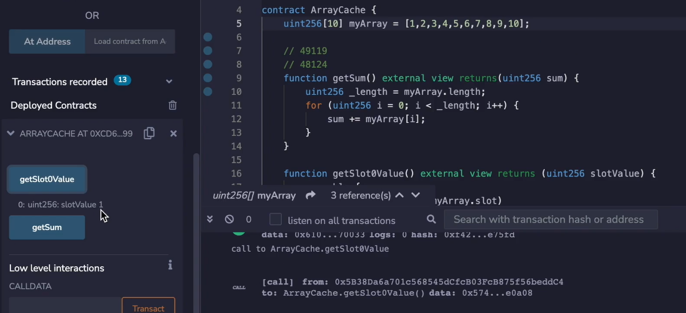
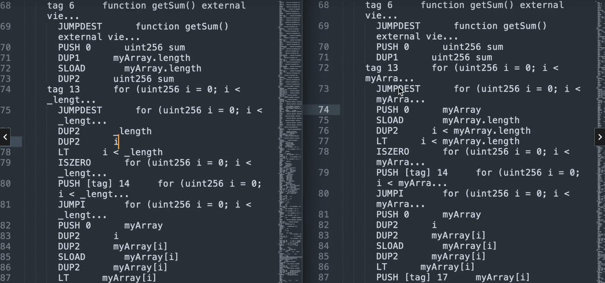
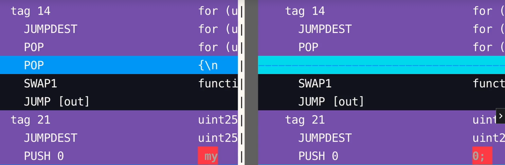

```solidity
    function getSum() external view returns(uint256 sum) {
        for (uint256 i = 0; i < myArray.length; i++) {
            sum += myArray[i];
        }
    }
```

Looping over an array is one of the first things you learn in programming. The typical construction looks like this (指for循环), but in solidity this is not the optimal way to do it when the array is in storage.


Every time **myArray.length** is evaluated, we get a warm storage access which costs 100 gas. As you can see here, and this is something we've reviewed already. 

When the array is long or even has more than a few items in it, this can add up quickly. (每次循环都要消耗一次warmaccess的gas，所以累加起来很快)

To see why this (指**myArray.length**) is a storage access, let's load the storage slot where the array is and see that the value is 10. (从**getSlot0Value**中的代码来看，确实是从slot 0中获得的数组长度10，那么则说明访问数组长度确实是storage access)

```solidity
// SPDX-License-Identifier: MIT

pragma solidity ^0.8.0;

contract ArrayCache {

    uint256[] myArray = [1,2,3,4,5,6,7,8,9,10];

    function getSum() external view returns(uint256 sum) {
        for (uint256 i = 0; i < myArray.length; i++) {
            sum += myArray[i];
        }
    }

    function getSlot0Value() external view returns(uint256 slotValue) {
        assembly {
            slotValue := sload(myArray.slot)
        }
    }

}
```



Over here, 10 is clearly the length of the array, and you can see in plain sight that there is an **SLOAD** over here, this is what happens when you do **array dot length**. 

(个人理解：因为是使用**SLOAD**这个opcode返回的 slot 0 上的值，即数组长度10，那么就证明了solidity代码中访问**myArray.length**就是storage access)

----------------------------------------------------------------------------------------

[For dynamic arrays, this slot stores the number of elements in the array.](https://docs.soliditylang.org/en/latest/internals/layout_in_storage.html#mappings-and-dynamic-arrays)

这里根据文档，如果是动态数组的话，slot 0 存的是数组中元素的数量，从 keccak256(0) 才开始存数组中的元素

----------------------------------------------------------------------------------------




Instead of doing a **SLOAD** in a loop, we should cache the length of the array so that we only do one **SLOAD**. Let's test the gas as is, then add the cache so we can compare the before and after. The gas cost in its current form is 49,119. 

```solidity
	function getSum() external view returns(uint256 sum) {
		uint256 _length = myArray.length;
        for (uint256 i = 0; i < _length; i++) {
            sum += myArray[i];
        }
    }
```



If we add the cache, it would look something like this. Now let's test it in this form. And we can see that the gas is now 48,124 gas. As you can see, we saved almost 1000 gas, which is to be expected because that's 10 **SLOAD**s that were saved. It's not quite 1000 because we had to pay a tiny little bit extra to do the cache operation. I'll discuss this at the end of the video. 

I should mention **this technique only works** if you expect **the length of the array to be constant throughout the loop**, and **also that the array has a dynamic length**. If the array has fixed length, then this won't save gas. **When an array has fixed length, the compiler knows its length and doesn't keep the value in storage**. 

```solidity
	uint256[10] myArray = [1,2,3,4,5,6,7,8,9,10];
```

If we make this (myArray从动态变为固定10个长度) **fixed** and recompile and test this, this **getsSlot0Value** function will instead **return the first item inside of the array**. 



Let's see that, and here you can see this is indeed the case. It gets 1 when the first item inside of the array is 1. This is what is actually stored in slot 0 now. 

Earlier we noted that we had to pay a tiny bit of extra gas to cache the length of the array, 5 gas to be exact. I've already copied the opcodes from both version of this smart contract into this text editor. You can see in the optimised case on the left there is 191 opcodes and in the unoptimized case there's ~~183~~ 189 opcodes. So that means 2 extra opcodes are being executed in the optimized case which add 5 more gas. 

49,119 - 48,124 = 995 = 100 * 10 - 5 

So we see that we save 1000 gas, but it's not quite 1000 gas, we actually save 995, wo we save 1000 gas from reading the array length 10 times, but add 5 gas back, and that's because of 2 extra opcodes. As you can see, we have 189 and one and 191 in the other.



Let's look at the opcode side by side so that we can see where this extra 5 gas is coming from. Over here, **JUMPDEST** is where the function **getSum** begins, so after the function selector is matched, it will jump to **tag 6** and we see a **PUSH 0**, a **DUP1** in both cases, but for the optimal case we cache it, so we see that it's duplicating slot 0 and then sloading it and then duplicating it again. (指line70 到 line73这4个opcode)

In the non-optimal case, it jumps to its destination does a **PUSH 0** and **DUP1** just as in the optimal case, and then it begins the loop. The loop starts with a **JUMPDEST** because a loop needs to jump back to the beginning of the loop each time. So there is an extra **DUP2** (line73) outside of the loop in the optimal case. 



And the other case, I'm going to have to use vim diff to make it a little bit more clear. And you're going to see that after the loop is completed, there is an extra **POP** that happens. Well, that's because that extra duplicate needs to be cleared out before the function returns. And a **POP** costs 2 gas, as we can see over here, and a **DUP1** costs 3 gas, and 2 plus 3 is 5.