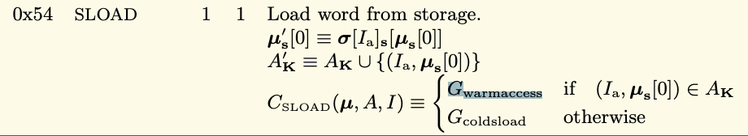
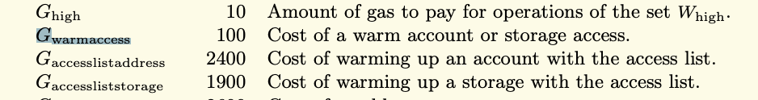

```solidity
    function getSum() external view returns(uint256 sum) {
        for (uint256 i = 0; i < myArray.length; i++) {
            sum += myArray[i];
        }
    }
```

Looping over an array is one of the first things you learn in programming. The typical construction looks like this (指for循环), but in solidity this is not the optimal way to do it when the array is in storage.





Every time **myArray.length** is evaluated, we get a warm storage access which costs 100 gas. As you can see here, and this is something we've reviewed already. 

When the array is long or even has more than a few items in it, this can add up quickly. (每次循环都要消耗一次warmaccess的gas，所以累加起来很快)

To see why this is a storage access, let's load the storage slot where the array is and see that the value is 10.

```solidity
// SPDX-License-Identifier: MIT

pragma solidity ^0.8.0;

contract ArrayCache {

    uint256[] myArray = [1,2,3,4,5,6,7,8,9,10];

    function getSum() external view returns(uint256 sum) {
        for (uint256 i = 0; i < myArray.length; i++) {
            sum += myArray[i];
        }
    }

    function getSlot0Value() external view returns(uint256 slotValue) {
        assembly {
            slotValue := sload(myArray.slot)
        }
    }

}
```


Over here, 10 is clearly the length of the array, and you can see in plain sight that there is an **SLOAD** over here. This is what happens when you do a read of length. Instead of doing a **SLOAD** in a loop, we should cache the length of the array so that we only do one **SLOAD**. 


Let's test the gas as is, then add the cache so we can compare the before and after. The gas cost in its current form is 49,119. If we add the cash, it would look something like this. Now let's test it in this form. And we can see that the gas is now 48,124 gas. As you can see, we saved almost 1000 gas, which is to be expected because that's ten loads that were saved. It's not quite 1000 because we had to pay a tiny little bit extra to do the cash operation. I'll discuss this at the end of the video. I should mention this technique only works if you expect the length of the array to be constant throughout the loop, and also that the array has a dynamic length. If the array has fixed length, then this won't save gas when an array has fixed length. The compiler knows its length and doesn't keep the value in storage. If we make this fixed and recompile and test this, this gets like zero value function will instead return the first item inside of the array. Let's see that. And here you can see this is indeed the case. It gets one when the first item inside of the array is one. This is what is actually stored in slot zero now. Earlier we noted that we had to pay a tiny bit of extra gas to catch the length of the array. Five gas to be exact. I've already copied the OP codes from both version of the Smart contract into this text editor. You can see in the optimised case on the left there is 191 OP codes and in the UN optimized case there's 183 app codes. So that means two extra up codes are being executed in the optimized case, which add five more gas. So we see that we save 1000 gas, but it's not quite 1000 gas. We actually save 995. So we save 1000 gas from reading the array length ten times, but add five gas back and that's because of two extra up codes. As you can see, we have 189 and one and 191 in the other. Let's look at the OP code side by side so that we can see where this extra five gas is coming from. Over here, jump test is where the function get some begins. So after the function selector is matched, it will jump to target six and we see a push zero, a dupe one in both cases. But for the optimal case we cache it so we see that it's duplicating slot zero and then s loading it and then duplicating it again. In the non optimal case it jumps to its destination. Does it push zero in a dupe one just as in the optimal case? And then it begins the loop. The loop starts with a jump test because a loop needs to jump back to the beginning of the loop each time. So there is an extra dupe two outside of the loop in the optimal case. And the other case, I'm going to have to use vim def to make it a little bit more clear. And you're going to see that after the loop is completed, there is an extra pump that happens. Well, that's because that extra duplicate needs to be cleared out before the function returns. And a pump costs two gas, as we can see over here, and a dupe costs three gas and two plus three is five.