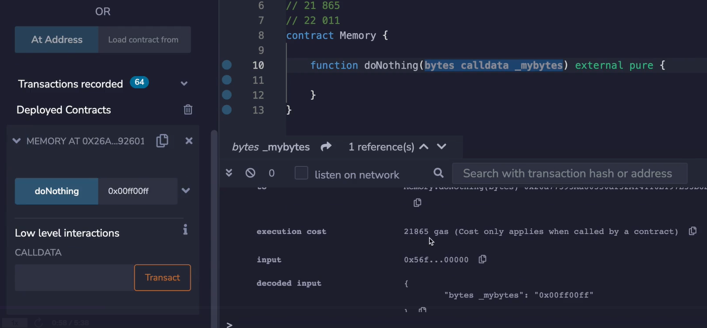
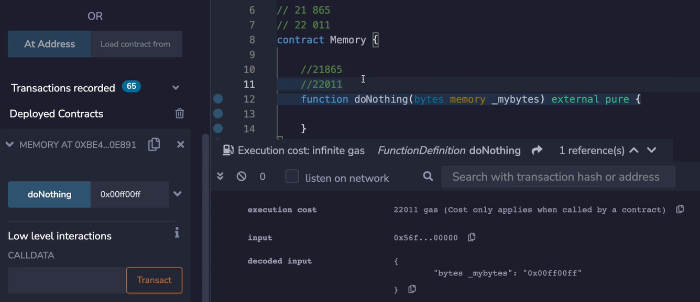
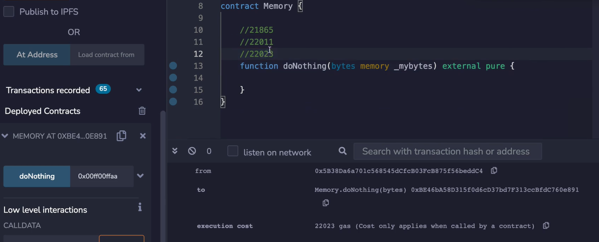

In this section, we're going to look at all of the gas costs that are associated with memory operations. This is quite short, there actually isn't that much information to it, but there are a few key things that you need to look out for. 

```solidity
// SPDX-License-Identifier: MIT

pragma solidity ^0.8.0;

contract Memory {

    // function doNothing(bytes memory _mybytes) external pure {
    function doNothing(bytes calldata _mybytes) external pure {
        
    }

}
```

The first thing that we're going to look at is when memory is used as part of a function call. Now, when you pass in something like bytes or an array, but **bytes** is actually an array of byte that's just syntactic sugar. You have the choice of either specifying **memory** or a **calldata**. 


If you do neither of them, then the compiler is going to yell at you and say that "Data location must be **memory** or **calldata** for this type". So let's look at the gas costs associated with each one and try to understand why they are what they are. 



If we do **calldata** and let's deploy and pass in, let's say **00ff00ff**, **doNothing**, we see that the gas cost is 21,865. 



Okay, what will happen if we change this to **memory**? We'll pass in the same value, this time it's higher, it is 22,011 gas. 

Why is that? Well, under the hood, this **memory** is signaling that you need to copy the data out of the calldata and into the local memory, I'm not actually going to step through the opcodes, but you can get a pretty good idea of that's what's happening. 


```yaml
0x56fd66e1
0000000000000000000000000000000000000000000000000000000000000020  // 32 byte
0000000000000000000000000000000000000000000000000000000000000004
00ff00ff00000000000000000000000000000000000000000000000000000000
```

The input will look like this. ~~I copy the wrong thing.~~ The input data from the transaction will look like this. **First of all, we have our function selector**, remember that? So this **56fd66e1** is coming from 56d6, 66e1. Okay. And when we send that transaction data portion, it's going to say: "I want to talk to this function", and then everything else is always broken up into 32 byte chunks, so there will be a number that represents 32 over here (第一个32字节最后的20 **HEX 20 = DEC 32**).

But this... this is the interesting part. It's going to say there are 4 more bytes that are interesting, and that's **00ff00ff**. 


If we were to send something a little bit different, like, let's say **aa**, we run this, then we would see that the input data is going to change where it originally said 4 and it's going to become 5. Okay, because now this **aa** is part of the transaction. So how do you know that this **00** is not part of the bytes array? Well, that's because you stop at the 5th byte.



You can also see that the gas cost will be higher obviously, because of two reasons: One is we're passing in more part of the transaction data, and remember we have to pay more gas for that, and then we're copying more data into memory.  (The extra non-zero byte is more expensive than the zero byte)

So seeing that **memory** is more expensive than **calldata**, why would you ever use **memory** instead of **calldata**, (此时将memory改为calldata) since this (指calldata) is clearly superior? If you ever need to mutate bytes array, you will not be able to do that with **calldata**, because **calldata** cannot be changed, it's what was sent as part of the transaction.

```solidity
		function doNothing(bytes calldata _mybytes) external pure {
        _mybytes[0] = 0xaa;
    }
```


So if we wanted to do something like **_mybytes[0] = 0xaa** this will not compile (编译不通过或者编译不了的意思) because it's saying “Calldata arrays are read-only”.

```solidity
		function doNothing(bytes calldata _mybytes) external pure returns (bytes memory) {
        bytes memory _myLocalbytes = _mybytes;
        _myLocalbytes[0] = 0xaa;
        return _myLocalbytes;
    }
```

So let's say hypothetically that we wanted to return what we received, but change the first byte to **aa**, well, we could do it like this, we could say **_myLocalbytes memory = _mybytes** and then we would... uh... I didn't specify the data type here, sorry, this is in the wrong order, **bytes memory _myLocalbytes = _mybytes**. 

And then I could say **_myLocalbytes[0] = 0xaa**, and then I could **return _myLocalbytes**. Okay, why is this complaining? Expected a curly brace, but got a return. Yes, it's **returns**. 


Okay, in this scenario, what's the gas cost going to be? **00ff00ff** and we will see that we get **aaff00ff** back because the **aa** was swapped into the first byte, and the gas cost shows associated with this was 22,442.

```solidity
		function doNothing(bytes memory _mybytes) external pure returns (bytes memory) {
        // bytes memory _myLocalbytes = _mybytes;
        _mybytes[0] = 0xaa;
        return _mybytes;
    }
```

The more efficient way to do this would be to make this **memory** instead and then skip this step. So if I do **bytes memory _mybytes**, this will be skipped and I will just replace this variable like so.


So let's deploy it and send in the same thing **00ff00ff** and this time the gas cost is 22,419 which is cheaper in this case. So, **memory** can be cheaper than **calldata** if you need to mutate this. 

By the way, I do have the compiler ~~switched~~ optimization on 1,000 already, so for whatever reason, the Solidity Optimizer doesn't recognize that this optimization will take place and you need to do it yourself. If you're coming from something like Clanger GCSE, you've probably given up on trying to outsmart the compiler at this point, but the solidity compiler is not as mature as those much older compilers.