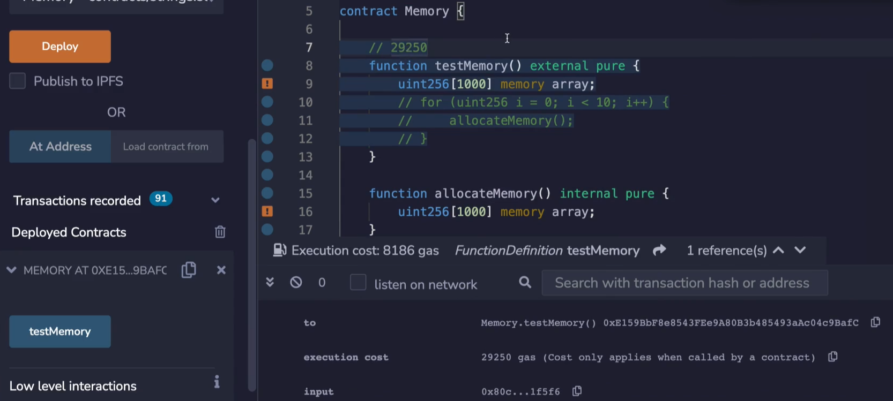
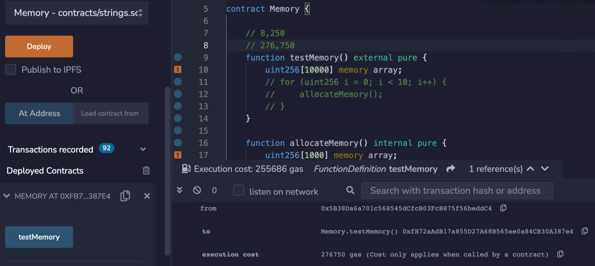
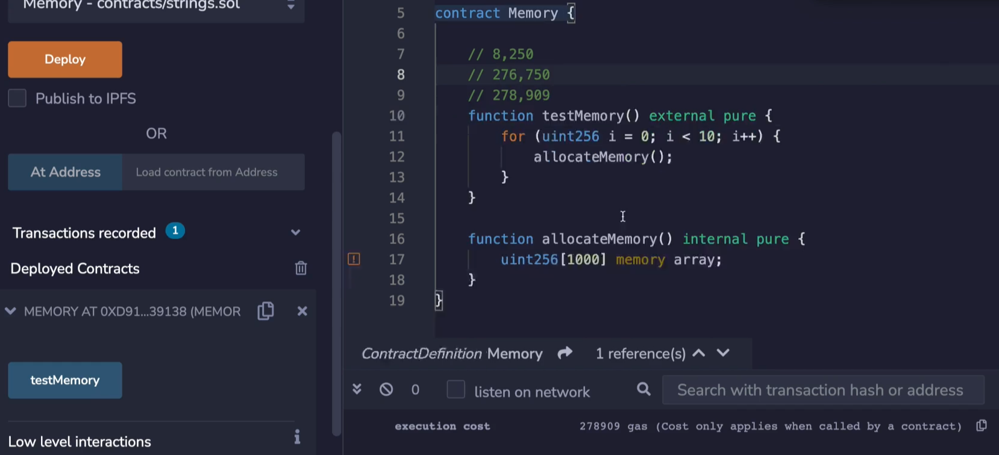

Unlike other languages, solidity does not clear memory that it no longer uses. Something like Go or JavaScript or Python has a Garbage Collector that will deallocate memory that no longer has any references to it. Something like Rust will do this automatically when the lifetime of a variable ends. And with a language like C or C++, you have to manually deallocate the memory. In solidity it's not possible to do any of it. So when you are allocating more and more memory through a transaction, the memory will never be overwritten, it's as if you had allocated one large array, and we saw in the previous video that this can add up to substantial gas costs. 

```solidity
// SPDX-License-Identifier: MIT

pragma solidity ^0.8.0;

contract Memory {

    function testMemory() external pure {
        uint256[10 00] memory myarray;
    }

}
```



By way of review, let's see how much allocating 1,000 256-bit numbers costs. So I am going to look at the gas cost for doing nothing except allocating this array over here. So compile, deploy and test, we see that the gas cost for 1000 integers is 29,000. As usual, we are going to subtract away the 21,000.



For the 10,000 case is, of course, going to be more than 10,000 of this because we are going to be affected by the quadratic part of the formula. We can see that the gas cost is 276 ~~million~~ thousand as it was in the last video. 

```solidity
		function testMemory() external pure {
        for (uint256 i = 0; i < 10; i++) {
            allocateMemory();
        }
    }

    function allocateMemory() internal pure {
        uint256[1000] memory myarray;
    }
```



Okay, what will we expect the gas cost to be... when we allocate the 1000 units, 10 times. It won't be 80,000, it's actually going to be these 1000 units back to back. And we can see that in action here. So I'm going to compile, deploy and test as usual, the gas cost comes out to 278,000 gas. Okay. So there is a little bit more because we have these extra function calls, but you get the point.

The memory is never clear, even though it's only used one time. So the practical take away from this is that you have to be very careful when you allocate memory over and over because the costs will keep adding up and possibly hit the quadratic portion of the formula. If you want to intentionally reuse these different parts of the memory, you're going to have to manually do that by changing the memory pointer with you. 

Alternatively, you could avoid declaring the memory inside of the loop and declare it right before the loop and do whatever you were going to do with the array inside of here. You, of course, will have to clear out the values between each iteration, depending on what you were doing.

