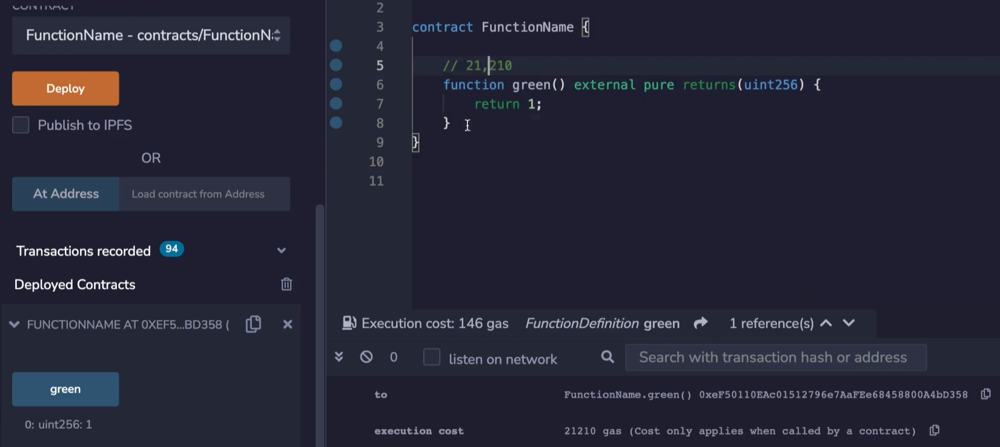
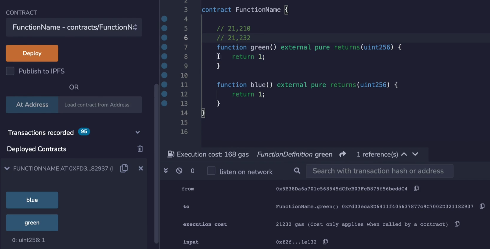
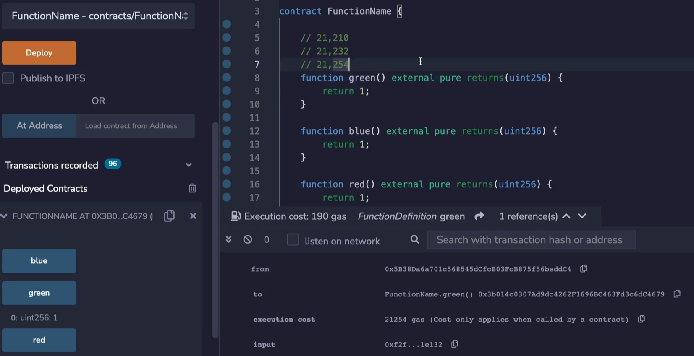
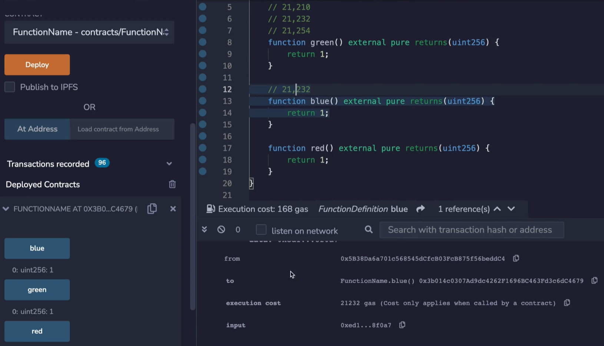
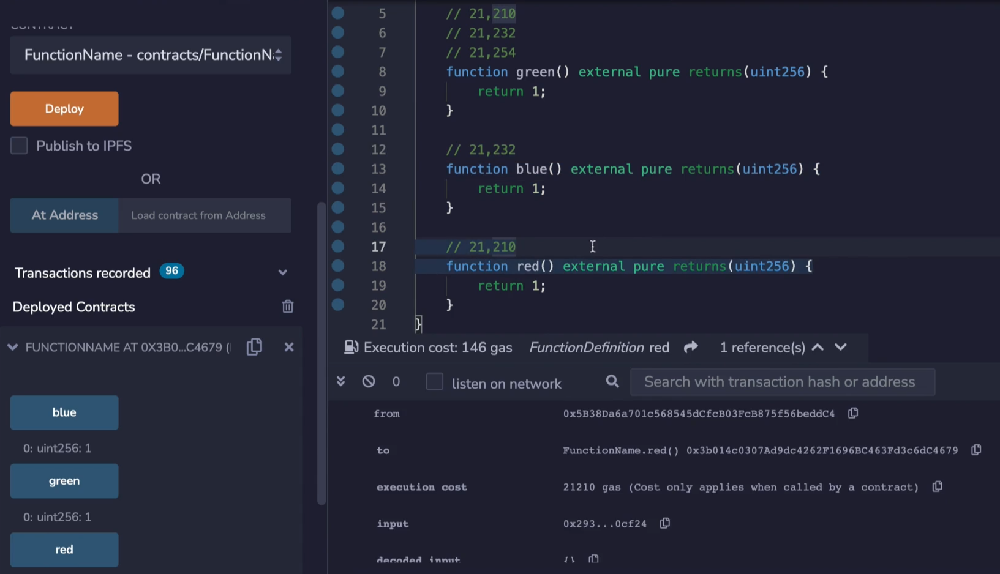
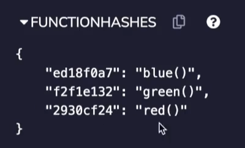
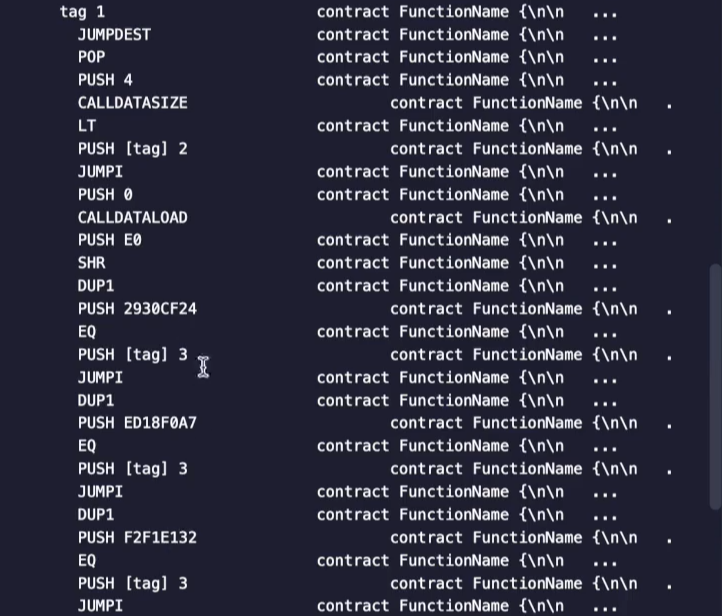
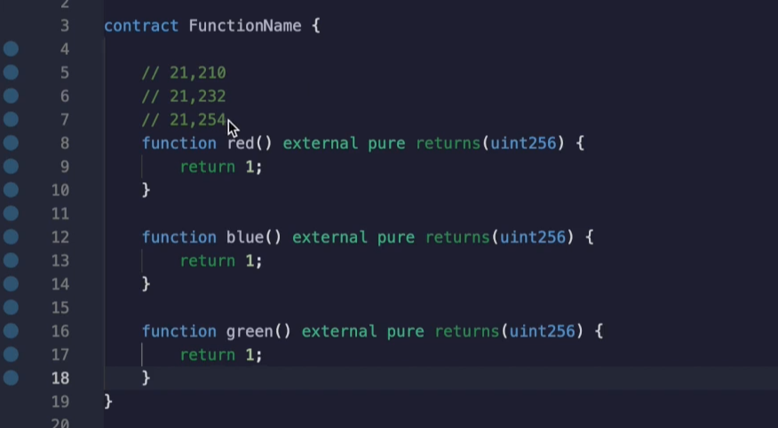

In this video, we're going to see how the name of a function affects its gas cost. This might seem rather counterintuitive, but once you see the explanation, it actually makes a lot of sense. 

```solidity
// SPDX-License-Identifier: MIT

pragma solidity ^0.8.0;

contract FunctionName {

    function green() external pure returns(uint256) {
        return 1;
    }

}
```



Let's create a function called **green** that doesn't do anything except return the value **1**. Okay. At this point, I'm pretty sure you know the drill. We see that the gas cost is 21,210. 

```solidity
		function green() external pure returns(uint256) {
        return 1;
    }

    function blue() external pure returns(uint256) {
        return 1;
    }
```



Now let's add another function that we are going to call **blue**, but I'm going to call the function **green** instead of blue, when we looked at the gas costs, interestingly, they go up despite not touching the function green. 

```solidity
		function green() external pure returns(uint256) {
        return 1;
    }

    function blue() external pure returns(uint256) {
        return 1;
    }

    function red() external pure returns(uint256) {
        return 1;
    }
```



So over here, **green** now costs... Over here, **green** now costs 21,232 gas. Let's add yet another function, what will happen to the **green** function now? When we test the green again, we see that the gas cost has increased again, to 21,254. 



Now, here's something interesting, what will the gas cost be of **blue**? **blue** cost 21,232 gas, just like **green** costed on its second try when **red** was not written yet. 



What will **red** cost? **red** costs 21,210 gas, just like **green** did before all of the other functions were added. 



Well, if we look at what the compiler output is producing, the first thing we need to take note of is the function hashes: **blue** is ed1, **green** is f2f and **red** is 293. 



When we look at the actual opcodes, what happens is: solidity needs to check which function selector was included in the **tx.data**. So first it checks was **red** picked? And if so, it's going to jump to execute **red** and then it's going to check was **blue** picked? And if so, it's going to execute the code for **blue**. And lastly, it's going to check was **green** picked and then it's going to jump to the code for **green** if that's the case. 

Again, these came from over here, **red** was 29... **green** was f2 and **blue** was ed. **The compiler will always sort these checks in hexadecimal order**. So **2** is smaller than **e** and is smaller than **f**. 

There are two takeaways from this: One is, if you have a function that is very gas sensitive, you should try to make sure that its function selector is near the top. And remember, the function selector is the first 4 bytes of the keccak256 of the function name when that function is formatted according to the specification, we talked about this in an earlier video. The other implication is that if you are benchmarking a function to optimize its gas cost, you have to not change the name because you don't know that the changes are the result of the name, of the function and thus it's function selector or if it's because of the changes you made inside of the function. 



If you do the math, you're going to see that each of these increases are worth 22 gas a piece. 


This isn't a coincidence, when we look at the opcodes over here, between each check we see that the instructions **EQ PUSH JUMPI DUP** are happening. So I guess to include everything, each sequence is a PUSH and EQ (equality) check, a PUSH, a conditional JUMP and a duplicate, and then it moves on to the next function. 

A **PUSH** will cost 3 gas and equality check costs 3 gas, a **PUSH** cost 3 gas, a conditional jump cost 10 gas, oh and a **DUP1** cost 3 gas over here. So this is 3, plus 3 is 6, plus 3 is 9, plus 10 is 19, plus 3 is 22. So for each unit down the function is, that adds another 22 gas.