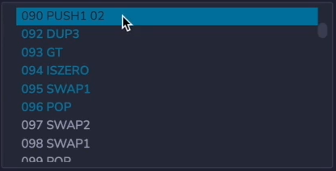

It's helpful to know which opcodes are used by the Ethereum Virtual Machine. So that way you can have an intuition if solidity construction is going to be efficient or not. For example, Ethereum has **LT** and **GT** operator, but it doesn't have a <= or >= operator. **So if you do <= or >= in solidity, it's not going to translate to a single opcode, the compiler is actually going to synthesize it out of the opcodes that are available to it, and this increases the gas cost**. 

```solidity
// SPDX-License-Identifier: MIT

pragma solidity ^0.8.0;

contract LessThan {

    function lessThan(uint256 x) external pure returns(bool) {
        return x < 3;
    }
}

contract LessThanEq {

    function lessThan(uint256 x) external pure returns(bool) {
        return x <= 2;
    }
}
```

Let's see this in action, over here, we have two contracts. One will check if **x** is less than 3 and the other one will check if it is less than or equal to 2. These are semantically equivalent, but we're going to see that under the hood, the solidity compiler creates something different. 


Let's deploy the strict **LessThan** contract and debug it to see what's going on. So we deploy the **LessThan** contract, let's apply it a value of 2 and debug it. We see that it's going to **PUSH** 3 onto the stack, which is what we expect from over here. It's going to **DUP** it and then it's going to do a **LT**. Okay, no surprises, it's just checking if **x** is less than 3. We expect to see that sequence of **PUSH** 3 **LT** somewhere inside of the compiled opcode. 



Let's see what the compiler does for less than or equal to. I'm going to deploy the **LessThanEq** contract and run the same test, debug it. And here we see a a **PUSH** 2 onto the stack which is to be expected, it's **DUP** and then we see a **GT** and an **ISZERO**. Okay well what is **ISZERO**, well, **ISZERO** rather predictably just checks if a number is equal to zero, so the previous operation, the **GT** will return a 1 or 0 depending on the comparison, and then **ISZERO** will simply invert that, that is semantically equivalent saying **!(2 < x)**, is the same as saying **2 <= x**. (这块应该说错了，2 >= x，所以x > 2 的非 就是 x <= 2)

So let's work through that. If we have **x == 2**, 2 is not less than 2, but you flip that, so it becomes true. With 3,    3 > 2, but you flip that it becomes false, and it is false that 3 <= 2, and you can work out the other examples yourself.

The specific takeaway for this video is to prefer the cheaper comparison operator whenever possible. 

1. **<** and **>** are always more efficient that **<=** and **>=**
2. **<=** and **>=** requirs two opcodes: **LT/GT** and **ISZERO**
3. Strict inequalities only require one opcde: **LT** or **GT**

But the general takeaway is to think about how your solidity code maps to opcodes and to consider if you can create something semantically equivalent that is cheaper to execute. Another example will be in the next video.