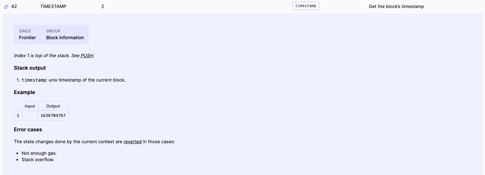

Like most languages, solidity shortcut evaluates **AND** and **OR** operators. When you evaluate **x OR y** that is boolean **OR**, and you know that **x** is true, then it doesn't matter if **y** is true or false.

```solidity
// SPDX-License-Identifier: MIT

pragma solidity ^0.8.0;

contract ShortCircuit {

    bool publicMint = true;

    mapping(address => bool) public allowed;

    function addToAllowed(address _address) external {
        // This code does not have access controls, do not use in production
        allowed[_address] = true;
    }

    // 21,225
    function shortCircuit() external {
        require(block.timestamp > 1649604154 || allowed[msg.sender], "invalid");
    }
}
```

So if this (**block.timestamp > 1649604154**) evaluates to true, then this (**allowed[msg.sender]**) operation will be skipped. The converse of this happens for the **AND** operation. If you are conducting the operation **x && y**, and **x** is equal to false, then it doesn't matter what **y** is, because the entire expression will evaluate to false, so if **x** is false, then **y** will not be evaluated.

If there is a substantial difference in gas cost between either of these expressions (指x和y) , then oftentimes it's worthwhile to put the cheaper one first, so that perhaps the more expensive one might get shortcut. 



This here is a common example where you are conducting a token sale. People might be able to buy the token if a certain time has passed or if they are on an allow list, over here, **the order matters**. In this particular setup, the allow list needs to read from memory (**allowed[msg.sender]**) and we know this cost 2,100 gas (应该是指cold access). On the other hand, checking the **block.timestamp** cost 2 gas as we can see over here.

Now, of course, there is a nuance to this, if you expect all of the tokens to be sold during the presale and none after the timestamp, then it would actually make sense to evaluate this in the opposite order. So if you want to be technical, you need to multiply the gas costs multiplied by the likelihood that the check will take place. So if you expect the timestamp to never be relevant, then in that case it would be worthwhile to flip them. But you would have to be extremely sure of that because this check (**||**右边的) costs 2100 gas and this check only cost 2 gas. So you would need to be almost completely certain that is the case for the flip to be worthwhile.