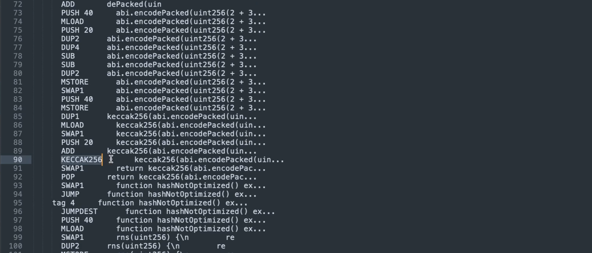

Unlike other compilers, you cannot always rely on the solidity compiler to carry out constant expressions and store the result in the compilation output. 

```solidity
// SPDX-License-Identifier: MIT

pragma solidity ^0.8.0;

contract Precompute {

    function mul() external pure returns(uint256) {
        return 3 * 7; // hex 15
    }

    function div() external pure returns(uint256) {
        return 22 / 2; // hex b
    }

    function divUnoptimized() external pure returns(uint256) {
        uint256 a = 2;
        return 22 / a;
    }

    function functionSignatureOptimized() external pure returns(bytes4) {
        return bytes4(keccak256("withdras()"));
    }

}
```

Let's look at some examples. Over here, we're going to look at multiplication and see 3 * 7 which is Hex 15. The solidity compiler will succeed in detecting that this expression never changes and will hard code the output inside of the bytecode, 3 * 7 is 21 in decimal which is 15 in hexadecimal, so we expect to see a **PUSH 15** somewhere inside of the bytecode when we compile this.      


Over here, I've pasted the byte code and if I look for **PUSH 15**, there it is, and they've nicely told us that this comes from the 3 * 7. 


The same thing will happen for the division case, 22 / 2 is 11 which is hexadecimal B, so we expect to see a **PUSH B** appearing in a similar manner. And there it is. If you want to be sure that that **PUSH B** came from the relevant function and isn't some opcode in another part of your contract, you can trace backwards to make sure that it goes back to the function selector where you expect it to be. So **PUSH B** is inside of **tag 3**. 


Over here, **tag 3** is pushed onto the stack before a jump and that's conditioned on something being equal to what looks like a function selector F9F, and if we look at the function selector, we will see it over there and see that they match. 

```solidity
    function divUnoptimized() external pure returns(uint256) {
        uint256 a = 2;
        return 22 / a;
    }
```

Let's look at a case where the optimization does not take place, over here, the solidity optimizer does not recognize this is actually the same thing, 22 divided by 2, I don't think it can be reliably predicted for when the solidity optimizer will fail to recognize that an optimization can take place. But if something is happening across several variables, it's not that reliable. Let's look at the opcodes for this. But before we do, one interesting thing to note about the previous opcode is that the **DIV** opcode didn't appear anywhere, so here we have the **div** function, but we would expect the opcode for actually executing division to appear somewhere inside of the opcodes, but because it was optimized away, the **DIV** opcode appears nowhere inside of here. 


That isn't the case in this scenario. When I compile this and copy out the assembly code and examine it, we will see that the **DIV** opcode is in fact present, because it is carrying out a division. Now let's look at the individual parts. 


We expect 2 and 22 to be pushed onto the stack at some pointm, so we should see a **PUSH 2** somewhere, there it is, and we also see a **PUSH 16** which is hexadecimal for 22. You can know that because a 10 in hexadecimal is 16 and 16 plus 6 is 22, so it's pushing both of these numbers onto the stack and then actually dividing them over here. 

```solidity
		function functionSignatureOptimized() external pure returns(bytes4) {
        return bytes4(keccak256("withdras()"));
    }
```


The next scenario we are going to look at is hash functions. This (指整个函数) will properly preoptimize, the keccak256 and then taking the first 4 bytes will result in 3ccfd6.


And we expect to see that inside of the byte code 3ccfd6, okay, oh, I forgot to mention that, but this is the first 4 bytes (3ccfd60b一共8位，2位是一个字节) and the solidity compiler has optimized it so that the result of the hash and then taking the first 4 bytes is there. 

```solidity
		function hasNotOptimized() external pure returns(bytes32) {
        return keccak256(abi.encodePacked(uint256(2 + 3)));
    }
```

However, this breaks down if we are doing a type conversion, I don't know if this is part of the specification of the compiler or not, but regardless, it's something that you should be aware of. Over here, we're taking a hash of something that is clearly a constant, but the solidity compiler does not compile it in that manner. 



Here is the byte code and we can see that it actually carries out a keccak256 hash function. If I look at the earlier byte code, which I just did by hitting command Z over here, then I see that there is no keccak256 byte code anywhere. These are just comments, but the actual byte code is non-existent. 

```solidity
		function multistepNotOptimized() external pure returns(uint256) {
        uint256 y = 2 - 1;
        return 2 ** y;
    }
```


Let's look at an example with an exponent. The key bytecode that we will be looking for here is **EXP**. Again, this is a constant because it's 2^1 is equal to 2, but that's not what will be carried out by the compiler. And there it is, this is taking the exponentiation even though it's constant.


And exponentiation will have variable gas costs depending on the size of the data that you are passing in, so it would be much cheaper if you manually evaluated this first and store the byte code. Now there can be an advantage sometimes to leaving code as an expression because it makes your code more clear. But you want to look through the compiler output to make sure that the compiler is actually evaluating everything. Otherwise, for one year, deployment costs will be higher because there will be more opcodes and two of the execution costs for your user will be higher because they will be executing opcodes when they could have just been executing only one, which is pushing on the evaluation of that expression.