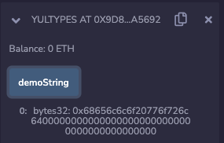
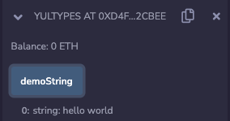
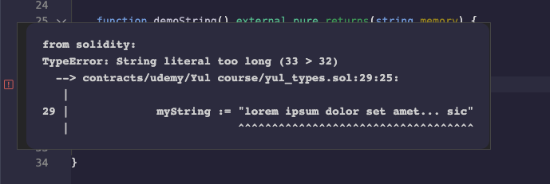
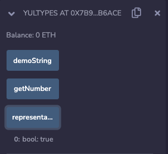
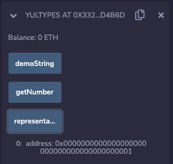

The first thing we're going to learn about with yul is types, and the reason why that is significant is because yul have only one type, it is the 32 ~~bit~~ bytes word or the 256 bits that you're used to seeing in solidity. Whenever you see yul inside of a contract that is written in solidity you're going to see it inside of the assembly block. 

```solidity
// SPDX-License-Identifier: MIT

pragma solidity ^0.8.0;

contract YulTypes {

    function getNumber() external pure returns(uint256) {
        return 42;
    }

}
```

So let's do something very simple, we're going to create a function that will just getNumber, it's going to be an external view and it returns a uint256. Now normally we could just do something like return 42 over here and this would be... and this would be valid except that... I put returns in the wrong place. Okay. Okay, so this is perfectly fine, it's probably saying that this should be a pure function, so let's just do that so that the compiler isn't yelling at us. All right, fine. 

```solidity
		function getNumber() external pure returns(uint256) {
        uint256 x;

        assembly {
            x := 42
        }
        return x;
    }
```

But how would we do this in yul? Well, let's get rid of this, we will say you uint256 x and then in assembly we're just going to set x to be equal to 42 and then we will return x, ok, this compiles properly and if I am to run it, I will deploy and getNumber, and sure enough, it's 42. 

So what did we learn so far? Well, one is yul doesn't have semicolons, yul note that that wasn't there (删掉了42后边的分号), that's not valid yul and the other one is when you're assigning a variable, it requires a colon equal sign (**:=**), so this mathematical assign value sort of thing, and of course is inside of an assembly block. The other thing you'll note is that this variable naming over here is able to reference stuff... that's inside of the this assembly block scope, so it can see the x over here, therefore, it's able to reference it inside the block. (主要意思是说assembly块内可以访问块外的变量)

Okay, now over here, we might see, oh, okay, this is interesting because we're assigning 42 into a uint. But earlier I said that assembly or yul doesn't have types or it has only one type -- the 32 byte word. Let's illustrate that by assigning different types. 

```solidity
		function getHex() external pure returns(uint256) {
        uint256 x;

        assembly {
            x := 0xa
        }
        return x;
    }
```

I'm going to reuse this function except I'm going to call it getHex and then I'm going to assign this 0xa which is the equivalent of decimal 10, so when I compile and test the contract and getHex then I should get 10 because 0xa is decimal 10, but solidity is interpreting it as a decimal when it's in a uint256. 

```solidity
		function demoString() external pure returns(string memory) {
        string memory myString = "";

        assembly {
            myString := "hello world"
        }
        return myString;
    }
```

Okay, let's demonstrate this with some more interesting types, over here, we're going to demonstrate a string. Now, a string is not naturally a bytes 32, so you cannot... cannot do something like this, string memory myString is equal to hello or let's keep it empty for now, and then inside of assembly we would supposedly do something like this, but this is not going to work, so even though it compiled, if we try to deploy this and run demoString.


What happens when we look down here? We're going to see that the transaction ran out of gas. **So what's going on here**? Well, this is memory (指myString), right? So the string is not being stored on this stack, it's being stored on the equivalent of the heap, and this is trying to assign "hello world" into the pointer. There's a pointer on the stack to a location in memory, so this is actually nonsense. So let's show how to do it properly. 

```solidity
		function demoString() external pure returns(bytes32) {
        bytes32 myString = "";

        assembly {
            myString := "hello world"
        }
        return myString;
    }
```

Remember how each type is bytes32? And bytes32 is always stored on the stack. So we're going to set this to instead be bytes32 myString and we'll have that empty and we will set myString to "hello world" and return this. Oh, except that we have to change the return type. Don't worry, we will make this readable in the second.



So we change the return type, redo this and get demoString, and over here we get something that is actually the representation of hello world. In fact, if we were to take this and convert it into a string representation, you would see that it's equal to hello world. 

```solidity
		function demoString() external pure returns(string memory) {
        bytes32 myString = "";

        assembly {
            myString := "hello world"
        }
        return string(abi.encode(myString));
    }
```



So let's do that inside of solidity though. Okay, now we will get the string representation back and it says "hello world". 

Now there is a gotcha with this because this assumes that the string you are putting into here is less than 32 bytes, if I were to do something like I don't know, "lorem ipsum dolor set amet blah blah blah". 



Okay, over here it's saying the string literally is too long, 33 is longer than 32, so the compiler will still catch if you try to put a value in here that is not going to fit. And the natural question would be is: if you're using yul, how do you put strings into your code that are longer than 32 bytes? That's something we will get to later. 

The last point I really want to drive home is how **the 32 bytes is the only type that is used inside of yul but solidity is just enforcing an interpretation when you make an address, a bytes 32, an integer or so forth**, let's demonstrate that.

```solidity
		function representation() external pure returns(bool) {
        bool x;

        assembly {
            x := 1
        }

        return x;
    }
```



Function representation, external, pure returns. Let's say bool for now. So if I have boolean x is not set and then I will set it. And I need to close the delete that. All right, let's try this out. This returns true because under the hood, even though we didn't put true in here, a boolean in solidity is really 32 bytes where the last bit is 1.

```solidity
		function representation() external pure returns(uint16) {
        uint256 x;

        assembly {
            x := 1
        }

        return x;
    }
```


We could do something with other data types and we'd get similar results. So for example, let's say I would return a uint16 if I make this a uint16, this compiles and this will simply be returned back as a 1, and it's 1.

```solidity
		function representation() external pure returns(address) {
        address x;

        assembly {
            x := 1
        }

        return x;
    }
```



That would apply to any other uint that I were to put in there. Let's do something interesting. Let's make this an address over here. We have an address and this is going to come back as a normal Ethereum address, but where everything is zero except the last bit is 1, and it's that.

