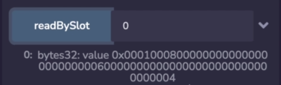
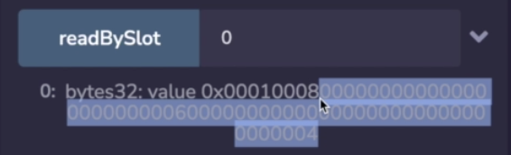
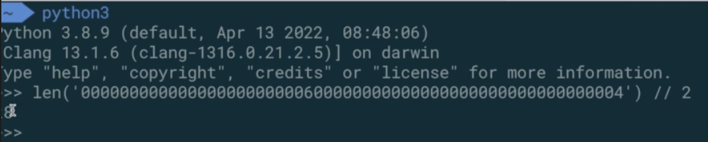
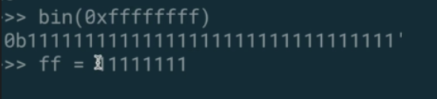
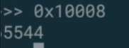
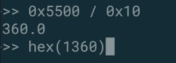

When multiple variables are inside a slot, it gets trickier. 

```solidity
// SPDX-License-Identifier: MIT

pragma solidity ^0.8.0;

contract StoragePart1 {

    uint128 public C = 4;
		uint96 public D = 6;
		uint16 public E = 8;
		uint8 public F = 1;
		
    function readBySlot(uint256 slot) external view returns (bytes32 value) {
        assembly {
            value := sload(slot)
        }
    }
}
```

Imagine we try to read variable E, now this number is contained inside of this 32 byte slot over here. So when we run this by reading from slot 0, which is where E is.



Then we're going to get this back and we see all of the values packed in here, we see the 4 which corresponds to C, we see the 6 which corresponds to D, we see the 8 which corresponds to E and the 1 which corresponds to F. And you can see that the E and F are fairly close to each other over here, which makes sense because they are smaller integers, so they get packed more closely than something that is 128 bits long.

Solidity doesn't have any problem reading these values, as you can see, if we get these variables in the conventional way, then it's no problem, these are just the public getters of the variables since these variables are public. 

```solidity
function getOffsetE() external pure returns (uint256 slot, uint256 offset) {
    assembly {
        slot := E.slot
        offset := E.offset
    }
}
```

So how are we going to get the variables we care about out? The first thing that solidity helps us with, or rather yul is that it gives us the **offset**. So we want to know where exactly inside of this slot is E, so I have a function here that's going to get the offset of E, But just to make this more interesting, let's return two values back, uint256 slot and we will say slot is equal to E.slot, and when we run this and we getOffsetE, 


we see that the slot is 0 and the offset is 28, now this is quite useful because this is telling us exactly where to look to find this variable.



What does this 28 mean? Well, when we read by slot, what it's saying is you look 28 bytes to the left (从最右往左数28个字节), you're going to find the variable you care about, now, remember that E is 8 in this case and it's saying that if you go 28 bytes down, you're going to find it. 



So let's see that that's actually the case, I'm going to copy everything up until where the variable E starts and then see how long it is, so if I take the length of this and do that here, you can see the 4 and the 6 this will give, and then if I divide by 2, that's going to tell me how many bytes this is, because remember each pair of these hexadecimal is a byte, so it's 28. (结果是28，前边的2视频里没显示出来)

```solidity
function readE() external view returns (uint256 e) {
    assembly {
        let value := sload(E.slot) // must load in 32 byte increments
        //
        // E.offset = 28
        let shifted := shr(mul(E.offset, 8), value)
        // 0x0000000000000000000000000000000000000000000000000000000000010008
        // equivalent to
        // 0x00000000000000000000000000000000000000000000000000000000ffffffff
        e := and(0xffffffff, shifted)
    }
}
```

So what it's saying is if we want to read E, we can simply take slot 1 and shift it to the right by 28 bytes, so let's do that over here. We have a function readE which is going to return back to us the value of E, and again, this is a uint16 and we're trying to get E back. Going back here, we need to load where the slot is and then shift it to the right by 28 bytes, now remember, E.offset was equal to 28, but this is in bytes, shift right (shr) takes the number of bits you want to shift by as an argument, not bytes. (一个字节是8位，所以这里乘以8)

```solidity
shr(x, y) C logical shift right y by x bits
```

And you can see that in the specifications: shr is going to logically shift y by x bits and the number of bits you're shifting is in the first argument, so this is 28 times 8 which is going to be the number of bits. 

Now, you don't actually need to carry out this multiplication, you can hardcode it because it is hardcoded and E.offset never changes, but I'm just explicitly carrying out the multiplication to make it clear what's happening. 

So let's see what's happening at each step, when we get this value, value is going to be equal to this. 

指使用这行代码 value := sload(E.slot) 获取0x<u>00010008</u>00000000000000000000000**6**0000000000000000000000000000000**4**

So when we load value, it's going to have this inside of there and everything to the right is going to fall off (省略了说在右移之后), so this I'm just going to change this to 0 and this to 0, (把6和4改成了0)

0x00010008  => 0x00000000000000000000000000000000000000000000000000000000<u>00010008</u>

this is all going to vanish and this is going to be filled in with zeros of the same size. Note that we still have this 1 over here because the variable F is to the left of E, so it's still preserved, but we'll solve that in a moment. So shifted now looks like the value that we have over here. (上边补全了0的数值)

You'll see this masking operation a lot where you AND something with a bunch of ff, now this is all really just a bunch of ones under the hood. 



So if I look at the binary representation of, whoops, then it's all a bunch of ones. All the bits are ones because F is the equivalent of 1111, and if you have 2 fs next to each other, that's the equivalent of 1111,1111 and this is one byte because there's 8 bits in it. 

```solidity
let value := sload(E.slot) // must load in 32 byte increments
//
// E.offset = 28
let shifted := shr(mul(E.offset, 8), value)
// 0x0000000000000000000000000000000000000000000000000000000000010008
// equivalent to
// 0x000000000000000000000000000000000000000000000000000000000000ffff
e := and(0xffffffff, shifted)
```

So this operation is actually not going to work because there are the wrong number of fs inside of it, so that's a typo (这时值还是0xffffffff), what we want to do is mask out only this part over here (指0008), so we get the 8 back, if we actually run the function the way it is now, then well, it magically works. 

Well, what's going on here? We would think that this 1 is going to get caught in there, and it should not, it should return a value higher than 8, right? Well, not quite, because over here we're explicitly determining, we're explicitly making the return type uint16, so it's really only pulling off these values at the end. (这里因为函数返回值类型是uin16，只取2个字节，所以就算and函数的参数写错了，最终返回值也只是最后边的0008，如果把返回值类型调大，你那么这个错误就会被发现了，因为1在第三个字节上)



However, let's say that this was looking at the entire thing (这里将返回值类型改为了uint256) and if you were dealing in yul, you only can deal with lengths of 256 bits, then if we run this version of the contract, yeah, we get this value back which is this in decimal, which you can see this way 65544. There we go. (上图中左边的6没显示出来)

e := and(**0xffffffff**, shifted)  => e := and(**0xffff**, shifted)

So the solution to that is simple, we just want to get rid of those, so that this becomes 0 and this matches the expected type, and this 1 (代表F的值的1) when it's ANDed with 0, is going to become 0. So let's rerun this, and when we readE, it behaves the way that we expect it to. I should note that I've used the shr operation over here. 



Some yul programmers prefer to use division to conduct shifting, so you can imagine if you were to divide, let's say 0x5500 and then you divide it by 0x10, just like in decimal division, this 0 (0x5500 => 0x550) will disappear, so I get this back. But if I look at this in hex value at 0x550. So the same thing when you divide by 10 and you just remove the leading item at the end of its integer division. (意思是除10就是右移1位)

```solidity
function readEalt() external view returns (uint256 e) {
    assembly {
        let slot := sload(E.slot)
        let offset := sload(E.offset)
        let value := sload(E.slot) // must load in 32 byte increments

        // shift right by 224 = divide by (2 ** 224). below is 2 ** 224 in hex
        let shifted := div(
        value,
        0x100000000000000000000000000000000000000000000000000000000
        )
        e := and(0xffffffff, shifted)
    }
}
```

So some people use division or multiplication to shift, and if you see something like this, then it's saying, well, remove this many bytes off at the end. Now shifting is preferred to division because it costs less gas. But I want you to understand that some people shift like this so that you can read the code when you come across it. 

```solidity
// masks can be hardcoded because variable storage slot and offsets are fixed
// V and 00 = 00
// V and FF = V
// V or  00 = V
// function arguments are always 32 bytes long under the hood
function writeToE(uint16 newE) external {
    assembly {
        // newE = 0x000000000000000000000000000000000000000000000000000000000000000a
        let c := sload(E.slot) // slot 0
        // c = 0x0000010800000000000000000000000600000000000000000000000000000004
        let clearedE :=  and(c,0xffff0000ffffffffffffffffffffffffffffffffffffffffffffffffffffffff)
        // mask     = 0xffff0000ffffffffffffffffffffffffffffffffffffffffffffffffffffffff
        // c        = 0x0001000800000000000000000000000600000000000000000000000000000004
        // clearedE = 0x0001000000000000000000000000000600000000000000000000000000000004
        let shiftedNewE := shl(mul(E.offset, 8), newE)
        // shiftedNewE = 0x0000000a00000000000000000000000000000000000000000000000000000000
        let newVal := or(shiftedNewE, clearedE)
        // shiftedNewE = 0x0000000a00000000000000000000000000000000000000000000000000000000
        // clearedE    = 0x0001000000000000000000000000000600000000000000000000000000000004
        // newVal      = 0x0001000a00000000000000000000000600000000000000000000000000000004
        sstore(C.slot, newVal)
    }
}
```

Now, let's talk about writing to E. Now, the reason why writing variables that are smaller than 32 bytes can be tricky is because solidity, yul and the Ethereum Virtual Machine in general is only able to write in 32 byte increments. So if you were to write directly to slot 0 in an attempt to change E, say using the methodology we explored earlier, it's for sure going to clobber the other variables and change their values, which is obviously undesirable. So to solve this, we need to use bit masking and bit shifting. Let's say that we were trying to change the value of E to become 10 which is hexadecimal a, so we, as usual, are going to compile and deploy this contract, let's say we wanted to change E to become 10, ok that succeeded. 

    // V and 00 = 00
    // V or  00 = V

And if we read over here we see that this got changed to **a** and hex **a** is decimal **10**. Okay so this exceeded. What did that function do? Well, this takes advantage of a few things: one is, if you take a value and AND it with 0, you're going to get 0 because 0 AND something else is always 0, If you take a value and OR it with 0, then you get the original value. 

So this is how we are able to selectively delete parts of the 32 byte storage and able to selectively preserve parts of it. We start off with a function argument, the newE that we wanted to write, and even though it's specified as uint16 we'll see that under the hood, yul of course is going to treat this as a 256 bit value. 

// newE = 0x000000000000000000000000000000000000000000000000000000000000000a

So this is what newE looks like from the perspective of yul, the next thing that's going to happen is obviously we need to know where E is, so it's going to get it from the slot.

// c = 0x0000010800000000000000000000000600000000000000000000000000000004

So **c** is going to be the value that's stored inside of this slot, and as we looked at earlier, it's going to have the 1, the 8, the 6 and the 4 in there which correspond to A, B, C and D. What we need to do is selectively delete E, now, E is a 16 bit value which is the same as two bytes, so we need to delete this byte and this byte so that we preserve F and all of the other variables. 

So to selectively delete it, we can take advantage of this identity axiom, I'm not sure what you call these things, 

// mask = 0xffff0000ffffffffffffffffffffffffffffffffffffffffffffffffffffffff

anyway we can take advantage of this fact, AND the value inside of storage with a mask like this and AND it with 0 is going to force it to be 0. Now this might look a little funny because it's very hard coded, but these variables are always stored in the same slot and have a fixed offset, they don't change over time, so hard coding is certainly fine. 

// c = 0x0001000800000000000000000000000600000000000000000000000000000004

The math that's being carried out here is the mask and is being ANDed with the value inside of the storage and this 0 gets ANDed with 8 which forces it to be 0, but the value 1 is preserved, the value 6 is preserved and the value 4 is preserved because f is all ones and all ones ANDed with something else is the original value. 

// V and FF = V

I guess we should have made note of that over here, this is another useful thing V AND all ones is equal to V. All right. 

```solidity
let shiftedNewE := shl(mul(E.offset, 8), newE)
// shiftedNewE = 0x0000000a00000000000000000000000000000000000000000000000000000000
```

The next thing that we're going to do is do what we did earlier, is shift left this time and put the new value in the correct location, we know how much to shift it, using the shift operator ( 指mul(E.offset, 8) ) that we talked about earlier, the new value will just be the values OR together, so shifted E is only going to affect the two bytes that we care about changing, and we know that we already cleared out those two bytes, so we know that we're not going to have any values in here that shouldn't be here. But when we OR the shifted E with what we cleared out from earlier, then it's going to preserve those original variables, so 0 OR 1 is 1 and the 6 is preserved because 6 OR 0 is 6, and then we store this value. 

This workflow is something that you're going to see pretty frequently when you are trying to set something in the middle of a 32 byte word because you can't operate on values less than 32 bytes when you're dealing with storage. Memory, as we'll look at in a bit, gives you a little bit more flexibility but you are still going to have to use this trick of deleting the value that you're trying to change, shifting the new value in there, and then ORing them together.