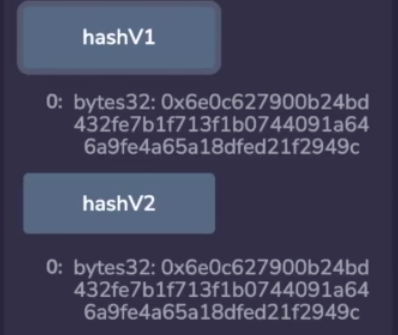
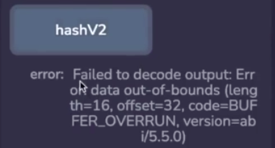

Memory is an important part of yul because it allows us to deal with data types that are larger than 32 bytes. For example, if we wanted to return a struct or an array from a function, this would not be possible with a single variable if that struct or array is larger than 32 bytes. 

```solidity
// SPDX-License-Identifier: GPL-3.0
pragma solidity 0.8.17;

contract UsingMemory {
    function return2and4() external pure returns (uint256, uint256) {
        assembly {
            mstore(0x00, 2)
            mstore(0x20, 4)
            return(0x00, 0x40)
        }
    }
}
```

So in this example, what we are doing is loading the value 2 into the first word in memory, a word is 32 bytes in yul and a 4 into the next word, and then we simply return the boundaries of the area in memory that we are trying to return. 

Note that return in yul returns an area in memory specified by the arguments, it's not returning a variable like it does inside of solidity, now under the hood, this is actually what solidity is doing, but you have to be a lot more explicit with yul. 

This works as expected, note that the syntax highlighting here ( **mstore(0x00, 2)** ) is a little bit misleading, return is a function inside of yul, it's not necessarily a special keyword. 


When we call return2and4, we get 2 and 4 back as expected. 

```solidity
    function requireV1() external view {
        require(msg.sender == 0xAb8483F64d9C6d1EcF9b849Ae677dD3315835cb2);
    }

    function requireV2() external view {
        assembly {
            if iszero(
                eq(caller(), 0xAb8483F64d9C6d1EcF9b849Ae677dD3315835cb2)
            ) {
                revert(0, 0)
            }
        }
    }
```

When you want to revert an execution, for example, due to access control or some other invalid state you also need to specify an area in memory to return, just like return, because what solidity kind of obscures from yul is that in a revert case it's still possible to return data so that the calling function can respond to it and do something about it. 

Most of the time, however, when you are reverting, it's because you want execution to stop and you're not trying to return values. So this ( **revert(0, 0)** ) is what you are going to see most of the time, but both of these functions are going to revert because I'm calling them with the wrong address. 

So let's pull up the console and when we call the... called the hash function, sorry, so when we call V1, we see a revert and V2 we see a revert, both of these are implementing the same logic of checking the msg.sender and then checking if it's equal to this particular address over here.

```solidity
    function hashV1() external pure returns (bytes32) {
        bytes memory toBeHashed = abi.encode(1, 2, 3);
        return keccak256(toBeHashed);
    }
```

In regular solidity, keccak256 takes a variable that is of type bytes memory, and in this case we are hashing the sequence 1, 2, 3 which is uint256 of 1, 2 and 3 laid out end to end in memory, note how this is explicitly in memory, but if I had just put a abi.encode inside of here, then the fact that it's in memory, is a little bit obscured. (指 **keccak256(abi.encode(1, 2, 3)**，这样实际上是在memory中，但是有点不明确)

```solidity
    function hashV2() external pure returns (bytes32) {
        assembly {
            let freeMemoryPointer := mload(0x40)

            // store 1, 2, 3 in memory
            mstore(freeMemoryPointer, 1)
            mstore(add(freeMemoryPointer, 0x20), 2)
            mstore(add(freeMemoryPointer, 0x40), 3)

            // update memory pointer
            mstore(0x40, add(freeMemoryPointer, 0x60)) // increase memory pointer by 96 bytes

            mstore(0x00, keccak256(freeMemoryPointer, 0x60))
            return(0x00, 0x20)
        }
    }
```

In yul, this is always explicit, it takes arguments, the starting point in memory, and how many bytes you want to hash as part of its arguments, so in this example, we've loaded 1, 2 and 3 explicitly into memory, and this whole sequence is hex 60 or 96 bytes, that's why we have supplied this over here, and this is where we started writing it. 

So this keccak256, we'll look inside of that area and it itself returns a 32 byte value which we are going to store in the zeroth slot and then we will return it. 



So this will work as expected, both the regular hash and our more low level implementation of it return the same values back. 

```solidity
return(0x00, 0x40)  =>  returns (uint256, uint256)
return(0x00, 0x20)  =>  returns (bytes32)
```

It's worth emphasizing that these arguments are a little bit different to what we saw earlier with **return**, **return**, you pass in the beginning and the end, these are the explicit memory addresses. Over in **hash** you supply the beginning and how many bytes total. 

One thing to note about the return value is that the compiler is not going to enforce that your return signature matches what is inside of return. So for example, if I were to do something funny like this, I put in 0x10, so I'm only returning 16 bytes.



And then I recompile and run this thing and run hashV2, the client doesn't like it because it's getting less bytes back than it expected, however, the transaction itself was successful, but the client doesn't know what it's looking at because it's expecting it to be 32 bytes. 

Similarly, I could put in a much larger value and say return 96 bytes even though I only wrote 32 to memory, so in this scenario it's going to work as expected. But what's really happening is it's returning more bytes, but the client is just ignoring those bytes because it's explicitly only looking for the first 32. 

```solidity
    function hashV2() external pure returns (bytes32) {
        assembly {
            let freeMemoryPointer := mload(0x40)

            // store 1, 2, 3 in memory
            mstore(freeMemoryPointer, 1)
            mstore(add(freeMemoryPointer, 0x20), 2)
            mstore(add(freeMemoryPointer, 0x40), 3)

            // update memory pointer
            mstore(0x40, add(freeMemoryPointer, 0x60)) // increase memory pointer by 96 bytes

            mstore(0x00, keccak256(freeMemoryPointer, 0x60))
            return(0x00, 0x60)
        }
    }
```

In this example, we were dealing with more than 64 bytes. Solidity reserves, the first 64 bytes for scratch space that you can do whatever you like with. So in the first example, we just loaded the values into that scratch space and return them. In this example, that would not be a good idea because this would crash into the free memory pointer. So what instead we did is load up the free memory pointer, which tells us where we can start writing things without collision, and then we start writing, we update the free memory pointer and then we run our hash function on that. Now, technically, this is not totally necessary in this scenario because when we call return, we're handing control back to the calling contract and our memory is going to be erased. However, I want to illustrate what good practice looks like in this code.