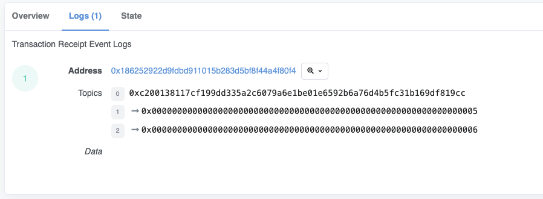
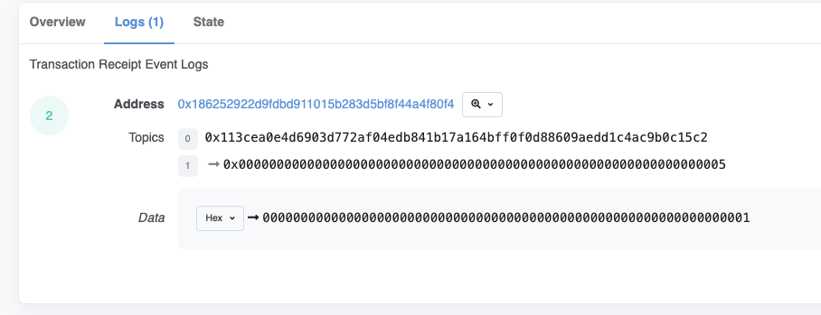

Now we're going to discuss how to accomplish logging in yul the way Solidity does it.

```solidity
// SPDX-License-Identifier: GPL-3.0
pragma solidity 0.8.17;

contract Log {
    event SomeLog(uint256 indexed a, uint256 indexed b);
    
    event SomeLogV2(uint256 indexed a, bool);
}
```

I have two examples here, one of... a log that emits two numbers and both of them are **indexed** and the other one where the number is not indexed, well, it's not a number, but under the hood, these are all 32 byte types, so it doesn't matter.

```solidity
function emitLog() external {
	emit SomeLog(5, 6);
}
```

Now, this, this here, of course, **SomeLog(5, 6)** is going to work exactly the way you expect it to. When you are using logs in yul, however, I found that remix is a bit idiosyncratic, so I found it's better to deploy it to a testnet to show the results. 

So I've already deployed it and put the contract over here and when I hit **emitLog**, it's going to ask me to confirm the transaction, but I've already run these transactions and it's a bit annoying to wait for them to finish on my recording, so I'll show you the transaction results directly.  



The result of **emitLog** had a transaction hash of 0x3d5, which you can see over here 0x3d5 and here you can see the 5 and the 6 getting logged, of course this gets converted to hex form, but 5 and 6 hex are also 5 and 6 decimal.

```solidity
function yulEmitLog() external {
    assembly {
        // keccak256("SomeLog(uint256,uint256)")   // line1
        let signature := 0xc200138117cf199dd335a2c6079a6e1be01e6592b6a76d4b5fc31b169df819cc
        log3(0, 0, signature, 5, 6)
    }
}
```

**The first Topic is the keccak256 of the event signature (line1)**. So what's that? Under the hood, if we look at the yul equivalent, you'll see that I've hardcoded the signature over here and logged 5 and 6. The transaction corresponding to that is over here and you can see the 5 and the 6 over ~~then~~..., over there, and the **Topic** is 0xc200 and so on, and then over here at 0xc200 and so on. (这段意思是说，将这个合约部署到测试网，分别执行emitLog和yulEmitLog两个函数，除了交易哈希之外，在Etherscan上留下的log记录是一样的，包括Topic和5、6两个参数)

https://goerli.etherscan.io/tx/0x76ab7034074e387b6b1596bd9861c6bb6d4e170d6e47f14a72a5b026f23c7664#eventlog

If you pay attention to the URL bar, you can see the transaction changing, but other than that everything is identical. 

So that is what is happening when you emit a log, it takes the **keccak256** of this signature, which looks like this (line1), uses that as the first entry inside of the indexed arguments and supplies 5 and 6 as the indexed arguments after that. (他把signature也算作indexed arguments)

```solidity
		Events are an abstraction of the Ethereum logging/event-watching protocol. Log entries provide the contract’s address, a series of up to four topics and some arbitrary length binary data. Events leverage the existing function ABI in order to interpret this (together with an interface spec) as a properly typed structure.
		Given an event name and series of event parameters, we split them into two sub-series: those which are indexed and those which are not. Those which are indexed, which may number up to 3 (for non-anonymous events) or 4 (for anonymous ones), are used alongside the Keccak hash of the event signature to form the topics of the log entry. Those which are not indexed form the byte array of the event.
```

(补充：根据[文档](https://docs.soliditylang.org/en/latest/abi-spec.html#events)的这段描述就可以理解为什么他把signature也叫做indexed arguments了，如果event有名字，那么indexed参数最多可以是3个，如果event是匿名的，那么则最多可以有4个，signature所在的那个位置也是可以叫做indexed的)


```solidity
contract Log {
    event SomeLogV2(uint256 indexed a, bool);

    function v2EmitLog() external {
        emit SomeLogV2(5, true);		// line1
    }

    function v2YulEmitLog() external {
        assembly {
            // keccak256("SomeLogV2(uint256,bool)")
            let signature := 0x113cea0e4d6903d772af04edb841b17a164bff0f0d88609aedd1c4ac9b0c15c2
            mstore(0x00, 1)
            log2(0, 0x20, signature, 5)	 // line2
        }
    }
}
```

So what about the situation where you have an **indexed** argument in one place and a non indexed argument in another? Well, in Solidity that's pretty trivial, you just follow the function arguments. (line1)

But in yul, if you put that inside one of these arguments over here, then is going to become an indexed argument, so what instead you need to do is put it into the memory (line2，指了下0, 0x20).

So we will load 1 which is corresponding to true inside of the first 32 bytes slot in memory over here, and then have the reference to that inside of the log statement. Note how over here our reference to memory is 0 0 ( **Log3(0, 0, signature, 5, 6)** ), so we're not using any of the memory, that's because we have no indexed arguments. (两个都是indexed，内存区域是0, 0，有一个不是indexed就把变量存到内存上，然后调用的时候内存区域是0, 0x20)



And you can see the results over here and over here you'll see that they're identical except for the transaction hash along the top, one is Solidity and the other is yul, so the Topic is the same, it has the same hash of the log signature, 5 is in the first argument for both of them and we have a **true** for the indexed portion.

```solidity
function boom() external {
    assembly {
    	selfdestruct(caller())
    }
}
```

Lastly, because this is on a testnet and I want to be a polite person and save space on the blockchain that isn't being used, I'm going to end by self destructing the contract, It should go without saying that you should not have any unprotected self-destructs in production smart contracts. (Do not implement unprotected self destructs in production)