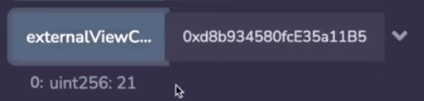
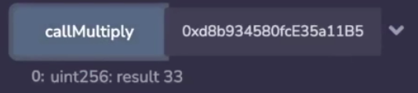
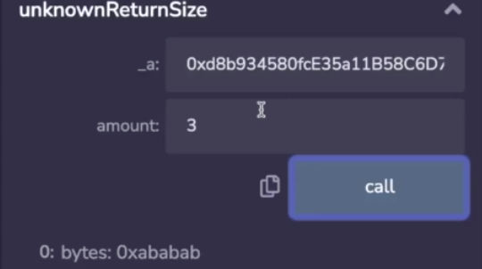

Now that we know the kind of tx.data that solidity is expecting, we're ready to see it implemented in yul.

```solidity
// SPDX-License-Identifier: GPL-3.0
pragma solidity 0.8.17;

contract OtherContract {

    // "9a884bde": "get21()",
    function get21() external pure returns (uint256) {
        return 21;
    }
}
```

Over here we have this contract with a function called get21 which simply returns 21. And for the sake of convenience, I've included its function signature over here, our goal is to call this from another contract entirely in yul, for the sake of convenience, I've included the function selector over here. 

```solidity
contract ExternalCalls {
    // get21() 0x9a884bde
    // x() 0c55699c
    function externalViewCallNoArgs(address _a)
        external
        view
        returns (uint256)
    {
        assembly {
            mstore(0x00, 0x9a884bde)
            // 000000000000000000000000000000000000000000000000000000009a884bde
            //                                                         |       |
            //                                                         28      32
            let success := staticcall(gas(), _a, 28, 32, 0x00, 0x20)
            if iszero(success) {
                revert(0, 0)
            }
            return(0x00, 0x20)
        }
    }
}
```

So back to our yul contract to make the call, what we will want to do is load the function selector into memory and then point to the region, that will be part of our API call, because our API call is only going to have four bytes in it, then the region we will point to will naturally only have four bytes. 

Solidity's opcode for making external calls are **staticcall**, **call** and **delicatecall**. Because we are inside of a view function, we have to use **staticcall** because staticcalls do not change the state and if a state change happens, then they revert. 

```solidity
let success := call(gas(), _a, 0, 28, 32, 0x00, 0x20)  // 多了个0
```

If we use regular call, then well, we put the wrong number of arguments which I will describe in a second, but if we use regular call, we cannot do that because this function cannot be declared as view, because "this expression potentially modifies the state". So staticcall ensures that we are not doing a state change and the compiler notices that we are inside of a view function. 

Anyway, let me describe what the arguments to static call are. The first argument is how much gas you want to pass to that other function, in this situation, what we're doing is passing all of the remaining gas that we have left, but if you wanted to hardcode this amount to a smaller amount, you could do that, and sometimes being flexible with this is useful if you don't trust the receiving contract because the receiving contract might use up all the gas in an attempt to conduct a denial of service, but in this case, we're sending the whole thing. This is the address of the contract we're calling. This is the intended transaction data which is what we have loaded into memory. And this is the region in memory that we are going to copy the results back to. 

So when the function returns, it's going to overwrite this area and replace it with the return value, but that's okay, we don't need this anymore. We check the success value and then return that area in memory where the answer has been written to, and this is obviously the same size as this (uint256). 



So let's see this in action, going to deploy **ExternalCalls** and the **OtherContract**, so we'll copy the **OtherContract**'s address and this is external, externalViewCallNoArgs, so that's over here and I'm calling this and I get 21 back. 

```solidity
contract OtherContract {

    // "73712595": "revertWith999()",
    function revertWith999() external pure returns (uint256) {
        assembly {
            mstore(0x00, 999)
            revert(0x00, 0x20)
        }
    }
}

contract ExternalCalls {

    function getViaRevert(address _a) external view returns (uint256) {
        assembly {
            mstore(0x00, 0x73712595)
            pop(staticcall(gas(), _a, 28, 32, 0x00, 0x20))
            return(0x00, 0x20)
        }
    }
}
```

We mentioned in an earlier video that even when a function reverts, it's able to return values, let's see that in action here. We're making a staticcall to this function, and what it's going to do is store a 999 into the memory and then revert with it. So this is going to behave the same way as a return, the only difference is that the success is going to be 0 rather than 1, but because we know that in advance, we're just going to pop it off to get rid of it, and then we will return what our staticcall returned. Note that when a function reverts or succeeds, it's going to be written to the same area that you pre allocate for it. 


So we will copy the target address and getViaRevert and we get 999 back. 

```solidity
contract OtherContract {

    // "196e6d84": "multiply(uint128,uint16)",
    function multiply(uint128 _x, uint16 _y) external pure returns (uint256) {
        return _x * _y;
    }
}

contract ExternalCalls {

    function callMultiply(address _a) external view returns (uint256 result) {
        assembly {
            let mptr := mload(0x40)
            let oldMptr := mptr
            mstore(mptr, 0x196e6d84)
            mstore(add(mptr, 0x20), 3)
            mstore(add(mptr, 0x40), 11)
            mstore(0x40, add(mptr, 0x60)) // advance the memory pointer 3 x 32 bytes
            //  00000000000000000000000000000000000000000000000000000000196e6d84
            //  0000000000000000000000000000000000000000000000000000000000000003
            //  000000000000000000000000000000000000000000000000000000000000000b
            let success := staticcall(
                gas(),
                _a,
                add(oldMptr, 28),
                mload(0x40),
                0x00,
                0x20
            )
            if iszero(success) {
                revert(0, 0)
            }

            result := mload(0x00)
        }
    }
}
```

If you want to call a function that takes arguments, we just need to make our ABI encoding proper as we saw in the previous video for a function that takes two uint256 arguments or something smaller than that, we just stack 32 bytes on top of each other. So we are going to call this function over here and it takes two arguments again, note that these are not uint256, but ABI encoding still specifies that this data be supplied with 32 bytes and we will just return the product of these two numbers. 

So we will load in the function selector and the two arguments, the region in memory we are supplying is going to be a little bit different because this is more than 64 bytes, we can't stick this into the scratch space, so what we did is we loaded it at the free memory pointer, the free memory pointer would point at the beginning of the first set of bytes that we wrote, so we have to add 28 to it, so that we're only looking at the first four bytes inside of the first 32 byte slot. 

And then because we updated the memory pointer after to point to... after where we wrote our data, we'll just load the memory pointer back so that we're looking in this region, and as usual we will specify the first 32 bytes to receive the return data



And when we callMultiply, we see 33 which is indeed the product of 3 and 11. 

```solidity
contract OtherContract {

    // "0c55699c": "x()"
    uint256 public x;

    // "4018d9aa": "setX(uint256)"
    function setX(uint256 _x) external {
        x = _x;
    }
}

contract ExternalCalls {

    // setX
    function externalStateChangingCall(address _a) external {
        assembly {
            mstore(0x00, 0x4018d9aa)
            mstore(0x20, 999)
            // memory now looks like this
            // 0x000000000000000000000000000000000000000000000000000000004018d9aa
            // 0x00000000000000000000000000000000000000000000000000000000000003e7
            let success := call(
                gas(),
                _a,
                callvalue(),
                28,
                add(28, 32),
                0x00,
                0x00
            )
            if iszero(success) {
                revert(0, 0)
            }
        }
    }
}
```

We've been using staticcall in the functions previous to this, now let's look at regular call. The primary difference between them is that there is an additional argument called callvalue which is what you use to forward the Ethereum (应该是指ether) that you are receiving as part of the transaction. Now, in this case, because this function is not payable, this callvalue is always going to be 0, so we could just make it 0 in the function would be more efficient, but if indeed we had something that was payable, and we wanted to send all of the ether we had received or maybe a fixed amount, we could do that, but other than that, the arguments are the same because we're not receiving a value back, we just specify the receiving area to be 0. 


This is going to call this function over here, which is going to setX and because x is public, we'll be able to see directly what happened, so we conducted the transaction and when we get x, it's 999 as we set it to be. 

```solidity
contract OtherContract {

    // "7c70b4db": "variableReturnLength(uint256)",
    function variableReturnLength(uint256 len)
        external
        pure
        returns (bytes memory)
    {
        bytes memory ret = new bytes(len);
        for (uint256 i = 0; i < ret.length; i++) {
            ret[i] = 0xab;
        }
        return ret;
    }
}

contract ExternalCalls {

    function unknownReturnSize(address _a, uint256 amount)
        external
        view
        returns (bytes memory)
    {
        assembly {
            mstore(0x00, 0x7c70b4db)
            mstore(0x20, amount)

            let success := staticcall(gas(), _a, 28, add(28, 32), 0x00, 0x00)
            if iszero(success) {
                revert(0, 0)
            }

            returndatacopy(0, 0, returndatasize())  // line1
            return(0, returndatasize())
        }
    }
}
```

An additional thing worth calling out explicitly is that there are situations where we don't know how big the return value will be, so we've been here to for loading everything into the first 32 bytes. What if the function we are calling returns a variable length of data, like it returns an array or something? In that case, we would use something that looks like this (line1), returndatasize() tells you how large the return data was, so it ignores what's you've... what you've allocated to receive (staticcall中指定的0x00 0x00两个参数被忽略) and just tells you what was the length of the data that was returned back, returndatacopy is going to copy a region from the return data into your memory, so it's saying into my memory slot zero copy the return data from zero all the way up until the total size. So you could copy less than the return data, but in this case we're trying to copy the whole thing. 

```solidity
    // "7c70b4db": "variableReturnLength(uint256)",
    function variableReturnLength(uint256 len)
        external
        pure
        returns (bytes memory)
    {
        bytes memory ret = new bytes(len);
        for (uint256 i = 0; i < ret.length; i++) {
            ret[i] = 0xab;
        }
        return ret;
    }
```

So let's see what we're calling, what this does is, it simply creates an array that is as many bytes long as the argument that is applied to it and then fills it with hex ab



Let's see that in action. So we have our unknownReturnSize over here and let's supply 3, we get 3 bytes back. Let's apply 2, we get 2 bytes back. Let's apply 10, we get 10 bytes back. 

Okay, the last thing that we're going to look at is delegatecall, this is really only ever used in the context of proxies, and I'm just going to look at the [OpenZeppelin implementation](https://github.com/OpenZeppelin/openzeppelin-contracts/blob/master/contracts/proxy/Proxy.sol#L22) over here, and it should be pretty easy to understand what's going on now. 

```solidity
    function _delegate(address implementation) internal virtual {
        assembly {
            // Copy msg.data. We take full control of memory in this inline assembly
            // block because it will not return to Solidity code. We overwrite the
            // Solidity scratch pad at memory position 0.
            calldatacopy(0, 0, calldatasize())  // line1

            // Call the implementation.
            // out and outsize are 0 because we don't know the size yet.
            let result := delegatecall(gas(), implementation, 0, calldatasize(), 0, 0)

            // Copy the returned data.
            returndatacopy(0, 0, returndatasize())

            switch result
            // delegatecall returns 0 on error.
            case 0 {
                revert(0, returndatasize())
            }
            default {
                return(0, returndatasize())
            }
        }
    }
```

Let's ignore this calldata thing (line1) for now, and focus on what happens after the call. During a delegatecall you don't know what function you're going to call and therefore you don't know the size of its return value, so they use the pattern we just looked at over here and based off of the **result**, they're going to check if the recipient of the delegatecall reverted, then they will revert with the data that it returned, otherwise return with the data that it returned, because remember, both **revert** and **return** return the area inside of memory that they specify. 

And in the delegatecall they have hardcoded ms.value to be 0, you can kind of guess what this is doing based off of what you saw here, we're going to talk about calldata soon, but over here they are simply copying the entirety of the calldata into memory and then saying from 0 to the calldatasize(), passed that on to the function that we are calling. 

You'll note that this is not memory safe at all in either case because calldata could be arbitrarily long and overwrite those 64 bytes, but they know that in the context of this function is being used, the transaction will end here and the memory will be erased anyway. 

As an exercise for the reader, I want you to think about how you would in ABI encode when you have a function that takes variable length arguments and specifically more than one of them, in this, in this exercise we have two arrays and in this exercise we have one integer followed by two arrays. 

All of the documentation for ABI encoding is supplied in the link over here. But you actually already know enough for how to do that because we've dealt with variable length before in our section about memory.