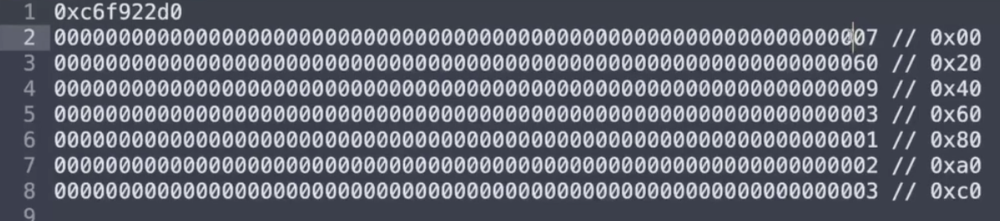
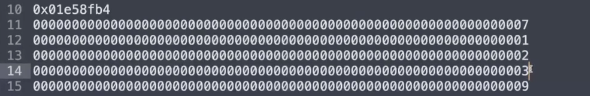
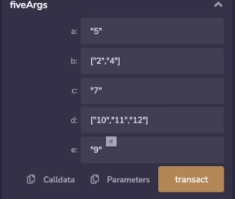
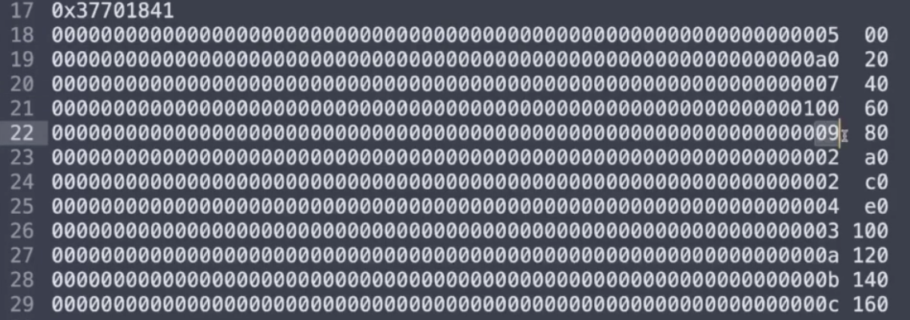
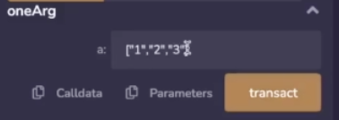
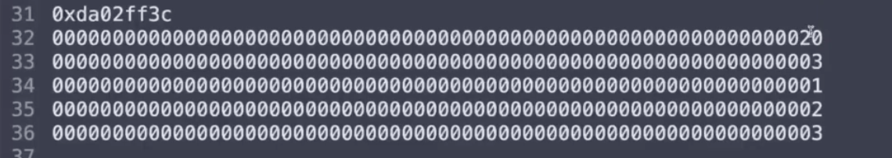
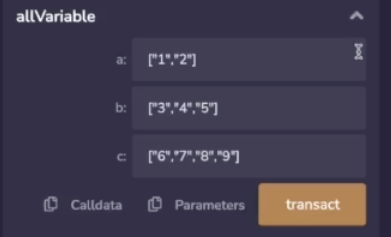
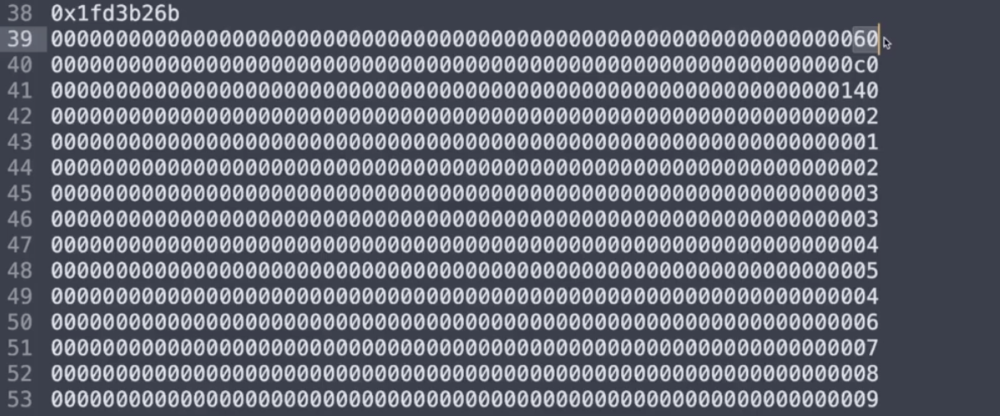

In this video, I'm going to explain how variable length arguments are encoded in the calldata. 

```solidity
// SPDX-License-Identifier: GPL-3.0
pragma solidity 0.8.17;

contract VariableLength {

    function threeArgs(
        uint256 a,
        uint256[] calldata b,
        uint256 c
    ) external {}
}
```

This is most clearly illustrated when you have a variable length data type sandwiched between two fixed length data types. 


Over here I've pre-populated the values with a 7, a 2, 2, 3 and a 9. When we run this transaction and then copy the calldata and format it.



This is what it will look like, you'll note that the 7 is in the first word and the 9 is in the third word, that's exactly what we expect, 7 and 9. 

But what's this thing in the middle? This is a pointer to the argument portion of the calldata where the variable length data begins. So 60 is pointing over here, because this is indexed as 0 through 1F, 20 through 3F and so forth, so 60 begins in this slot and this 3 is the length of the array, it says you need to look forward 3 more slots, 1, 2, 3. And so this is how this function is going to encode 7 and array of , 2, 3 and 9. Remis is adding quotes around this because I've run this before I started recording this video, but hopefully the point is still clear. (应该是说remix自动添加的双引号)

```solidity
// SPDX-License-Identifier: GPL-3.0
pragma solidity 0.8.17;

contract VariableLength {

    struct Example {
        uint256 a;
        uint256 b;
        uint256 c;
    }
    
    function threeArgsStruct(
        uint256 a,
        Example calldata b,
        uint256 c
    ) external {}
}
```

It behaves a little bit differently if there is a struct. 



Let's look at that, so here is a struct of 7 and 9 again, but with 1, 2, 3 supplied for a, b and c, so here we have the struct in the middle and the fixed length arguments surrounding it. When this is encoded, it's actually going to lay out the struct and not point to somewhere else because it knows in advance how big the struct is, by comparing these, you can see that if you are using tuples that you know have a fixed length, you can see that it is more efficient to use structs instead of arrays if you know in advance how long the length is, because the array version must encode a pointer to where the array is stored as well as how long it is, the smaller your call data is the less gas the transaction will cost, so this method is to be preferred if your tuples are a fixed length. 

```solidity
    function fiveArgs(
        uint256 a,
        uint256[] calldata b,
        uint256 c,
        uint256[] calldata d,
        uint256 e
    ) external {}
```



Just to illustrate the point even further, we're going to look at what happens when there are 5 arguments laid out in this manner, so here we have 5 arguments with a, c and e being stored as 5, 7 and 9, and for argument b, I have stored 2, 4 and for argument d, 10, 11 and 12 which will correspond to a, b and c when converted to Hex. 



Let's see what that looks like, here we have 5, 7 and 9 and the pointers to the arrays which are a0 and 100, I've already labeled them over here, a0 corresponds to this segment over here and this is the length of the array followed by 2 and 4 which is what we had from over here. Similarly, hex 100 points to this 3 over here which is the length of a, b and c which correspond to 10, 11 and 12. 

```solidity
    function oneArg(uint256[] calldata a) external {}
```



This pattern holds even when there is only one argument, over here we are passing in 1, 2, 3 as usual. 



And the calldata for that is going to have a pointer to where it is stored, the length of the array and the contents of the array. Now this might seem a little bit wasteful because why do you need to point it anywhere when there's only one item? Whatever the reason is, this is the design and this is what solidity is expecting. Note that 20 is of course corresponding to this segment over here.

```solidity
    function allVariable(
        uint256[] calldata a,
        uint256[] calldata b,
        uint256[] calldata c
    ) external {}
```

When all of the variables are a variable length, it should be predictable. 



Here I have 1, 2, 3, 4, 5, 6, 7, 8, 9. 



This is a pointer to a, a pointer for b and a pointer for c, 60 is going to point over here to let us know that we have array 1 and 2, c0 is going to point to this 3 over here to let us know that over 3, 4 and 5, and 40 is going to point to this 4 over here to where we have 6, 7, 8 and 9, I don't need to label the indexes here, I think you get the point already. 

A natural question is how does solidity know that this is a pointer rather than a uint256? Well, it does that because it knows in advance, the function signature and solidity compiles some safeguards in place to make sure that there is one actually enough data to properly fill in the arguments and that the data is compliant with the format you expect, of course, when you are using yul you have to do this manually, but the point of this exercise is so that if you are interfacing with a solidity contract, you know the format of the data that it is expecting.