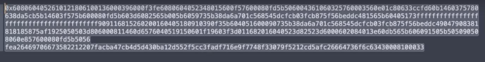
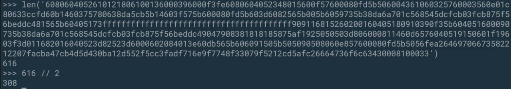
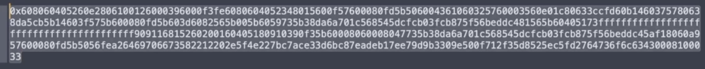
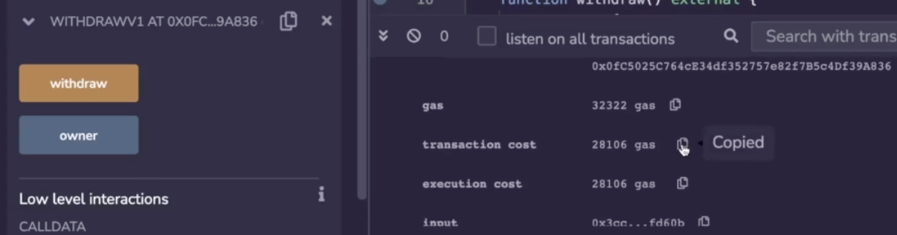
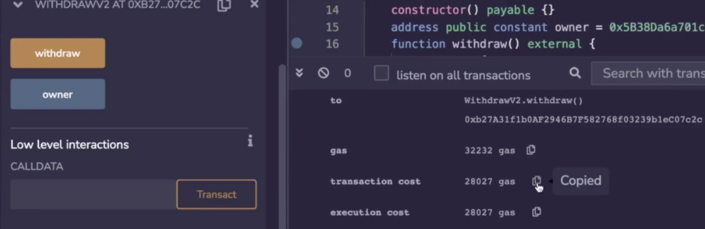

Now that we've seen how call works in yul, we're able to tie it back to something we looked at earlier which is the instruction **selfbalance** which exists in yul but not inside of solidity. 

```solidity
//SPDX-License-Identifier: GPL-3.0
pragma solidity 0.8.17;

contract WithdrawV1 {
    constructor() payable {}

    address public constant owner = 0x5B38Da6a701c568545dCfcB03FcB875f56beddC4;

    function withdraw() external {
        (bool s, ) = payable(owner).call{value: address(this).balance}("");
        require(s);
    }
}
```

Over here I have written two versions of the same thing, this is a very common construction for withdrawing ether from a smart contract. The address of the recipient is set to payable and then we do .**call** on it, well, setting the value of the call to be the balance inside of the smart contract and we set the ABI encoding to be empty because all we're doing is conducting a transfer. 

```solidity
contract WithdrawV2 {
    constructor() payable {}

    address public constant owner = 0x5B38Da6a701c568545dCfcB03FcB875f56beddC4;

    function withdraw() external {
        assembly {
            let s := call(gas(), owner, selfbalance(), 0, 0, 0, 0)
            if iszero(s) {
                revert(0, 0)
            }
        }
    }
}
```

The equivalent of that in yul looks like this, we are going to be sending it to the owner, we're going to be sending the amount of balance inside of the smart contract and we're not supplying any function selector or abi encoded arguments just like over here, and we're not interested in the return value, so this is set to an empty array. 

```solidity
        (bool s, bytes memory returnArr) = payable(owner).call{value: address(this).balance}("");
```

This return is actually the same as what is taken as the second item in the tuple if you were using regular solidity, so to be valid this would have to be bytes, memory, returnArray and this is valid except that it's not being used. So we'll just get rid of that for now. But you'll note that this area in memory would correspond the area that you specify over here, if the return value happens to be bigger than what you specify, then that simply won't get transferred over, we've talked about how to handle this earlier. 

We aren't supplying any function selectors or arguments over there, but if we were to, that would be the same information that is contained over here, in both situations we checked the return value to see if the transfer succeeded or not, and then revert the function if it didn't. These two things behave identically, but interestingly, the second one is more efficient, now, this course is not about gas or gas efficiency, you can see my other one for that, but this nicely demonstrates some efficiencies that come about when you use yul at the right time. 

So first of all, let's deploy the contracts and we'll see that the second one is actually smaller than the first. So first, I'm going to deploy **WithdrawV1** and I'm going to supply it 1 ether, and when I look at the transaction, we see that it costs 115,000 gas to deploy, so let's store that here.



And let's also see what was actually deployed by copying the input, so this is the byte code of the smart contract we are deploying, so this is how much bytes we are deploying, and let's stick this into Python to see how big it is. 



We would need to remove the 0x and this is 616 hex characters which is 308 bytes. So let's go back and deploy the other one, give it 1 ether to start with, and we deploy, we see this time that the gas was 102,035 which is a nice savings.



And the byte code looked like this, this is clearly smaller, but let's measure it. 


Let's not include the 0x this time we will take the length of all of the bytes which should be divided by 2 and we get 224 back, so this is 224 bytes which makes sense because if it costs less gas to deploy, it has to be smaller. 

All right, so that's pretty cool, let's look at the transaction costs. 



Let's go back to V1 and let me make sure I'm using the right address, yes I am, and I'm going to call withdraw and it succeeds, the cost for this one is 28,106 gas.



And the cost for the other contract is going to be slightly cheaper, so it's not that big of a gap, it's only 70 or so gas, but that's still money saved. 

```solidity
contract WithdrawV1 {
    constructor() payable {}

    address public constant owner = 0x5B38Da6a701c568545dCfcB03FcB875f56beddC4;

    function withdraw() external {
        payable(owner).transfer(address(this).balance);  // line1
        (bool s, ) = payable(owner).call{value: address(this).balance}("");  // line2
        require(s);
    }
}
```

Now, a natural question that can come up at this point is, okay, this is a common construction (line2), but what about the one that looks like this (line1), payable owner transfer address, this dot balance, so this is a common construction too, what did I do wrong? I spelled address wrong. So this is a common construction too. 

What's the difference between this and this? Note that there's no return value because under the hood this will revert if it fails. 

```solidity
ayable(owner).transfer(address(this).balance)  =>  let s := call(2300, owner, selfbalance(), 0, 0, 0, 0)
```

Well, this well, this gets translated into, replacing this gas over here where it forwards all of the gas to just 2300, so it hardcodes the gas to a smaller amount. 

Now, why would you do that? Well, in response to the reentrance attack on the DAO hack, the developers were very scared of reentrance in general, so their solution to it was to limit the amount of gas that would be forward as part of an ether transfer. 

```solidity
ayable(owner).transfer(address(this).balance)  
				=>  (bool s, ) = payable(owner).call{gas: 2300, value: address(this).balance}("")
```

So they would say .**transfer** would look like this, and the fact that the recipient only gets a small amount of gas, that means that even if they put malicious code into the fallback or receive function in order to call back this function and do something evil, they would only have 2300 gas which is not enough to do it. 

So that would prevent them from doing anything besides logging the fact that they received the money, but later on it was decided that this was actually a bad design decision because if Ethereum is programmable money, then it should be able to execute programs when it's sent somewhere, but if a program only receives 2300 gas, it's not going to be able to do very much. 

So the real solution is to avoid reentrance in the first place, that is a whole nother topic, nowadays it's considered good practice to not hardcode the gas that you are sending out, if you are sending this to a externally owned account, frankly, it doesn't matter because it's not going to a smart contract, it's going to a wallet, but I just wanted to show you what the gas call ( **gas()** ) was and what transfer is doing to that value.