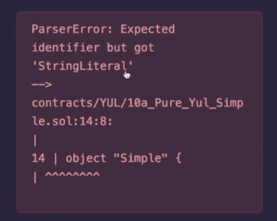
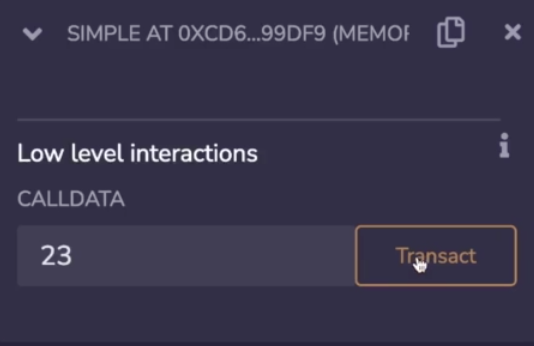
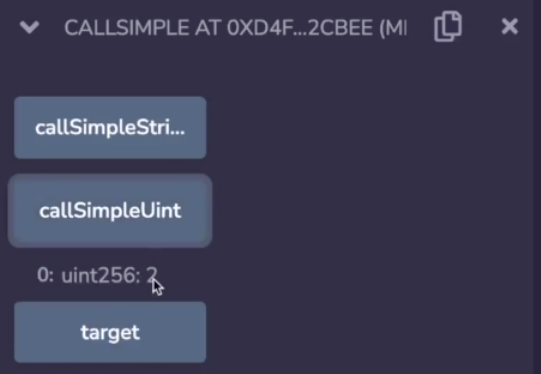

We are now ready to create a contract entirely in yul, in fact, that's what you are looking at right now.  

```solidity
// SPDX-License-Identifier: GPL-3.0

object "Simple" {
    code {
        datacopy(0, dataoffset("runtime"), datasize("runtime"))
        return(0, datasize("runtime"))        
    }

    object "runtime" {
        
        code {
            mstore(0x00, 2)
            return(0x00, 0x20)
        }
    }
}
```

To make things as simple as possible, I've made the contract only returned 2, so it's going to store 2 inside of the first 32 bytes of memory and then return that aspect of memory, note that there is no function selectors or anything here, that is a solidity thing. 

You can do whatever you want inside of yul, now let's look at the part that would be new which is the constructor portion, this "runtime" is an indicator for a particular section of byte code, so **datacopy** is going to say, look, inside of this particular segment over here, this object "runtime", get the size of it and copy it into memory, then return that area in memory. 

These data markers (指双引号中的runtime) are what allow you to access different parts of the byte code of your smart contract,  we're going to learn more about that in the next video, but this is what a very basic constructor looks like. At the top level, a yul has an object and inside of it it can have more objects or code.



Now, if we try to compile this thing, it's not going to work because when we look down here, it says it "expected a string literal but instead got object". 


So what's going on there is we are using the wrong compiler, what you will have to do is open up advanced configurations and switch it to yul, yul also have an optimizer just like solidity does, so if we compile it now, it works because it's valid yul. 



Now, if we were to deploy this, it's a little bit hard to test because even though we're returning a value over here, remix doesn't know anything about that, so if I send it to 23, that is a valid transaction, but unfortunately remix is not smart enough to read the output. 

```solidity
interface ISimple {
		function itDoesntMatterBecauseItJustReturns2() external view returns (uint256);
}

contract CallSimple {
    ISimple public target;

    constructor(ISimple _target) {
    		target = _target;
    }

    function callSimpleUint() external view returns (uint256) {
        return target.itDoesntMatterBecauseItJustReturns2();  // line1
    }
     
    function callSimpleString() external view returns (string memory)  {
    		(bool success, bytes memory result) = address(target).staticcall("");
    		require(success, "failed");
        return string(result);
    }
    
}
```

The workaround for this is to deploy a regular interface and just call this thing as if it were a normal contract, it's kind of like what we were doing earlier, I have another file over here called Yul_Interface.sol and it's just going to take a **target** contract and then call it. 

Now over here I have this very funny function name, itDoesntMatterBecauseItJustReturns2, this (line1) will encode a certain function selector and send it to other function, but it doesn't matter what that function selector is because the yul contract we've programmed will just gnore it. 

Let's see that in action, so I'm going to have to change the compiler back to solidity, compile this (Yul_Interface.sol) and deploy this new contract, but I will want to take our target contract and pass it as an argument to the constructor. 



Now, if I do callSimpleUint, I'm going to get 2 back, again, I want to stress that the yul code is ignoring this interface, it doesn't know anything about it. 

```solidity
interface ISimple {
		function decafcoffee() external view returns (uint256);
}
```

I could have called this decafcoffee and it would still work.

```solidity
object "Simple" {
    code {
    		sstore(0, caller())
        datacopy(0, dataoffset("runtime"), datasize("runtime"))
        return(0, datasize("runtime"))        
    }

    object "runtime" {
        
        code {
            mstore(0x00, 2)
            return(0x00, 0x20)
        }
    }
}
```

Inside of our original code, if we wanted to do something like store the sender, we could do that. So if we did something like sstore into slot zero the caller, then this is also valid yul except that I have to change the compiler back, so now I have that data in there. 

```solidity
/** 
    To Learn

    1. constructor
    2. yul doesn't have to respect call data
    3. how to compile yul
    4. how to interact with yul
    5. custom code in the constructor

**/
```

So let's summarize what we've learned, we've seen a constructor in an object that is entirely yul, yul doesn't have to respect the call data, we've shown how to compile yul and a way to interact with it, and we've also shown that you can put custom code in the constructor.