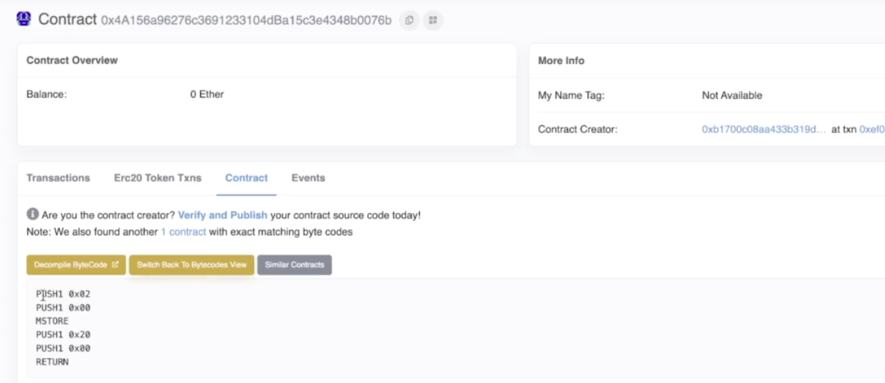
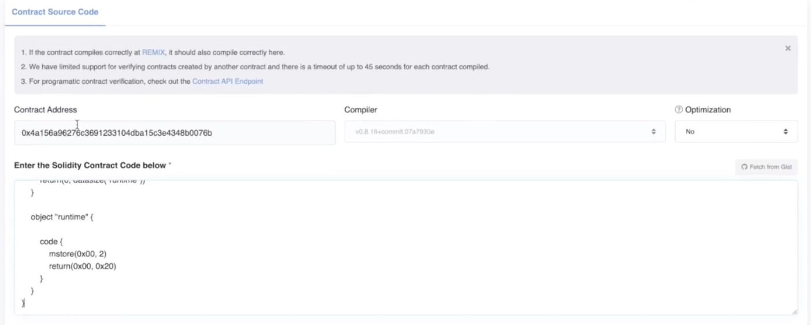
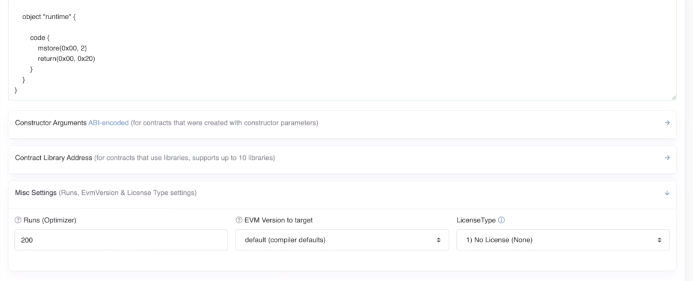
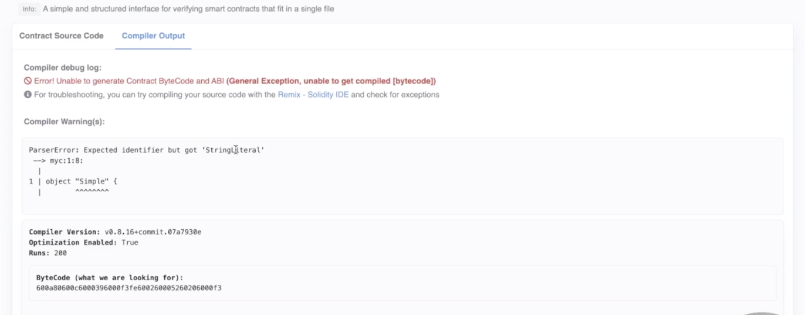
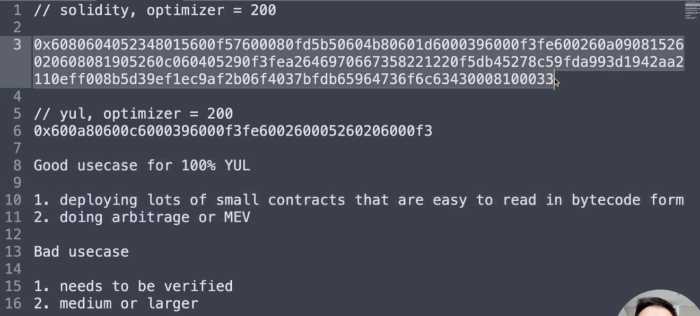

Besides the possibility of introducing bugs and security problems, there is actually a good reason to not be writing contracts entirely in yul. 

```solidity
// SPDX-License-Identifier: GPL-3.0

object "Simple" {
    code {
        datacopy(0, dataoffset("runtime"), datasize("runtime"))
        return(0, datasize("runtime"))        
    }

    object "runtime" {
        
        code {
            mstore(0x00, 2)
            return(0x00, 0x20)
        }
    }
}
```

Let's say we were to actually deploy this, so I will open this up and instead of using the local environment, I'm going to deploy it to Rinkeby, then I'm going to deploy it and confirm it and view on ETHERSCAN.



So wait for this transaction to go through, and it has gone through, let's look at the byte code, here we see the contract and, of course, it hasn't been verified yet, but this is the actual output and it's actually pretty understandable what's going on here, it's going to push 2 and 0 onto the stack and store the 2 in word 0, then it's going to push 32 and 0 and return that area in memory. Okay, that is extremely straightforward. 


But what would happen if we actually tried to verify this? Well, the first problem that we have is that yul is not an option here. 


The closest thing we have would be solidity single file, and then we would select the compiler version that we use and confirm it.



When we simply copy and paste this code into here, this will not work, now if I'm not wrong, we had the optimizer turned on when we ran this thing, we did so, let's set that to be 200 like we set it to be. 



And then we will pick palm trees, verify and publish. 



Now over here we have a problem because it doesn't like the syntax, "Expected identifier but got 'StringLiteral'", so this is not considered solidity by Etherscan and because of that it's not possible for us to verify the contract, even though we can technically read it, because it's quite simple. 

Because of this, I generally recommend that you severely restrict the cases where you actually use 100% yul, if you need to use a lot of yul, it's better to write the contract in solidity and then replace the function bodies with assembly if you really need to do that. But that's not to say that there aren't serious advantages to writing entirely yul sometimes. 

```solidity
contract Return2 {

    fallback(bytes calldata _ignored) external payable returns (bytes memory r) {
        r = abi.encode(2);
    }
}
```

Let's look at the alternative. This over here is the same function we have from earlier. In order to return something from the fallback function, we need to obey the signature of bytes calldata and the variable we're not going to use, and then we're going to return bytes. In reality, this is going to return a uint256 because we're only going to return 32 bytes, under the hood, that's what return is doing in solidity anyway.

We've made it payable because this actually makes it more gas efficient as I talk about in my gas course, and if we look at the compilation output of this, we're going to see it's quite a bit larger than the yul version. 



Just you don't have to watch me compiling and copying and pasting things, I've done that already over here. This is the compiler output byte code that we were just looking at, and you can see that it's quite large compared to the yul code, this is quite small, I would estimate this as about probably about a fourth or maybe a fifth as big. 

So when would you want to use 100% yul, well I've listed some cases that in my opinion are a good use for them. If you needed to deploy a lot of small contracts that are easy to read in byte code form, then that would be a good thing to do, maybe if you had a bunch of micro agreements between parties that only need to be separate contracts, that could make sense. The other thing is, if you are just writing the smart contract for yourself and you don't need to verify it and you really, really need the efficiency, so if you're doing arbitrage or minor extracted value, then you might want to be writing all yul contracts, because being gas efficient in those applications is advantageous. 

You should avoid using 100% yul, when the contract needs to be verified or the contract isn't small, because the larger the yul contract, the easier it is to make mistakes, and the tooling around yul right now is not very mature. So you're not going to get a lot of automated assistance to help you avoid bugs like you will with languages that have more mature tooling in the ecosystem.