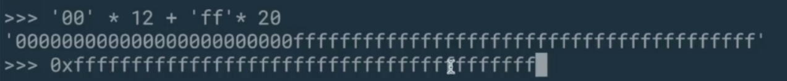
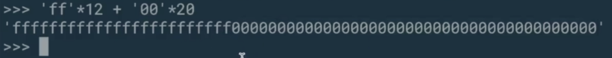
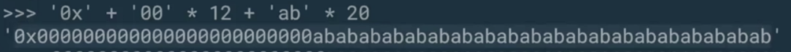
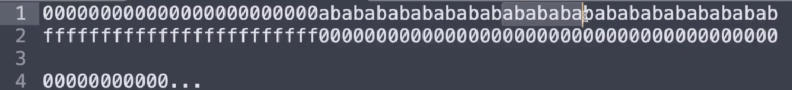

```solidity
    object "runtime" {
        code {
            // Protection against sending Ether
            require(iszero(callvalue()))   // line1

            // Dispatcher
            switch selector()
            // "balanceOf(address)"
            case 0x70a08231 {
                returnUint(balanceOf(decodeAsAddress(0)))
            }
            
            // "transfer(address,uint256)"
            case 0xa9059cbb {
                transfer(decodeAsAddress(0), decodeAsUint(1))
                returnTrue()
            }
```

We're going to study the implementation of balanceOf next, but to do that, we actually need to understand what decodeAsAddress and decodeAsUint are doing. Even though balanceOf just takes address as an argument, under the hood, it's actually going to call decodeAsUint also. 

```solidity
            // 这里的offset理解为传过来的calldat中的第几个参数
            
            function decodeAsAddress(offset) -> v {
                v := decodeAsUint(offset)  // line1
                if iszero(iszero(and(v, not(0xffffffffffffffffffffffffffffffffffffffff)))) {  // line4
                    revert(0, 0)
                }
            }
            function decodeAsUint(offset) -> v {
                let pos := add(4, mul(offset, 0x20))
                if lt(calldatasize(), add(pos, 0x20)) {  // line2
                    revert(0, 0)
                }
                v := calldataload(pos)  // line3
            }
```

So let's see what decodeAsAddress is doing. Here's the function definition, now this might look convoluted, but what it's (line1) doing is it's getting 32 bytes from the argument index that you specify and then checking that the first 12 bytes are 0. Okay, let's break this down, the first thing that decodeAsAddress does is called decodeAsUint.

Okay, so what is this doing? The first 4 bytes are the function selector and everything that's after that is a 32 byte multiple of an integer which are the arguments of the function. Ultimately, what we're trying to do is skip over the first 4 bytes and then load that particular index of the argument, so if you have only 1 argument, then we're going to be looking at bytes 4 through 36, if we had 2 arguments, then we would be have to skip over the first 4 bytes and also skip over the first 32 bytes in front of that in order to get you to the first index of the argument or the second argument. 

So in this case, this function was called with offset 0, so it's going to start loading byte 4 and then the 32 bytes that follow that, but if we had two arguments and we called decodeAsUint(1), then we would start loading at byte 36. 

This (line2) check over here just makes sure that we have enough calldata, so if someone called balanceOf but didn't supply any arguments, then this would detect that, because we would see, well, 4 plus 32 is 36, and if calldata size is less than 36, then we know that there isn't enough calldata for this to be a valid function call and woll revert.

Remember, an address is 32 bytes, but the first 12 bytes are 0, so if an address was supplied as the argument, then this (line3) will still load up 32 bytes, so now we can go back here (line1), we have our 32 bytes which are supposed to be 12 bytes of 0 followed by the address. Okay, now let's walk through what this (line4) is doing, what is **not** 0xffff.... this is 20 bytes, when we call **not**, that's not going to turn this into all zeros, this has an implicit 12 bytes of 0 in front of it, so not 0xffff... with 20 bytes of ones in front of it, when it is flipped, it is going to become 12 bytes of ones, followed by 20 bytes of 0. 



So that would actually look like this are 0xff 20 times is currently 12 bytes of 0 and 20 bytes of ones, this, like this when it has less than 32 bytes in it, is just shorthand for what we have above. 



What will happen when we flip this well, it will become 12 bytes of ones and 20 bytes of zero. 



Now that we have this value, what are we going to do with the address? Well, an address is going to look something, well, let's say let's just construct a fake address over here, so it's going to be 0x plus 00 12 times, plus, let's say ab 20 times, so this is a valid address. 



So if we were to byte wise AND these things together, let me put them in a text editor, so it's more clear. So when we AND these things together, we should get entirely zeros back all the way, because you can see that the 0 portion of the address should AND with the fs and the 0 portion of the mask should AND with the address. 

```solidity
and(v, not(0xffffffffffffffffffffffffffffffffffffffff))
```

So we expect if everything is proper for this thing to be 0, if it's not 0.


If there is some byte in here, like if we supplied an address that had a 1 over there, then that's not a valid address. And this iszero iszero is basically the identity, right? So if there is a non-zero bit in here, then this if statement will be true and it will revert, if all of them are 0, then it will not revert. 

I'm not exactly sure why they did iszero iszero because as we talked about earlier with if, if any of the bits are not zero, then if we'll return true, it doesn't have to be zero or one, but that's how they did it. 

The value that is returned from this function is the values, so all decodeAsAddress doing is just verifying that it really is address. That is, it's a 32 byte value where the first 12 bytes are zero. This thing is also implicitly checking if the address is the zero address because according to the ERC20 specification, if you ask the balanceOf the zero address, it's supposed to be invalid, and this will revert under that situation. 


Because if we look at this, let's say that this abab was all zeros, then this would return 0 back, so that's kind of a sneaky way of fulfilling the specification because it's not explicit, but it does the job. 

And now that we have our address back, then we can call a balanceOf to figure out what it is and then you will return the same as we described previously.