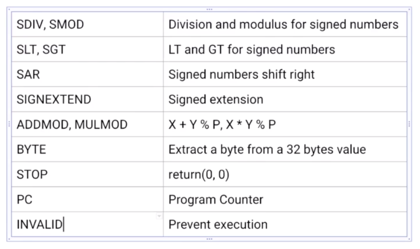

A natural question at this time now that we are at the end of the course is did we cover everything inside of the specification? We did for the most part, but there are some parts of yul that are so obscure and rarely used that I didn't think it was worth creating a separate video for, but let's look over them anyway. 

Well, we didn't cover as inside of this table over here, so let me just explain it. If you are doing signed arithmetic, so you are working with signed integers as opposed to unsigned ones or binary numbers that are encoded in twos complement form, you would be using sign division, signed modulus, signed less than, sign greater than and signed shift ,right. As opposed to the unsigned version of those opcodes. 

Obviously, when you are taking the division of numbers that might not have the same sign, then you need to account for that. And when you are shifting numbers, you don't want to move the bit that is associated with the positive or negative off of the word that you're working with. So these codes will handle it for you to sign, to extend. If you're not already familiar with that, don't worry if you are, it's exactly the same here as is in whatever context you encountered it in. That's basically to give you more bytes to work with if you need a larger sign to number, add mud. And Admiral, so if you're familiar with RSA encryption or any modular arithmetic, this is what you would use them for. Typically you would be adding or multiplying two numbers modulo or prime, and this will do it in one step as opposed to doing it step by step like I've shown here, but can be handy sometimes. So because you'll always work. Or rather the EVM always works in 32 byte values. Byte will allow you to extract a particular eight bit value from that 32 bytes and spare you some masking and shifting like we had talked about earlier. Stop is just a shortcut for return. Zero zero. Maybe we should have used that. It's a little cleaner, but that's what it is. A PC is the program counter. So if you're familiar with compilers, that's exactly what it sounds like. This is read only for safety reasons. You can look up more about program counters online. That is at the point of this course. If this is something you are not already familiar with, invalid is something that prevents execution of byte codes. Now, naturally. Well, why don't you just use stop or return or something? Sometimes the solidity compiler is going to insert metadata into the byte code just to give you some information about the contract that it compiled. So to prevent that metadata from accidentally getting executed, it will be presented with the invalid keyword. So if you wanted to do something similar like that in Ule, then that's what you would use invalid for.